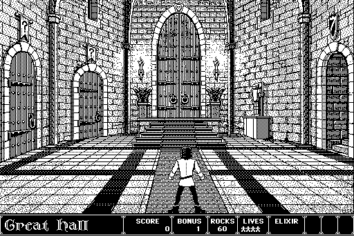

What am I up to [/now](/now)

Some places you can find me on the internet:

    <a href="https://hachyderm.io/@markphilpot"> Mastodon</a>
    <a href="https://github.com/markphilpot"> Github</a>
    <a href="https://www.flickr.com/photos/markphilpot"> Flickr</a>
    <a href="https://anilist.co/user/mphilpot"> Anilist</a>
    <a href="https://markphilpot.bandcamp.com"> Bandcamp</a>

### Experience

