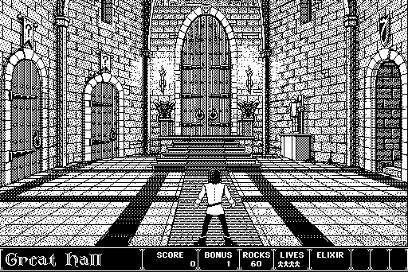

### Experience

Which path did you choose?

Let's take this in reverse chronological order:

For a year I worked with [Paul Patrick](https://www.linkedin.com/in/paulpatrick) building out a scalable business solution to gather, analyze and assess cyber threat intelligence. While we weren't able to get it off the ground, I loved every second of it and got a chance to build some cool tech which you can find at the [DaedaFusion Github](https://github.com/daedafusion) repositories. The process of open sourcing is still on going but I hope to finish by the end of 2016.

I worked for LM for 10 years out of school on a bunch of cool projects and with awesome teams. Here's a quick run down (in chronological order this time):

#### GPS IIF Ground

I worked on helped deploy the next generation of the GPS ground software (the software that the Air Force runs to keep the GPS system working). It was a great learning experience, working primarily in C++ on both GUI and backend systems. Also got a chance to be on site at Schriever &amp; Vandenberg AFB for testing and deployment dry runs.

#### TMOS Ground

When I moved out to the Bay Area, I joined the TMOS crew working on the prototype of the next generation satellite comm system (replacing AEHF). I got a chance to build my Java and distributed system chops as well as leading a prototype team building the user interface. Unfortunately with the economic downturn the project was canceled.

#### Software Research &amp; Product

After TMOS, I joined up with Paul Patrick and built a team to explore Big Data systems, Graph databases and malware analysis with the goal to try to build a commercial cyber threat intelligence (CTI) product.
