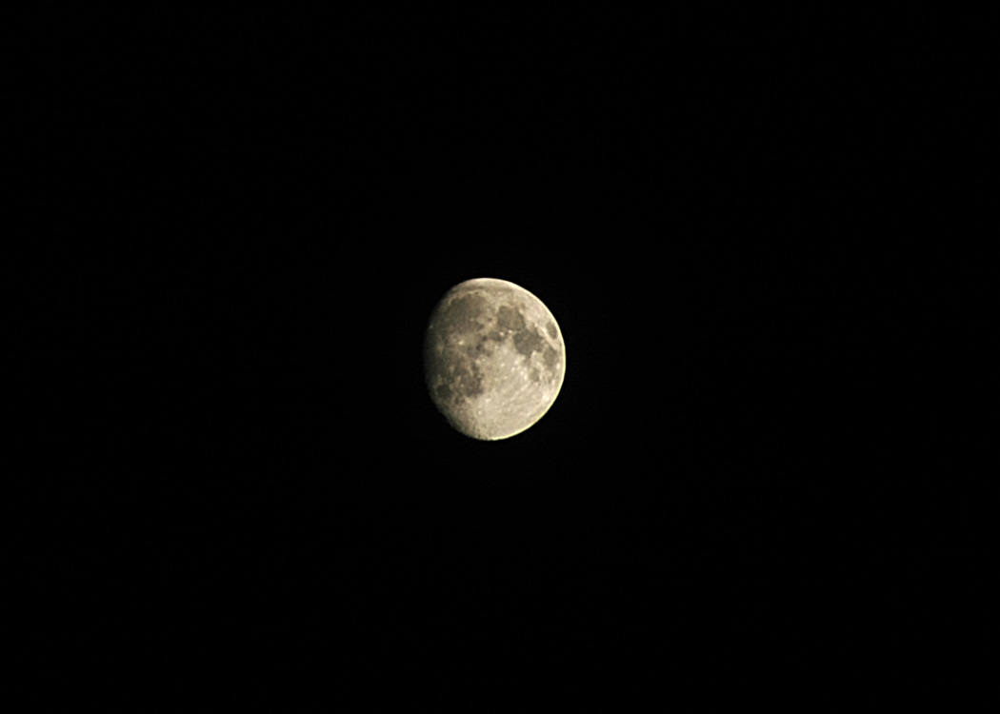

I've added two new sections to my Gallery. The first is an area featuring some of my favorite photos. All of these I've printed in some form and few currently as some of my best work (you have to start somewhere).

Additionally, I added an album looking back at my years at Duke through pictures. I'm sorry about the poor quality in some (my freshman year I still had a 1MP HP... amazing how fast technology has advanced since then).

There is supposed to be a new moon on May 7th. I'm hoping to be able to take my D70 out for another attempt at some astrophotography, this time trying to do a full sky stack. Unfortunately from the roof of my apartment building, you have all the lights of DC around, so its definitely not ideal, but hey, its just experimenting. From the roof I have a great view of the Cathedral, but the problem is there is a chain link fence around the roof-top area, and my tripod doesn't go high enough to completely clear it. At some point soon I hope to head up there at night and snap a few up close.

This was my first attempt:

Given the light pollution in DC, I thought it came out pretty well. We'll see if I can pick up stars with a new moon next week.
