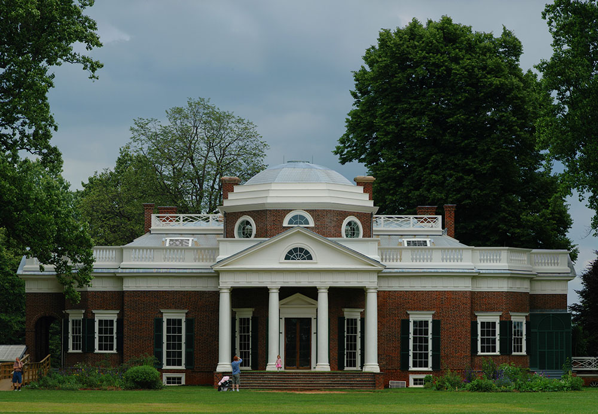

So I finally got my fireworks pictures up in a new gallery. This was a rather difficult shoot. The fireworks started as soon as we got to our place on the Mall, so I wasn't able to get any pictures of the crowd, the Capitol or much of anything else. Just put my tripod down and started shooting and had to adjust all the parameters on the fly. Out of about 200 images, about 20 or so turned out pretty well. I wasn't able to do some really long exposures because I couldn't figure out how to not overexpose the image. I think if I had some prep time, I could get it, but it was all spur of the moment, and adjust as you go.

This is one of my favorites because it almost looks like a star constellation or galaxy. The second image is a 21 stitch pano (around 40MP) of Monticello taken when we went down to Charlottesville. It was sunny when we started the tour of the house, but by the end it was overcast, so it looks slightly gloomy. Oh well.

Prior to the fireworks, we gathered for a great BBQ in a park area in north Rock Creek. Paul came out from Seattle for the weekend and Dave came up from North Carolina. Sam and his girlfriend came down from Philadelphia as well but unfortunately Sam and Dave had to leave before the fireworks (work... ever the inconvenience). I hadn't played croquet or ultimate in a very long time, so thanks guys! I had a blast! (And the BBQ turned out really well... once we reinvented how to make fire) =)
