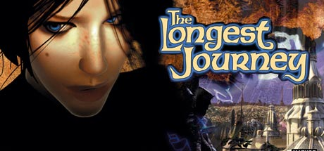

Back in the summer of my sophomore year in college (2000 or 2001) while Jeff and I were working at Vialta, one lunch time we stumbled upon a review of a new game from Finland. It hadn't yet been released in the US (I don't think they had yet secured a US publisher). It was a rave review. Harking back to the classic puzzle & character driven adventure game that had made the Sierra classics so popular so many years ago. This was released when Quake, Unreal, and the rest of the FPS genre was <em>huge</em>, so a pure adventure game stuck out. Not knowing if it would ever reach the US (I should have known better... about 8 months after I caved it was released... but I did get it 8 months early), I went ahead and imported the English version. <a href="https://www.longestjourney.com/">The Longest Journey</a> was a great ride though a genre that I thought had been abandoned.

It was well worth it. The plot was fantastic (though one could argue it's a little over the top... that's what makes it fun). The characters were deep and evolved. The music was excellent & it was visually stunning. Everything a good adventure game needs. People clamored for a sequel. It was ripe for it. And it is finally coming: <em><a href="https://www.dreamfall.com">Dreamfall</a></em>.

Though I don't own a Playstation, I reveled when they made Final Fantasy VII & VIII available for the PC. I loved those games because of the characters and the story. While the battle system was fun, I always felt it got in the way of the rest of the game. You had to slog through endless battles to advance the plot, and you had to dedicate yourself to doing the battles because you couldn't beat the game unless you had. I hope to get a Playstation 2 for Christmas or something so I can play IX and X... I've seen my brother play snippets of both, and I know it would be hours of entertainment (however, I'm not too sure how my wife-to-be will handle that) =)

Dreamfall hopefully won't be pulled down by the hype (though I doubt many even know about it, really). They released a video trailer for E3 (you can download it from the website). The environments look incredible. However, there has been no word on game play yet... Some interviews talk about trying to make a very different game, as there have been many knock offs of the <em>The Longest Journey</em>, they wanted to make something new. Only time will tell if this is a good thing or not.

As there is no release date yet, I don't know when I'll have the pleasure of playing <em>Dreamfall</em>. (Hopefully won't be too long) =) I'll send out a review when it does.
