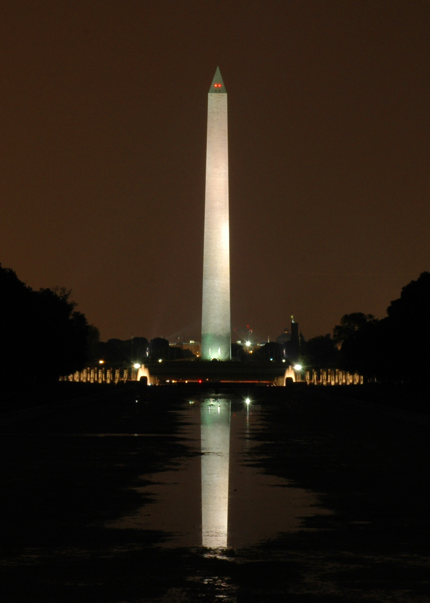

I thought I'd start out Friday with a "new" image. It's actually a rather old picture (July 2004 I believe). I took a bunch of other good ones on that shoot, so this set got lost in the background. I uploaded two others in my <a href="https://gallery.mcstudios.net">Gallery</a> of the Washington Monument that I thought also turned out well. Unfortunately the Reflecting Pool was draining at the time, but I actually think it creates a rather neat effect.

Ann & I have a last minute dance lesson this evening so we don't humiliate ourselves at our wedding (or bore everyone to tears by just swaying back and forth). We took some lessons a few months ago, but we had not selected our music yet. So hopefully it will turn out well =)

We got around to seeing <em>War of the Worlds</em> last weekend. It delivers what it should, however I was hoping for more mystique a la <em>Close Encounters of the Third Kind</em>, granted with more death and destruction involved. I still think the best movie this summer has been <em>Batman Begins</em>. Though there are a lot of strong movies coming out this Fall/Winter that I'm looking forward to. We actually saw a preview for <em>King Kong</em>, and I have to say, it should be fun. And the fact that they cast Jack Black as the director is great. Should be lots of fun.

Anyway, got to run here pretty soon.
