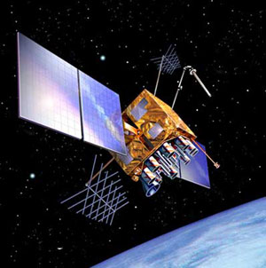

We are now both set for our transitions back to California. I accepted a job with the TMOS project at the San Jose Lockheed office (more on the project later...)

I must say I am very lucky to have worked on the GPS project for four years right out of school. It has been a great experience and I've learned a great deal from the fantastic people on the project both in Gaithersburg and Colorado Springs.

The San Jose facility looks to be only 15 miles from campus. I really have no idea how long that will actually take during rush hour (101 is notorious for congestion), but I can't imagine it being much worse than my current commute since I'll be so close to the freeway to begin with.

So the current (tentative) plan is for me to come out in June to start work. Ann's going to finish up her work at NRDC through July. I'll then fly back out DC in July, help pack up the apartment and then take a drive cross country -- We were thinking of taking I-40 instead of I-80 so we can sight see in New Mexico and Arizona. I'll then cap it off with a trip to Las Vegas for Sam's bachelor party before heading back to the office. Sounds like a great month actually (aside from the hassle of moving). We'll then have some more flux in August before the dorms open in September and school actually starts.

Ann and I are taking a much needed and deserved vacation this weekend, so expect some good pictures next week (hopefully).
