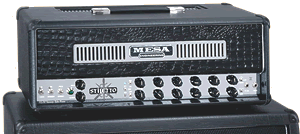

Sorry about that. When I changed hosts, I was able to start using Wordpress' Akismet plugin for spam, and didn't realize that it had different rules for comment moderation. All comments should be out there now =)

Things are still crazy here... adjusting to a new job, acclimated to a new apartment... you know, the works.

My big new purchase... a "pre-owned" Mesa/Boogie Stiletto Deuce head with a 4x12 Mesa slanted cab. This thing is massive!

I've never owned a tube amp before and this one is perfect because you can switch between tubes and solid state silicon diodes for the distortion channels, so you basically get the best of both worlds. This thing sounds incredible (and very, incredibly loud... I haven't pushed it past 9 o'clock... I don't think the downstairs neighbors would like me if I did). Its amazing the difference when compared to a shitty practice amp. Took me 5 hours to get it (drive up to Stockton and back) and nearly threw out my back getting it up to the apartment (Daniel had gone up to Lafayette, and we couldn't find anyone around to help -- the head itself, while only 8"x8"x36" weighs probably 50+lbs... the cab at least 100+lbs), but it was entirely worth it.
