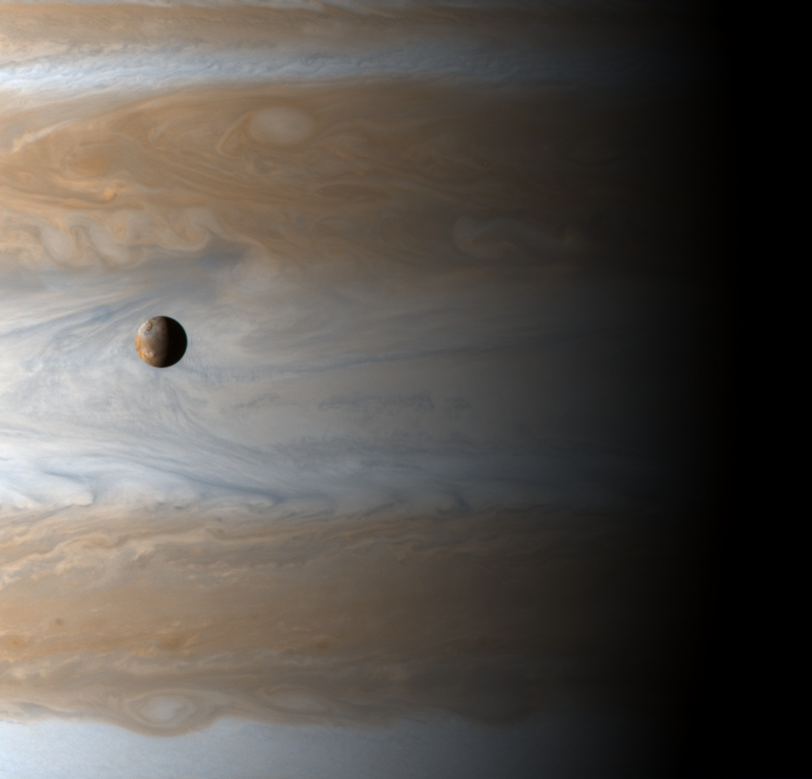
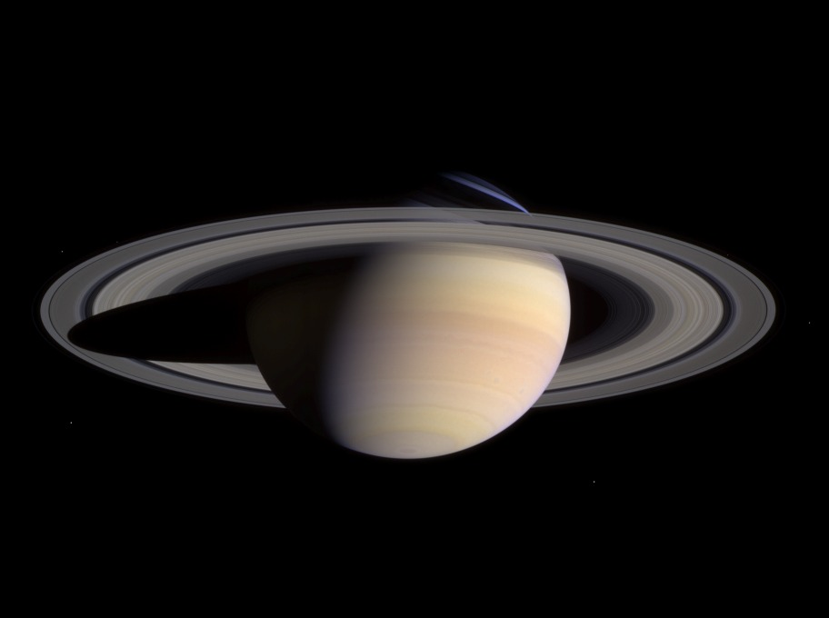
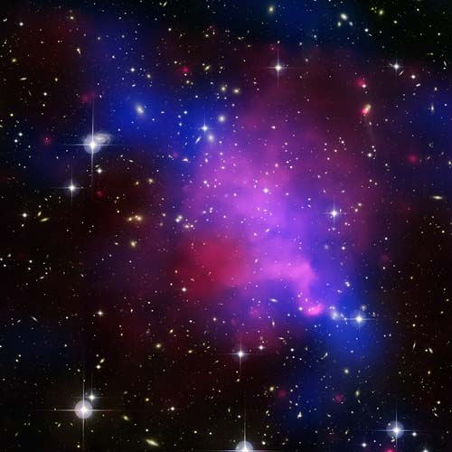
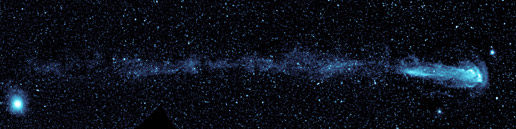

Maybe its the way I'm wired... I don't know if others feel this way. Images this beautiful make me choke up... just imaging being in an expanse of space where I could look and see something like this larger than life... and why I'm so disappointed that unless some really weird quirk is discovered in physics... humans aren't meant to voyage very far into space... They are only meant to see things of great beauty from afar. (Click image for full size)

<a href="https://ciclops.org/ir_index.php?id=27"> Io Across Jupiter</a>

<a href="https://ciclops.org/ir_index.php?id=27"> Saturn</a>

Chandra X-Ray Observer

<a href="https://www.nasa.gov/mission_pages/galex/20070815/">Mira - The Shooting Star </a>
