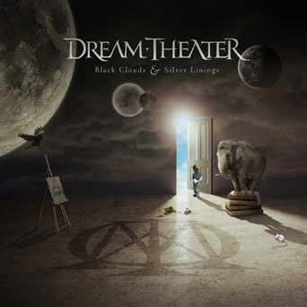

Dream Theater's latest album <em>Black Clouds & Silver Linings</em> continues their musical evolution brilliantly and might be their best work melodically to date. Vocal layers are much thicker (just the way I like it) with Mike Portnoy and John Petrucci lending their voices to the mix more than I can remember on any previous album. They also have struck a very satisfying balance between crazy instrumentals and truly melodic figures. Unlike some other bands in this genre, Dream Theater seems to continually evolve their sound and every album is distinct from the last. There really is quite a lot to digest with this album -- essentially two "single-esque" type songs and rest truly epics that will take a few listens to wrap your head around, but never did I feel that a song was laboring under it's own weight.

Overall, really a fantastic production, and comes highly recommended.

<h4>A Nightmare to Remember</h4>

My early favorite on this album starts off quick and heavy but the gem in this song is the "interlude" (if you can call it that) in the middle. The chorus in this section is really one of my favorite Dream Theater riffs ever. Every time it's played (which unfortunately is only twice) I want to crank the volume and sing along. Petrucci then starts one of many fantastic solos on this album. Especially when compared to Train of Thought, where I thought he over-shredded on his solos, he seems to have dialed it down one notch and the result is exemplary. After Rite of Passage, Wither and Best of Times, this is the next most accessible song on the album for the lay-DT fan.

<h4>A Rite of Passage</h4>

The bombastic single with a kick ass chorus. The most straight forward song on the album (if you exclude a brief crazy instrumental) is deftly produced and gives the band a much larger sound than they done on recent albums. Listen to this, enjoy it (which you will) and then move to some of the more epic fair.

<h4>Whither</h4>

The ballad of the album is toned down and not at all pretentious (as rock ballads go). The vocals are some of James LaBrie's best and Petrucci's solo is the most air guitar educing one to date.

<h4>The Shattered Fortress</h4>

This track concludes Mike Portnoy's <em>Twelve-step Suite</em> [<a href="https://en.wikipedia.org/wiki/Twelve-step_Suite">wikipedia</a>] (or AA Suite) about his struggle with alcoholism.

* Six Degrees of Inner Turbulence -- The Glass Prison
* Train of Thought -- This Dying Soul
* Octavarium -- The Root Of All Evil
* Systematic Chaos -- Repentance

It is truly an epic conclusion, weaving in melodic threads from all the previous songs while at the same time feeling like it all belongs together. Only fans who are familiar with the songs above will be able to digest all the hooks and inside references, but over all a very good song. I'm looking forward to the live concert where they perform this suite start to end.

<h4>The Best of Times</h4>

A beautiful opening, and a kick-ass entrance which reminds me a little of The Who or Rush (but with that Dream Theater flair). The style harken's back their epic Six Degrees of Inner Turbulence and is the most classic Dream Theater sound. The lyrics are really touching (all regarding Portnoy's father who apparently died of cancer late last year).

<h4>The Count of Tuscany</h4>

The true <strong>epic</strong> of the album. I'm still digesting this one. I've heard many sources reference Change of Seasons with this song. This song sounds more like a "whole" song while CoS sounds a bit more like a patch work.
