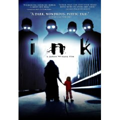

I heard about <a href="https://www.imdb.com/title/tt1071804/">Ink</a> today from a blog post about how it had been pirated all over the torrent sites, but as a result had zoomed up the popularity charts. If you have Netflix, it's available on <a href="https://www.netflix.com/Movie/Ink/70125584">Watch Instantly</a>, and I highly, highly recommend it.

<em>Ink</em> is an incredible independent film written by <a href="https://www.imdb.com/name/nm1985821/">Jamin Winans</a> and released by <a href="https://www.doubleedgefilms.com/">Double Edge Films</a>. By far it has easily become my favorite indie film I've ever seen. In what feels like a cross between, <em>It's a Wonderful Life</em>, <em>Sin City</em>, and <em>Dark City</em>, Ink brilliantly walks the fine line by not explaining anything and just drops you into this incredible story. Once you ride through the beginning, you begin to get your feet under you and start putting the pieces together.

Make an effort to see this film. It will be worth your time.
