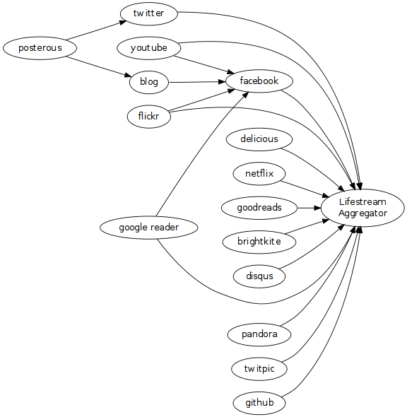

So I decided to try to create a graph that showed the flows of the various social networking sites that I use frequently. Lifestream Aggregator in this case refers to three things: Friendfeed, Lifestream Plugin for Wordpress (<a href="https://blog.mcstudios.net/lifestream">here</a>) and Sweetcron (<a href="https://www.markphilpot.net">www.markphilpot.net</a>).

