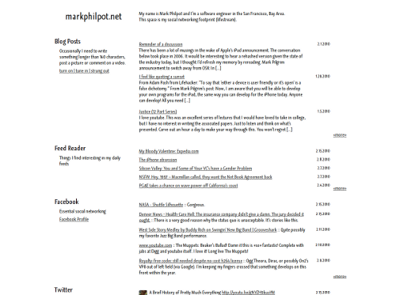

Necessity is the mother of invention, and that's especially true for software.

For a long time, I've wanted to display my lifestream as a single page (and on my own domain) in a way I could customize to match my own aesthetics. I tried <a href="https://code.google.com/p/sweetcron/">Sweetcron</a>, <a href="https://github.com/dominiek/kakuteru">Kakuteru</a>, and a few custom scripts for pulling data from Friendfeed. Everything was either too complex or lacked the ability to customize the way I wanted. For a while, I had been collecting my lifestream events using the <a href="https://www.enthropia.com/labs/wp-lifestream/">Lifestream Plugin for Wordpress</a> and was really impressed in it's stability and functionality. I wanted to display this data but outside of my Wordpress installation, so I decided some PHP was necessary.

<h2>Custom Lifestream Display</h2>

The source is located over <a href="https://github.com/griphiam/mpnet">here</a> on github. It's a simple set of PHP files that uses the lifestream data from the Lifestream Plugin in your Wordpress database and renders it grouped by event type.

A live demo (my lifestream) can be found at <a href="https://www.markphilpot.net">www.markphilpot.net</a>

<h4>Features</h4>

<ul>
	<li>Attractively display your lifestream by event type</li>
	<li>Supports jQuery plugin <a href="https://james.padolsey.com/demos/imgPreview/full/">imgPreview</a> for posts with a thumbnail entry in the feed</li>
	<li>Supports jQuery plugin <a href="https://leandrovieira.com/projects/jquery/lightbox/">lightbox</a> for Flickr images</li>
	<li>Supports <a href="https://www.jacksasylum.eu/ContentFlow/">ContentFlow</a> (Cover Flow implementation) to display vi.sualize.us images</li>
	<li>Supports AJAX retrieval of more history for each event type</li>
</ul>

<h4>Installation</h4>

Very simple: Create a config.php file in the include directory that includes the necessary variables (See README) and customize feeds.php to point to all the correct feed IDs for your installation.

<h4>Known Issues</h4>

If you used a different prefix for your WP installation, you may need to update the tables in the queries.

There is some logic in <a href="https://github.com/griphiam/mpnet/blob/master/include/content.php">content.php</a> that may be particular to my feed set (logic to eliminate duplicate entries for example).

I've used a very minimalistic design, but it should be fairly simple to customize the CSS. If you find any problems or identify any neat features, please file an issue at github or send me a patch.
