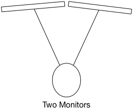
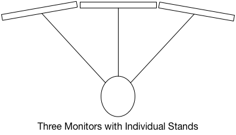
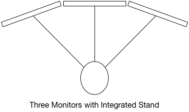

   <small class="caption-text muted"> <a href="https://www.flickr.com/photos/42736403@N08/5439996103">Photo</a> by <a href="https://www.flickr.com/photos/42736403@N08/">Chance Reecher</a></small>

As any developer will tell you, screen real estate is a premium commodity. Once you have developed a workflow with two monitors, there is really no going back. You will complain and lament any time you are forced to work extended hours on a single screen.[ref]Laptops seem to get a pass in this regard. It may be you just psychologically accept the smaller single-screen workspace. I know I have a highly modified development workflow when I use a laptop vs when I'm at my desk[/ref]

There is however, a significant ergonomic disadvantage to the dual monitor setup: there is no screen directly in front of you. You are inevitably forced to move your neck and/or eyes unless you have a funky setup where your keyboard and mouse can pivot with you and your chair.

# The Jump To Three

When I last put together a new desktop a few years ago, I bought three Samsung SyncMaster 204BW thinking I would use two and then I would put the third on a desk for my wife to connect her laptop to. It quickly became apparent that my wife doesn't like docking her laptop and once she got a MacBook Air, there was no convenient way to use it with a monitor. So the third ended up not being used and shoved in a closet.

Fast forward a few years I got a Mac Pro for studio and development work. I had noticed that it supported three monitors, but it never occurred to me to actually use it. Then a few weeks ago in the process of literally cleaning out the closet, I remembered that we had a spare monitor (and just so happened to be identical to the existing monitors in my setup) and thought what the hell, I would take [Jeff Atwood's](https://twitter.com/codinghorror) advice and try out a [three monitor setup](https://blog.codinghorror.com/three-monitors-for-every-user/).

It was a huge improvement! Having a center monitor as your primary workspace was a drastic improvement in ergonomics and the extra real estate was a great bonus.

# Making It Better

My desk has a monitor riser, so it meant that all three monitors were set in a flat plane with only a slight angle towards the center. While it worked OK, the increased distance to the two side monitors was noticeable. I then tried an integrated three monitor stand which allows the side monitors to be closer to me since they are attached to a single arced arm.

The stand is very heavy and awkward to adjust. Due to the weight, the side monitors sag just a bit, but since they are on a riser it wasn't too noticeable. If you have the desktop space to keep them on individual stands and have the side monitors closer to you in the arc, that is probably better than trying to use a single stand with a long arm to connect the monitors to. If you have a monitor riser or limited desk space, I highly recommend a stand.[ref]I ended up getting a cheap one from amazon. The build quality is good, but I can't help but wonder if this is one area where it is worth the extra money for superior quality.[/ref]
