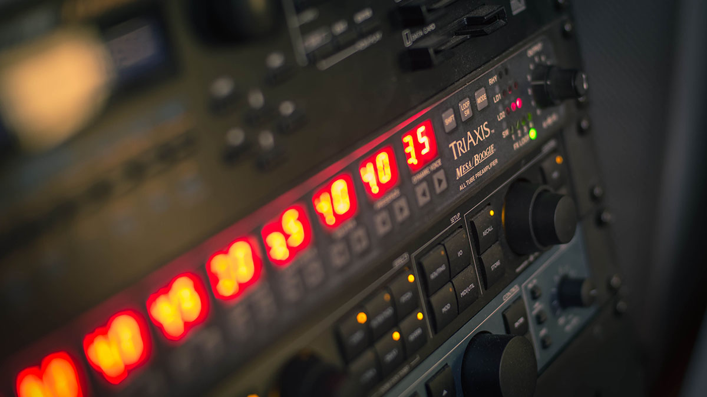

 <br/> <small class="caption-text muted">Photo by <a href="https://www.flickr.com/photos/markphilpot/">Mark Philpot</a></small>

The Mesa Boogie TriAxis / 2:Ninety is a classic. Sure, we have digital modelers, cab simulators and silicon based preamps now, but nothing can quite complete with the raw tube power and spectrum of the TriAxis preamp and the 2:Ninety power amp. Combine that with a classic tc electronic G-Major in the effects loop, you have a wondrous world of sound possibilities.

# Abandonware

The problem is that we have entered a world where current technology cannot begin to comprehend software of the past. And to make matters worse, the hight of the TriAxis was well before the rise of open source. Hell, most of the MIDI world has never been pulled out of the 90's; most of the software being shareware downloaded from web pages that look straight out of Geocities (kids, ask your parents).

Most guitar preamps and effects today have a nice software component that allows easier control of the device than the front panel hardware controls usually provides. To make matters worse, the TriAxis has only one knob (level control) and the absolute worst push buttons you have ever seen or attempted to use.

To get the most of the TriAxis, you need better control.

The "signature" [patch editor](https://www.tonymckenzie.com/triaxis_downloads.htm) was a home project by [Tony McKenzie](https://www.tonymckenzie.com/). I even think Mesa referenced this software as the defacto standard. The problem is that this software was developed in the Windows 98 era and can't run on 64bit computers. Additionally, the downloads of presets from his website are not sysex dumps; they are a proprietary file format so he could give presets a name.

So what does that leave us with? Well, thankfully, the file format he used isn't obfuscated: The first region is actually the sysex dump, followed by a region defining the names of the presets. If you open up the .tri files in a hex editor, you can extract the sysex dump and load that into [SysEx Librarian](https://www.snoize.com/SysExLibrarian/) to send to the TriAxis.

Additionally, you can use [ievms](https://github.com/xdissent/ievms) to pull down a 32 bit version of Windows 7 where you can load up his software, build your own set of presets, then save it. You can then run the following to truncate the file down to 2746 bytes:

```bash
head -c 2746 my_presets.tri > my_presets.syx
```

I highly recommend trying the Wade presets on Tony's site. Its essentially a "best of" collection of presets that will really highlight the breadth of the TriAxis and 2:Ninety.
