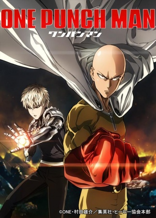

So this is my inaugural anime post that I really meant to do for the Summer season but due to vacations wasn't able to do. I still hope to do a Summer 2015 retrospective at some point because it really was an excellent season. My plan right now is to try to do two posts a season: a First Impressions post that covers the first episode or two of the shows I'm going to try to watch, and a Retrospective post covering the shows I enjoyed and the reasons why I dropped others.

By way of introduction, I use [Hummingbird](https://hummingbird.me) to keep tabs on by anime "todo" list and you can follow me [here](https://hummingbird.me/users/mphilpot). The interface is by far superior to [MAL](https://myanimelist.net) which is probably a post in and of itself.

 

### [One Punch Man](https://hummingbird.me/anime/one-punch-man)

If you go based on the hype, this is the only show of the season. Having never heard of the manga before the anime crossed my radar, I really knew nothing of this other than the single line synopsis. I've been a fan of Madhouse's most recent work ([Death Parade](https://hummingbird.me/anime/death-parade), [Ore Monogatari!!](https://hummingbird.me/anime/ore-monogatari)) the last few seasons so I was looking forward to seeing what the hype was about. An episode in, I have high hopes.

The animation is fantastic (almost like Madhouse got together with Trigger) and I really like the OP. I just have no idea where the show will go with the story. Episode 1 was a basic introduction, and I'm hoping the show is more than a villian-of-the-week formula.

 

### [Heavy Object](https://hummingbird.me/anime/heavy-object)

Going into this season, I was genuinely excited for this one. The writer is Kazuma Kamachi, writer of [Toaru Majutsu no Index](https://hummingbird.me/anime/toaru-majutsu-no-index) and [Toaru Kagaku no Railgun](https://hummingbird.me/anime/toaru-kagaku-no-railgun), two shows I throughly enjoyed. Those shows had fantastic characters and great world building. But after episode 1? Meh?

Granted the first episode was heavy on backstory, but just found myself bored by the conflict and the characters felt completely flat. Contrast this with the characters from Railgun who I fell in love with almost immediately. I'll get through the 3 episode rule with this one, but it might not get beyond that.

 

### [Sakurako-san no Ashimoto ni wa Shitai ga Umatteiru](https://hummingbird.me/anime/sakurako-san-no-ashimoto-ni-wa-shitai-ga-umatteiru)

The last to air for the fall season, this could be promising or it could be a very awkward triangle relationship between an engaged couple and a high school student. I'd admit the dynamic between the two main characters has some good back and forth and it doesn't dive head first into awkwardness based on the age difference. This will be either a "murder mystery of the week" with some punchy dialog between the characters, or an over the top sordid exploration of the relationship between an older woman and underage teenager.

 [8-Bit](https://)

### [Comet Lucifer](https://hummingbird.me/anime/comet-lucifer)

I'm not one of those people who strictly avoids mecha, but I'm also not one that seeks it out. I honestly didn't realize this was a mecha before I watched the first episode. I think my liking of this show will parallel how deep they go into the characters. If it turns out to be "just another mech series" then I'll probably skip it. I will confess however, that I was intrigued by the first episode.

 [Tezuka Productions](https://)

### [Young Black Jack](https://hummingbird.me/anime/young-black-jack)

I had no idea this was a prequel for an exiting series. Knowing nothing of the characters, the first episode fell entirely flat with me. I doubt I'll make it to 3 episodes with this one.

 

### [Hacka Doll The Animation](https://hummingbird.me/anime/hacka-doll-the-animation)

The only reason this is on anyone's radar for this season is the studio attached to it. I loved [Kill la Kill](https://hummingbird.me/anime/kill-la-kill) and was really hoping for more [Little Witch Academia](https://hummingbird.me/anime/little-witch-academia) (no, I haven't had a chance yet to watch the [movie](https://hummingbird.me/anime/little-witch-academia-2)). But oh boy does this seem like a wasted effort. I guess the only saving grace is that it truly does turn out to be a dud, it was only a series of shorts.

 

### [Utawarerumono: Itsuwari No Kamen](https://hummingbird.me/anime/utawarerumono-itsuwari-no-kamen)

File this under "complete unknown" and "somewhat promising." I actually appreciate that the show just drops in the audience without explaining any of context of the world the protagonist finds himself in (unlike some other shows I could name _cough_ Heavy Object _cough_). My one gripe is that it's a continuation of a lazy (but theoretically competant) male lead trope. It really would be nice to have a show with this tone that was gender flipped. The saving grace is that the female supporting character seems like the "sweet but kick-ass type" -- I hope anyway.

  [Silver Link](https://)

### [Rakudai Kishi no Cavalry](https://hummingbird.me/anime/rakudai-kishi-no-cavalry)

Why must the Japanese always ruin perfectly good shows with meaningless ecchi shit? I really want to take a show like this and put it on the editing block and see if a genuinely good show comes out of it. I think underneath all that crap there might be a half decent story to be told here, but my guess is they ruin it by pushing the ecchi plus "fight of the week" to 11.

 

### [Gakusen Toshi Asterisk](https://hummingbird.me/anime/gakusen-toshi-asterisk)

What. The. _Hell_?! You could literally run Asterisk and Cavalry side by side, and they _literally_ would be identical. Shot for shot. Hell, even the dialog could have been copied. I just happened to watch these two back to back and had to stop and check that I hadn't accidentally played the same episode twice. _Mind Blown_

Once again, theoretically a decent story underneath the ecchi, but I have almost no hope that there will be a shift in tone for the better. I think Cavalry will be much better than this one based on a single episode sample.

 [Studio Gokumi](https://)

### [Lance N’ Masques](https://hummingbird.me/anime/lance-n-masques)

Think Medieval Superman... with weird dynamics and implications with _very_ underage girls. Most likely I'll end up passing on this one.

 

### [Concrete Revolutio: Choujin Gensou](https://hummingbird.me/anime/concrete-revolutio-choujin-gensou)

What do you get when you cross [Kekkai Sensen](https://hummingbird.me/anime/kekkai-sensen) with [Rolling Girls](https://hummingbird.me/anime/the-rolling-girls)? I'm not exactly sure either, but Concrete Revolutio would be my best guess. Unlike Kekkai Sensen, I wasn't immediately sucked into the world being built and it was hard to get a sense of the characters. I'll definitely give it a few more episodes, but considering how long we've waited for Kekkai Sensen's final episode, I feel like Bones doesn't get any free passes on this one.

 

### [Owari no Seraph 2](https://hummingbird.me/anime/owari-no-seraph-nagoya-kessen)

A so-so series from two seasons ago, I held off finishing once I heard there was going to be a second season.

 

### [Haikyuu 2](https://hummingbird.me/anime/haikyuu-2)

Like with [Baby Steps 2](https://hummingbird.me/anime/baby-steps-2) in the spring, I stumbled into a sports anime which I never thought I'd watch. However, the enthusiasm fans seem to have for this show made me curious so I went back and started with the first season; and I'm very glad I did. Where as Baby Steps has a single protagonist (because of the sport... but wouldn't you like to see a spin-off with mixed doubles?), this seems like it will be more team dynamics focused which could open a lot of avenues for interesting story telling. I do think I'm going to miss having any women in the supporting cast (or hell, it might have been better focusing on a women's volleyball team), but only time will tell where they end up going. All in all, I'm very glad I decided to give season 1 a try and will be making my way through.

Hero image created by Zana at <a href="https://neregate.com/blog/">neregate.com</a>  
The following websites were used as sources of information to create the chart : 
<a href="https://www.animenewsnetwork.com/">ANN</a>
<a href="https://m-p.sakura.ne.jp/">Moon Phase</a>
<a href="https://myanimelist.net/">MAL</a>

