Welcome to my first attempt at an anime season retrospective. Some ground rules before we get started.

**No Spoilers**   Retrospectives will be to give a sense of what I thought of a show in case you didn't catch it. Eventually, I'll have dedicated posts to reviewing specific shows that will have spoilers and go into a lot more detail.

**Subject to Change**   By the time I get around to a show's individual review, my opinion might have changed. I'm not planning on retconning these posts to necessarily match.

With that out of the way, I'm sorry this will come in a bit late as I'm still working out the kinks.

## Overall

Wow. While I haven't been following anime that long, this summer season easily goes down as one of the best. While there weren't any all-time great shows, the breadth in quality that we got was astonishing. Great stories and great characters up and down the lineup. From what I understand, summer had been traditionally the "thin" season with the heavy hitters going with Fall/Winter/Spring premiers. Honestly, this season has left me with a hangover as the fall season doesn't look like it has nearly the quality that this did.

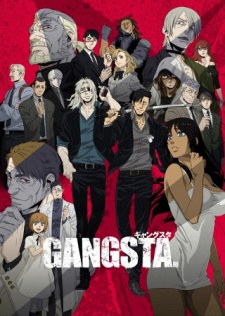 [Manglobe](https://hummingbird.me/anime/gangsta)

### [Gangsta](https://hummingbird.me/anime/gangsta)

_Wanna Renegade Down_

I loved this show with a huge caveat :: I will be absolutely crushed if this never gets a second season. Everything about this show was excellent; from the catchy OP (_Renegade_ by STEREO DRIVE FOUNDATION), to the characters, to the soundtrack... I'm giving it full marks with the **assumption** there will be a second season. While the ending didn't feel like a traditional "read the manga" ending, there has been no word to date on any follow on work.

If you enjoyed [Black Lagoon](https://hummingbird.me/anime/black-lagoon) then I highly recommend this one.

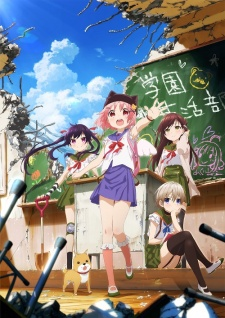 

### [Gakkou Gurashi!](https://hummingbird.me/anime/gakkou-gurashi)

_Must watch_

Don't read anything. Just trust me. Give this one a shot. Go! Why are you still here? Expect a more spoiler filled review very soon.

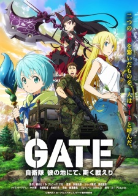 

### [GATE](https://)

_On Hold_

I have to say, A1 seems to be struggling to find something other than [Sword Art Online](https://hummingbird.me/anime/sword-art-online). The premise of this show has so much potential! Modern Military vs Medieval Fantasy. There have to be some great story arcs given that setting, but what it feels like we got was something broaching slice of life with vanilla characters. I'm about five episodes in and have it on hold until the second half airs in the winter, so I definitely don't have the complete picture. I don't even know what to say, I'm just so fearful they've really missed an opportunity here.

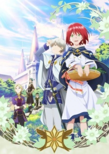 

### [Akagami no Shirayuki-hime](https://hummingbird.me/anime/akagami-no-shirayuki-hime)

_Classic in the making_

It has been a long time since I've seen a story this touching with fantastic characters and such a strong female protagonist; such a breath of fresh air that doesn't suffer from many of the overdone stereotypical tropes (damsel in distress, love triangles, etc). As a bonus, they announced there will be a second season coming soon (winter if I remember correctly). Even if you're not a fan of typical shoujo, there is a very good chance you may still enjoy this one.

 

### [Charlotte](https://hummingbird.me/anime/charlotte)

_Conflicted, but ultimately worth the watch_

Wow, this show really ran the gamut for me. I gave it three episodes and when it seemed like it was just going to be a formulaic version of _Quantum Leap_, I put it on hold. I loved the OP (_Bravely You_ by Lia) and thought there was potential, but there were other shows that had my interest. Toward the end of the season, I started it up again... and then the show pivoted. Charlotte was almost two different shows concatenated together. The arc of the MC might just have wrapped around twice. It makes me wonder how much of a show's writing is completed before the show starts airing.

If you enjoyed [Angel Beats](https://hummingbird.me/anime/angel-beats) you'll probably enjoy this one as well. I'll have more to say in a review soon (hopefully).

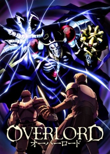 

### [Overlord](https://hummingbird.me/anime/overlord)

_On Hold slipping toward Dropped_

For me at least, this was [Sword Art Online](https://hummingbird.me/anime/sword-art-online) with none of the fun. I know some talked about the devolution of morality for the MC as being worth watching, but I just couldn't get behind it. Part of that might be to do with the avatar or the thread of ecchi, but I was just bored watching it. Now, I haven't dropped it completely but that's entirely due to Madhouse as the production studio. In my mind, they've earned a chance to bring me around with their work recently. I'll keep it in my hold queue for a while and see if I can give it a second chance.

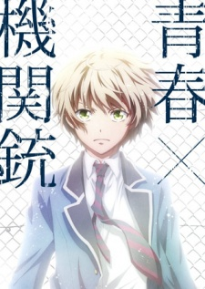 

### [Aoharu x Kikanjuu](https://hummingbird.me/anime/aoharu-x-kikanjuu)

_Solid_

Fully entertaining. Just the right amount of over-the-top coupled with an ass-kicking cross-dressing female lead. The pacing is its one fault; feels too much like a 15 year old learning to drive stick. That being said, I loved the character interactions and the extreme personas. I actually think there will be an OVA with the disc release, where I really, _really_ hope they finally do the one thing they needed to do with this show. Fingers crossed.

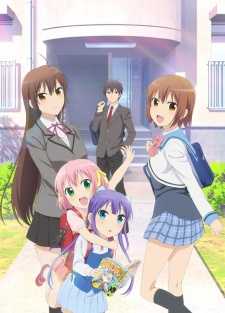 [Creators in Pack](https://)

### [Danchigai](https://hummingbird.me/anime/danchigai)

_Why did I even bother_

What is it with the Japanese obsession being in love with one's own brother or sister? I mean, really... _really?_ At this point I'm not shocked per se and I think the only reason I got through this show as that it was a short (5 minute episodes). This is probably not worth your time (even if that time isn't much compared to a regular show).

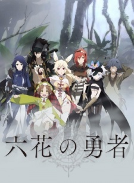 [Passione](https://)

### [Rokka no Yuusha](https://hummingbird.me/anime/rokka-no-yuusha)

_Intense_

This was the one show during the season that I watched as soon as it became available on Crunchyroll. This is not the show I thought it was going in and it's not the show you think it will be after the first few episodes. My fear however, is that the ending felt very much like a "read the manga" ending. There seem to be rumors that a second cour might be possible for the 2016 spring season.

Give this one a shot. It's truly an action-packed mystery thrill ride of a show.

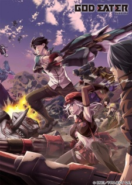 

### [God Eater](https://hummingbird.me/anime/god-eater)

_On Hold_

Since this wasn't on either Cruncyroll or Funimation, I was only able to catch one episode before placing it on hold. Since then, Crunchyroll ended up picking it up, but ufotable stop the show after only 9 episodes with the rumor being they couldn't keep up the level of animation for a weekly show.

Speaking of which, while I think the characters and plot fell flat, the animation is gorgeous. It's just a shame it's wasted on such poor writing. I will end up finishing this one if I can carve out the time, even if it's just to appreciate the animation (which is definitely a ufotable speciality).

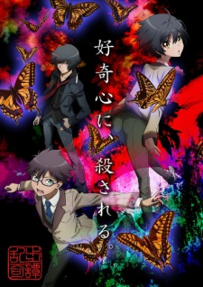 

### [Ranpo Kitan: Game of Laplace](https://hummingbird.me/anime/ranpo-kitan-game-of-laplace)

_Almost Done_

I have a few more episodes to go on this one. This is a dark, murder mystery of the week type of show... the type of show that I appreciate but have to be in the mood to watch an episode. The story telling is quite good and there is enough comedy sprinkled in so that the darkness isn't super depressing. Oh, and this show completed the ying-yang with Aoharu with the MC being a very feminine male lead.

_Update:_ Finally finished the show and **wow** that was a great ending. It really shows how much an ending to a series can swing your opinion. Definitely recommend. The first half is essentially introductions and laying the ground work. The show gets it's legs in the second half and screams to the finish.

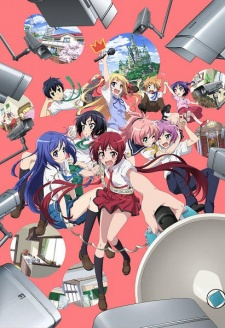 [Production IMS](https://)

### [Joukamachi no Dandelion](https://hummingbird.me/anime/joukamachi-no-dandelion)

_On Hold, Haven't Started_

Last and the very least... I meant to watch this one, but I ended up watching so many shows this summer that inevitably something had to fall through. I'll get to this one eventually.
