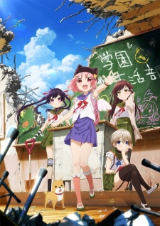

[Gakkou Gurashi!](https://hummingbird.me/anime/gakkou-gurashi) _School Live!_

If you haven't seen this yet, preserve your ignorance a bit longer and at least watch the first few episodes and come on back for an in depth discussion.

    ┻┳|
    ┳┻|
    ┻┳|
    ┳┻|
    ┻┳|
    ┳┻|
    ┻┳|
    ┳┻|
    ┻┳|
    ┳┻|
    ┻┳|
    ┳┻|
    ┻┳|
    ┳┻|
    ┻┳|
    ┳┻|
    ┻┳|
    ┳┻| ___
    ┻┳| •.•)  is everyone gone?
    ┳┻| ⊂ﾉ
    ┻┳|

## Prologue

I understand the difficulties in generating a synopsis for a show like this. I'm assuming [Mahou Shoujo Madoka★Magica](https://hummingbird.me/anime/mahou-shoujo-madoka-magica) had the same issue: how to let people know not to completely judge the show based on the promotional material. However, that being said I have a bone to pick.

Here's the synopsis from ANN:

> The story revolves around four girls who decide to stay over at school: the energetic Yuki Takeya, the shovel-loving Rumi, the center of the group Rurii who brings everyone together, and the spacey school adviser Megu. However, through mysterious circumstances, the girls find themselves the final survivors in a zombie attack, and continue to live at the school.

What the hell? To me, that's the equivalent of a synopsis for Star Wars spoiling Darth Vader is Luke Skywalker's father (and if I just spoiled that for you... I'm impressed you've spent this long on the Internet without knowing that).

Let's compare that to Madoka Magica's synopsis:

> She has a loving family and best friends, laughs and cries from time to time... Madoka Kaname, an eighth grader of Mitakihara middle school, is one of those who lives such a life. One day, she had a very magical encounter. She doesn't know if it happened by chance or by fate yet. This is a fateful encounter that can change her destiny—this is a beginning of the new story of the magical girls.

You already know it's a magical girl show, so this synopsis doesn't spoil anything. It means the true nature of the show gets spread by word of mouth (doesn't hurt that you have Gen Urobuchi as the lead writer).

Anyway, back to Gakkou. Thankfully there are more twists and turns throughout the show that surprised everyone, the fact that the post-apocalyptic setting was spoiled for most people wasn't a complete detriment.

## Story & Characters

On the surface, this appears to be nothing more than a moe inspired high school slice-of-life. We're introduced to the four girls going about their day at school. Only at the end of the first episode does the first twist reveal itself (unfortunatley only for those who managed to avoid the introductory synopsis). The story takes place exclusively at a high school (except for one brief field trip) and surprisingly it doesn't feel boring or claustrophobic.

The characters all have distinct personalities and temperaments that add some complexity while not feeling forced and over the top. The design of Kurumi alone caused a complete sell out of that particular shovel. The way the crew deals with Yuki and what she is going through is both touching and to a certain extent understandable (rather than convenient as a plot device).

## Animation

This is where I feel this show excels (though I don't think many others will feel this way). On the surface you have a very stylized moe character design and call out facial reactions that present a normal slice of life high school show. The moment the zombies are introduced and the real condition of the school is revealed, it really is like a bubble bursting. If you've seen the show already, I actually recommend going back and watching the first few episodes. You will notice how much detail there is in the background shots that are subtle enough the first time around they don't arouse suspicion.

## Music & Sound

<iframe width="100%" height="166" scrolling="no" frameborder="no" src="https://w.soundcloud.com/player/?url=https%3A//api.soundcloud.com/tracks/218144691&amp;color=ff5500&amp;auto_play=false&amp;hide_related=false&amp;show_comments=true&amp;show_user=true&amp;show_reposts=false"></iframe>

The opening was a fantastic contrast to the dark nature of the show. The first five seconds of the song drop a hint before the happy melody takes over, and then after the first episode, the destruction beginning to seep through the opening's animation. I thought it was brilliantly done.

I also loved that they changed up the ending songs in a few episodes to really add punch to the final scene.

Finally, a special shout out for the sound design when the zombies are on screen. Combined with the visual obscurity, the darkness and zombies gave weight to how scary this situation would be.

## Final Thoughts

The last thought that comes to mind is "Who manages to execute better? Madoka or Gakkou?" Granted they are very different shows, and I still would give the edge to Madoka, but it really speaks to the strengths of Gakkou it is even a possible comparison.

The ending had hints there might be more to come, but it could also mean I need to find the manga to see what happens next. This type of ending I love -- wrap it up so there is a satisfying conclusion, but hint there may be more and see if you can drum up support.

In the end, I hope you took my advice and watched the series before finishing this post and really enjoyed all Gakkou Gurashi had to offer.
