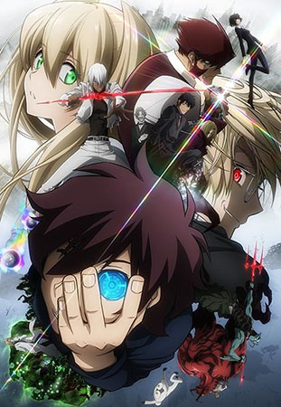
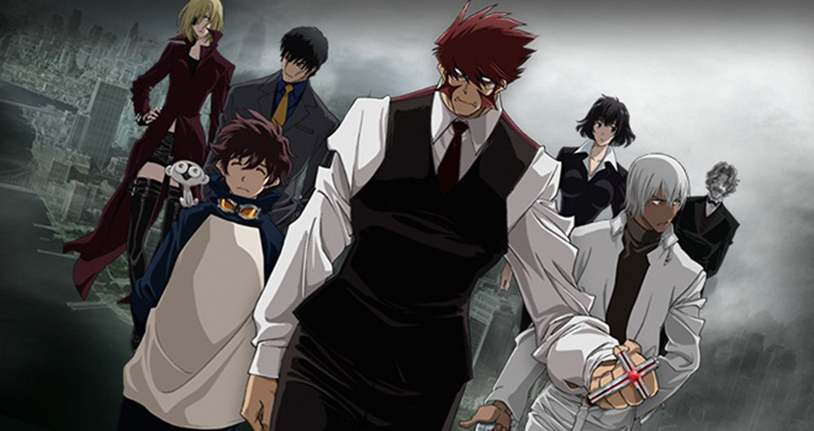
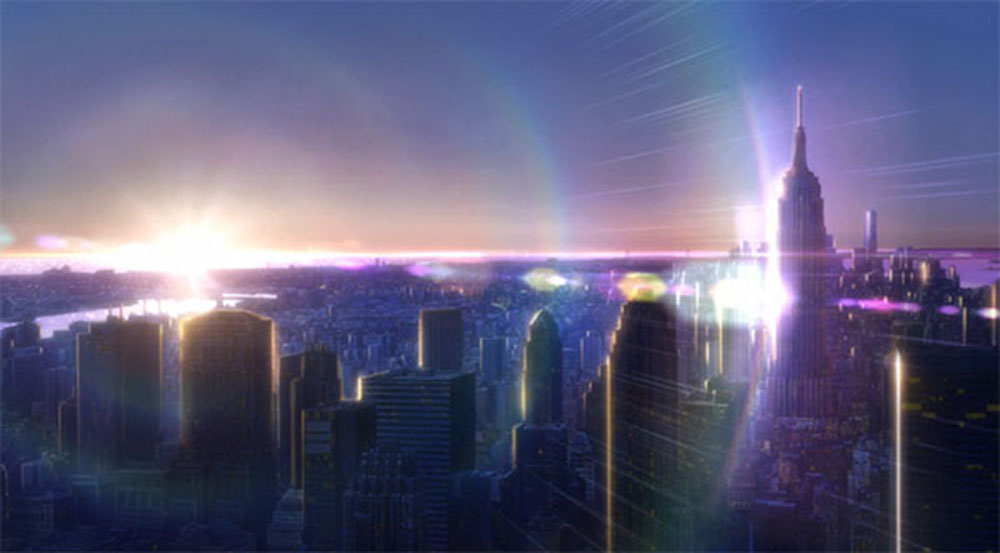
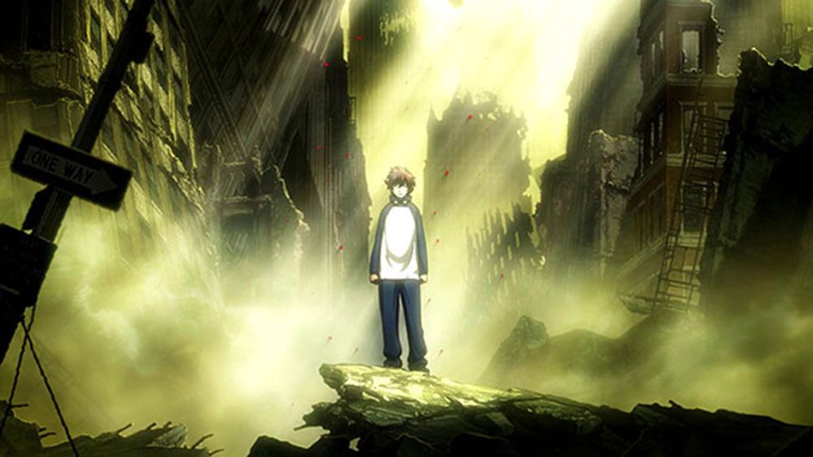

[Kekkai Sensen](https://hummingbird.me/anime/kekkai-sensen) _Blood Blockade Battlefront_

It's not often you see this pulled off at all. Bones wanted to do a double length final episode and apparently the station that was airing it wouldn't accommodate it. I have no idea if they had the final 40min episode ready since the conclusion of the spring season or if they've been working on it for 12 weeks, but final episode finally aired (albiet with Funimation taking a week or so after the airing it to put on their site).

Was the wait worth it?

## Story & Characters

The Rat Pack and aliens set in the 1920's set in a quasi post-apocalyptic New York (now known as Hellsalem's Lot). Interested right? There is a lot to like about the world Bones builds right from the get go. A rift violently opens up in NY dumping aliens and magic creatures along side humans in the worlds most epic melting pot. A band of super human crime fighters known as Libra try to keep the most extreme elements in check. Kekkai Sensen doesn't explain much about the world, instead presenting it fait accompli and weaving characters in and out. The main character, Leonardo Watch seeks out and joins Libra and we follow this chaos as it unfolds.

The super powers are fantastic leading to some epic fight sequences, but I felt the ensemble cast got short shrift through most of the series. Only a handful had any backstory fleshed out. Hell, other than Leonardo's sister he doesn't get much of his backstory out there. Instead there is a focus on the characters White and Black (Mary and William Macbeth) and while necessary to the story's conclusion, I do wish more time at been spent with the members of Libra and Leonardo himself.

There isn't much of a story structure either. Many of the episodes are mostly standalone and the lack of explanation left me grasping at straws a lot of the time trying to follow along. On the other hand, this show is more appropriately viewed as a roller coaster; just hang on for dear life and enjoy the ride.

## Animation & Direction

The animation is truly epic at times -- the amount of detail in background shots is just insane. The blend of seemingly normal New York with absolutely twisted demonic realms was at times simply stunning.

I loved the character designs -- a fantastic blend of absurd and fanciful, especially when combined with all the wild looking aliens cohabiting Hellsalem's Lot.

I do have to mention the direction, specifically "camera" positioning and transitions. A lot of the episodes felt rushed and garbled because of the rapid cuts to very abnormal camera angles. It seemed to me they choose camera placement and edits because they were "cool" and "interesting" to the detriment of the story and narrative. There are one or two episodes that are very 'slow' by comparison (long takes, more traditional camera placement) that seemed like the story was more composed and the transitions were aiding rather than detracting.

## Music & Sound

<iframe width="100%" height="166" scrolling="no" frameborder="no" src="https://w.soundcloud.com/player/?url=https%3A//api.soundcloud.com/tracks/203814002&amp;color=ff5500&amp;auto_play=false&amp;hide_related=false&amp;show_comments=true&amp;show_user=true&amp;show_reposts=false"></iframe>

_Hello, World_ is an epic OP. The vocal style is not something you hear often in anime and the production was superb.

<iframe width="100%" height="166" scrolling="no" frameborder="no" src="https://w.soundcloud.com/player/?url=https%3A//api.soundcloud.com/tracks/207893243&amp;color=ff5500&amp;auto_play=false&amp;hide_related=false&amp;show_comments=true&amp;show_user=true&amp;show_reposts=false"></iframe>

The ED really evokes a modern take on a 1920's feel. Light hearted and funny, it plays well with the humorous elements of the show. It did feel a little out of place as we got closer to the conclusion and they were going for more weight and punch in the episode endings.

The [OST](https://www.youtube.com/watch?v=gqAOnG1Pvi0) is movie-epic as well, blending big band jazz elements with a bit of string electronica. It's definitely an OST I can listen to beginning to end while working and really enjoy it.

## Final Thoughts

Ultimately, I can't imaging them taking the current 12th episode and cutting it in half and doing the show justice, so I'm glad they waited it out to give us a satisfying conclusion. I wish they had gone down the two cour route and I think that would have really helped the pacing (as well as give the writers an opportunity to flesh out the backstory of more of the characters).
