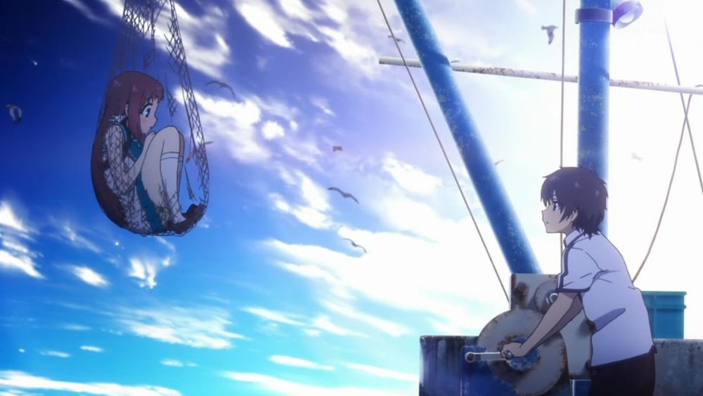

[Nagi no Asukara](https://hummingbird.me/anime/nagi-no-asukara) _Nagi-Asu: A Lull in the Sea_

## tl;dr

_Nagi no Asukara_ is a classic. Period. Full stop. That being said, I would only recommend this if you enjoy character development with little to no "action" and you have the patience to watch character drama drawn out a bit excessively. This show is a feast for the eyes and a great story and characters despite their flaws. If that sparks your interest, go watch it now, cause there will be spoilers contained below.

    ┻┳|
    ┳┻|
    ┻┳|
    ┳┻|
    ┻┳|
    ┳┻|
    ┻┳|
    ┳┻|
    ┻┳|
    ┳┻|
    ┻┳|
    ┳┻|
    ┻┳|
    ┳┻|
    ┻┳|
    ┳┻|
    ┻┳|
    ┳┻| ___
    ┻┳| •.•)  abandon all hope ye who spoil the show...
    ┳┻| ⊂ﾉ
    ┻┳|

## Animation

For me the animation must be dealt with first. I am normally a big fan of PA Works, but they truly outdid themselves on this one. The atmosphere in this world is simply breath taking.

The character design is fantastic and the blending of the "under the sea" settings with the surface was done brilliantly. On animation alone, this show scores high marks, but thankfully there is also a quality story to go with it.

## Story & Characters

The main story revolves around a group of middle-school teenagers and how they deal with one of the most tangled love graphs you'll ever see. Yes... not triangle, a fucking graph! Don't believe me? Here is a rendition of the initial love interests:

The writer for _Asukara_ is [Mari Okada](https://en.wikipedia.org/wiki/Mari_Okada) and if you don't know that name, take note: she is also the writer for [Toradora!](https://hummingbird.me/anime/toradora) and [Anohana](https://hummingbird.me/anime/anohana-the-flower-we-saw-that-day) (among many others). A web of relationships is almost expected given her pedigree.

After the first cour, an event takes place that splits up our cast. Five years later, the graph has evolved into this:

While the show does deal with some serious topics (racisism), it really only makes up the backdrop for the evolution of the main characters.

At times I felt very frustrated due to the "obliviousness" of some of the characters. It wasn't as bad as artificial conflict created because the characters are constantly misunderstanding each other which I usually find insufferable. The focus of some characters and the reticence of others matched their personalities, so the frustration wasn't quite as contrived and forced as it could have been.

## Music & Sound

<iframe width="100%" height="166" scrolling="no" frameborder="no" src="https://w.soundcloud.com/player/?url=https%3A//api.soundcloud.com/tracks/135604338&amp;color=ff5500&amp;auto_play=false&amp;hide_related=false&amp;show_comments=true&amp;show_user=true&amp;show_reposts=false"></iframe>

The first OP set the stage well. _Lull_ matches the initial innocence of the world and characters as we start on this journey. The second OP however was easily my favorite.

<iframe width="100%" height="166" scrolling="no" frameborder="no" src="https://w.soundcloud.com/player/?url=https%3A//api.soundcloud.com/tracks/133508215&amp;color=ff5500&amp;auto_play=false&amp;hide_related=false&amp;show_comments=true&amp;show_user=true&amp;show_reposts=false"></iframe>

_Ebb & Flow_ perfectly sets up where these characters have made it to and where they are going.

The OST matches the animation, atmosphere and story perfectly. Simple in all the right places and really added to the overall experience.

Finally, a shout out to the sound designers -- the underwater sets were brilliantly done. I don't know how they did it, but they managed to convey that same sensation you hear when it's showing outside -- a blanket dampening, combined with the creaking of the ocean was a wonderful effect.

## Final Thoughts

Thankfully this is not a romance anime that fails to give any resolution to the relationships. However, like most romance anime, all the time is spent dancing around one another and there is no screen time allotted to the characters actually being _in_ the relationships.

It took me longer to finish this that it should have -- 26 episodes is really a lot when current shows are usually given only a single cour. If you're interested, here's the [graph](final.png) on how everyone ended up.

I loved this show and I'm sad there isn't more story for me to experience with these characters.

That being said however...

Miuna is the best girl
