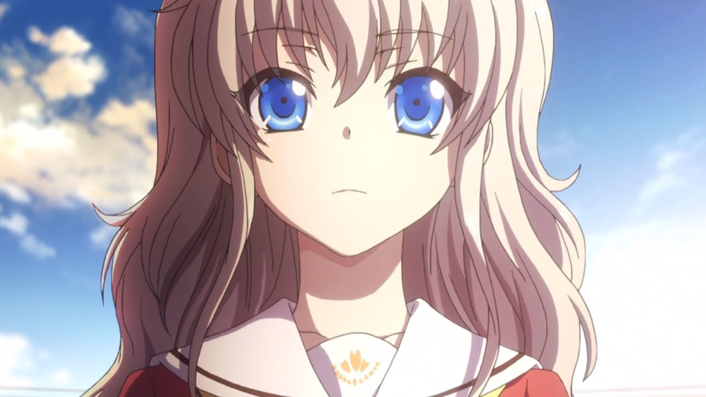

[Charlotte](https://hummingbird.me/anime/charlotte)

I almost skipped this one. The first few episodes felt like a high school version of _Quantum Leap_ (albiet very nice to watch). Not thinking it would end up going anywhere, I put it on hold for about 3/4 of the summer season. A few sites I follow kept posting episode discussions on this show and I couldn't fathom why.

Anyway, during a week when I had caught up on everything else, I decided in delve back into Charlotte... and then I watched episode six.

## Story, Characters, & Animation

I'll let Aniplex give the summary:

> In a world where children have a chance to develop special powers upon reaching puberty. Otosaka Yuu is one such child, choosing to live a relatively normal, satisfying life despite possessing an ability to control others’ bodies for a short period of time. One day, Yuu is suddenly approached by Tomori Nao, another child with special powers. Their meeting sets the stage for a story about growth, their many experiences, and a cruel fate that links the two. A routine life changes to one filled with the unexpected, a promise to return home becoming their only guide down an uncertain road.

tl;dr :: [X-Men the Animation](https://youtu.be/itLS__hFqXk?t=346)

Charlotte is a product of a collaboration between PA Works and Key ([Clannad](https://hummingbird.me/anime/clannad), [Angel Beats!](https://hummingbird.me/anime/angel-beats)) so you get a few things off the bat: great visuals, distinctive character design and (usually) a solid soundtrack.

PA Works doesn't disappoint (again). The character design is closer to that of Clannad than Angel Beats but all around it's another solid entry in the studio's portfolio. But the animation was never the issue.

Charlotte is like two different anime's concatenated together. If you commit to it, this show has a dramatically different second half. The feel, tempo, and pacing are night and day, however the back half feels extremely rushed (especially when you get to the final episode) and many of the side characters get discarded in the process. What saves the show overall is that despite the flaws in the second half, the show manages to turn around a very tepid opening with emotion and drama.

I also have to give credit for the character arc of Yuu (minus the last episode) -- Going from a stuck-up little prick to a genuinely compassionate human being was an incredible feat and one I didn't think could happen when the show started.

## Music & Sound

<iframe width="100%" height="166" scrolling="no" frameborder="no" src="https://w.soundcloud.com/player/?url=https%3A//api.soundcloud.com/tracks/220473870&amp;color=ff5500&amp;auto_play=false&amp;hide_related=false&amp;show_comments=true&amp;show_user=true&amp;show_reposts=false"></iframe>

The show's OP _Bravely You_ is fantastic. Combined with great visuals, the entire opening is what single handedly kept me from dropping the show at the outset.

While the OST didn't really resonate with me while I was watching it, there is actually a nice "concert" in the middle of the second act that is quite good and doesn't feel contrived.

<iframe width="100%" height="166" scrolling="no" frameborder="no" src="https://w.soundcloud.com/player/?url=https%3A//api.soundcloud.com/tracks/223043352&amp;color=ff5500&amp;auto_play=false&amp;hide_related=false&amp;show_comments=true&amp;show_user=true&amp;show_reposts=false"></iframe>

It fits with the mood of the second act and feels very Angel Beats inspired.

## Final Thoughts

Most everyone has pegged the final episode as a complete clusterfuck -- and they aren't too far off. Many rants were born upon that episode airing. There is a shred of payoff at the end, but they could have done a rather awesome second cour with just the contents of the last episode.

Ultimately this show is worth your time. I don't think it's better than Angel Beats, but its in that same vein, and if you enjoyed that one, stick out the first half and you'll definitely be rewarded.
