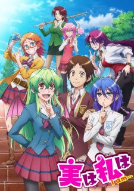
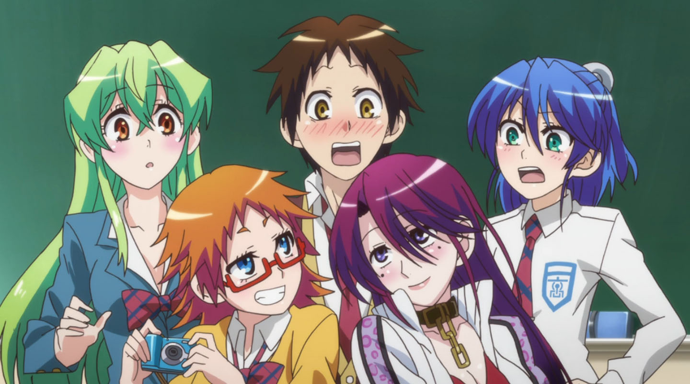
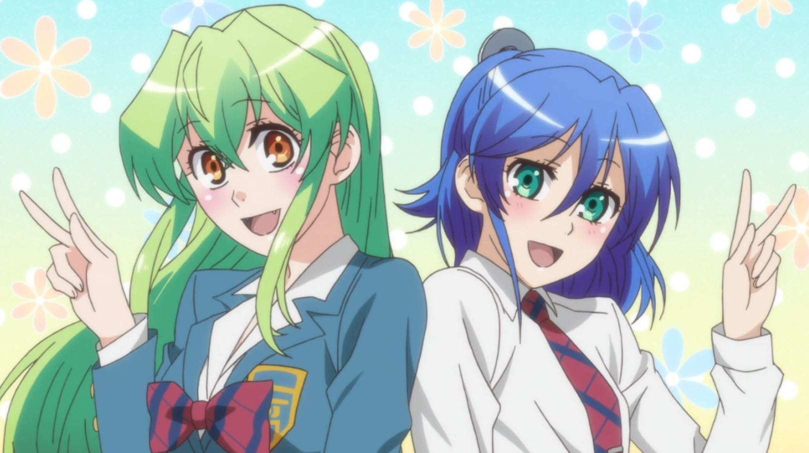

[Jitsu wa Watashi wa](https://hummingbird.me/anime/jitsu-wa-watashi-wa) _Actually, I Am…_

I almost missed this gem. I watched the first 5 minutes of the first episode and dismissed it. The weird (yet distinctive) character designs didn't help. I thought it was going to be just another ecchi, harem show with monster & alien girls (a la [Rosario + Vampire](https://hummingbird.me/anime/rosario-vampire)).

For some reason, I didn't remove it from my Crunchyroll queue... it just sat there, ignored for the remainder of the summer season.

I don't know what caused me to try watching the first episode again, but I'm _so_ glad I did. For me, this show ticked off most of the things I want to see in a romantic comedy and it quickly became one of my favorites.

## Story & Characters

The basic premise is a well run trope -- An emotionally transparent and good natured high school student is so open that he can't keep secrets. Urged by his friends, Asahi Kuromine decides to confess to his classmate crush Yoko Shiragami -- only to discover she's a vampire. A sweet, but incredibly dense vampire...

One of the reasons I stopped watching the first time was that I thought this trope was going to get in the way -- that it would focus exclusively on his inability to keep secrets. Thankfully it turns out this is just part of the setup. The show uses it as a character trait rather than a plot device.

There really isn't much that's ground breaking in the story. It's just a sweet story with likable characters and it doesn't overplay the ecchi or inevitable relationship conflict. In fact, I felt genuine empathy for the other two girls who like Asahi but struggle to hide their feelings given how obvious Asahi's feelings are for Yoko.

## Animation

The character design grew on me surprisingly. They are "weird" when compared to what other studios are producing now, but it actually fits the characters. The backgrounds aren't anything to write home about -- it's all about the characters.

Don't let the design put you off.

## Music & Sound

<iframe width="100%" height="166" scrolling="no" frameborder="no" src="https://w.soundcloud.com/player/?url=https%3A//api.soundcloud.com/tracks/213586593&amp;color=ff5500&amp;auto_play=false&amp;hide_related=false&amp;show_comments=true&amp;show_user=true&amp;show_reposts=false"></iframe>

Most OP and ED for shows that I binge on I often end up skipping (because I just heard them 20 minutes ago). Not so with either of these. I listened to them every time and they really grew on me to the point where a few times I wen't back and listened to them again before breaking for the night.

<iframe width="100%" height="166" scrolling="no" frameborder="no" src="https://w.soundcloud.com/player/?url=https%3A//api.soundcloud.com/tracks/215645420&amp;color=ff5500&amp;auto_play=false&amp;hide_related=false&amp;show_comments=true&amp;show_user=true&amp;show_reposts=false"></iframe>

It also helped that there is a really funny "Quiz" bit at the end of the credits which I highly recommend. Watch to the very end... you'll get one last laugh before it ends.

## Final Thoughts

How crazy good was this summer season?! Had I given this a chance initially, it would have been a show I watched as _soon_ as it was available on Crunchyroll. Ultimately I'm so glad I didn't end up missing this.

This show was so good, I will definitely go out and pick up the manga. The english release of the first volume is out in January, 2016 from [Seven Seas](https://www.gomanga.com/books/my-monster-secret/665).
