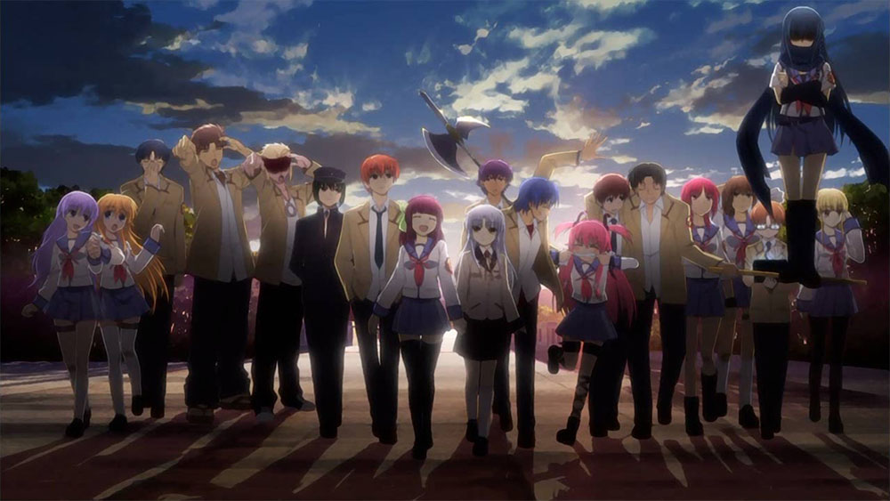

Any medium has the potential. So submerged in the story & characters you find yourself totally taken emotionally.

I'm not one of those people who claim "I cry at nothing." Certain things will definitely get me choked up by just the weight of the emotion involved -- even things that you wouldn't necessarily think would do so. An example would be ESPN's [20th Century Montage](https://youtu.be/jlmxHvOWKB0?t=32). Even though it's entirely sports related, there are moments in that were I get choked up because of the sheer emotional punch those moments represent. Part of that is knowing the context and why, but that is beside the point for the current discussion.

There are a few _really_ good anime shows where I was so tightly wound around the story and characters where I can say (without shame) that tears were shed -- and in one case caused me to openly bawl my eyes out and even thinking about it now causes tears to leak.

Below is collection of anime whose story and characters packed a huge emotional punch. While I will try not to spoil the punches too much, I recommend watching each of these with as little known before as possible. I can definitely recommend each and every one of the shows below, so you should go watch them first.

# Emotionally Choked Up

### Gakkou Gurashi!

The most recent show on this list is here because of its emotional range -- cute moe, fear, desperation, loss... It truly ran the gamut and that roller coaster made it's gut punches that much more effective.

The realization of reality that Yuki goes through (almost like a loss of innocence) is really heart breaking _because_ she was this foundation for the rest of the girls even if it was just their desire to not let reality pop that bubble.

That and that damn dog...

### Toradora!

Christmas Eve. If you've seen this show, you know the scene of which I speak.

Toradora has the best execution of this style of romantic triangle evolution. The chemistry between Ryuuji and Taiga builds up to the events after the Christmas party and it truly is soul crushing when realization of how she really feels washes over her.

Thankfully, the punch is pulled a bit here since there are still five or so more episodes after that point to pull you back out of the emotional hole.

### Angel Beats!

I kind of knew what was coming from a few episodes in -- as each supporting character "moved on" I knew what might be in store at the end. What I didn't know was how they were going to deliver that blow.

They are all dead after all... how could the knowledge of how they got there significantly change things? Well, this show proves (and is topped by a show further down the list) that reasons do matter.

I watched this show significantly after it aired and bits and pieces had filtered in, so I don't think the end hit as hard as it might have.

# Real Tears

### Plastic Memories

From the moment you start this show, you know there is going to be hard gut punch at the end. Hell, even the first episode manages to crush your soul and that is for two characters you barely even know yet.

I enjoyed the fact that there were no frills or gimmicks in the story. You knew (or could guess) the destination -- it was just a matter of the journey getting there. There was a lot of potential for trite cliches throughout and I think they managed to avoid a lot of pitfalls. The audience really grew to love Tsukasa and Isla even though everyone knew from the start that there was a time limit to their relationship (and both sides know it going into it and yet still choose to make the effort).

I will never look at ferris wheels the same way again, however.

### Death Parade

The premise of this show is to deliver multiple gut checks throughout the season, and Madhouse did a fantastic job quickly introducing two new characters each week and weave a narrative that resulted in some epic scenes.

However, the penultimate feels train goes to the unnamed dark-haired women who is Decim's companion. While we don't get her backstory until the very end, I was very emotionally invested in _why_ she was there, since the show makes it plain she is human while Decim and the others clearly aren't. The reveal definitely doesn't disappoint in the feels department.

# Complete & Total Emotional Wreck

### Shiatsu wa Kimi no Uso

If you haven't seen this (or better yet, not heard of it before), **stop right now** and go watch this show.

    ┻┳|
    ┳┻|
    ┻┳|
    ┳┻|
    ┻┳|
    ┳┻|
    ┻┳|
    ┳┻|
    ┻┳|
    ┳┻|
    ┻┳|
    ┳┻|
    ┻┳|
    ┳┻|
    ┻┳|
    ┳┻|
    ┻┳|
    ┳┻| ___
    ┻┳| •.•)  did you see it? do you need a hug?
    ┳┻| ⊂ﾉ
    ┻┳|

It is hard to put into words how much this show crushed my soul into itty bitty pieces. I only knew this show by the name _Shiatsu wa Kimi no Uso_ -- I didn't know what the english translation of the title was. When all was revealed at the end, I was seriously devastated. I think I cried for 30 minutes straight after that... I was inconsolable. It was so bad that for months afterwards, the mere _thought_ of this show would cause me to choke up. I think the only reason I can write this now is that my mind has partially blanked it out for self preservation.

This show is absolutely worth watching, so don't let the preceding paragraph dissuade you from starting this show. I haven't spoiled much, and if you are in anyway a musician (especially a serious piano player), you will love this show. The music is out of this world and the animation is fantastic.

Just head to Costco before you start and stock up on Kleenex.
