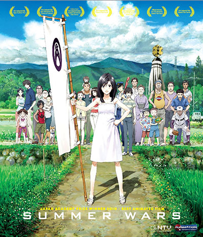
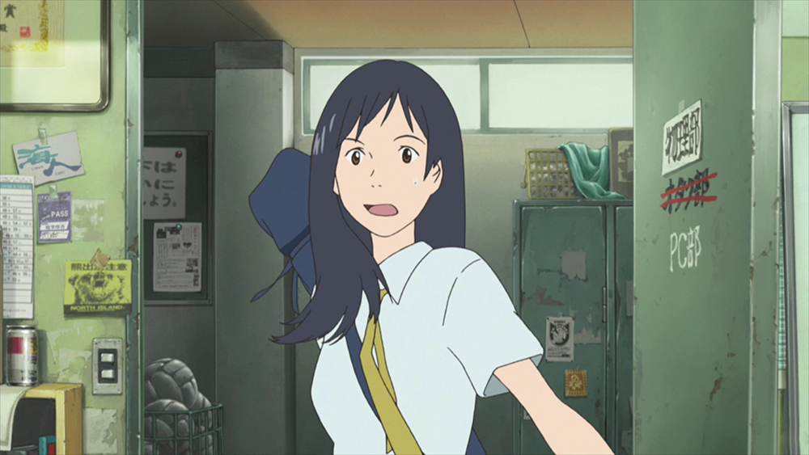
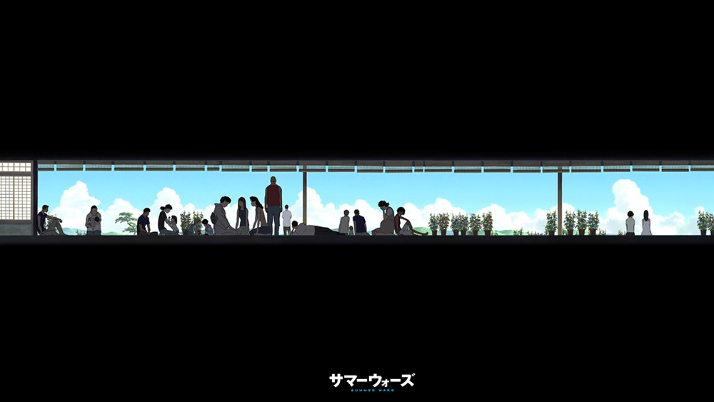
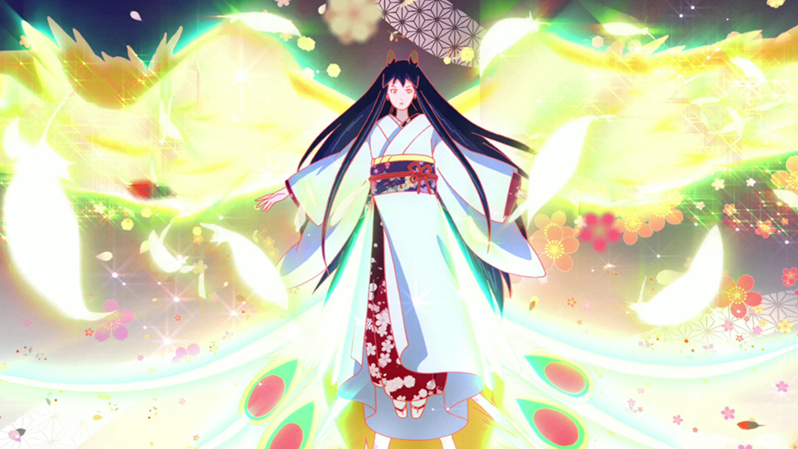
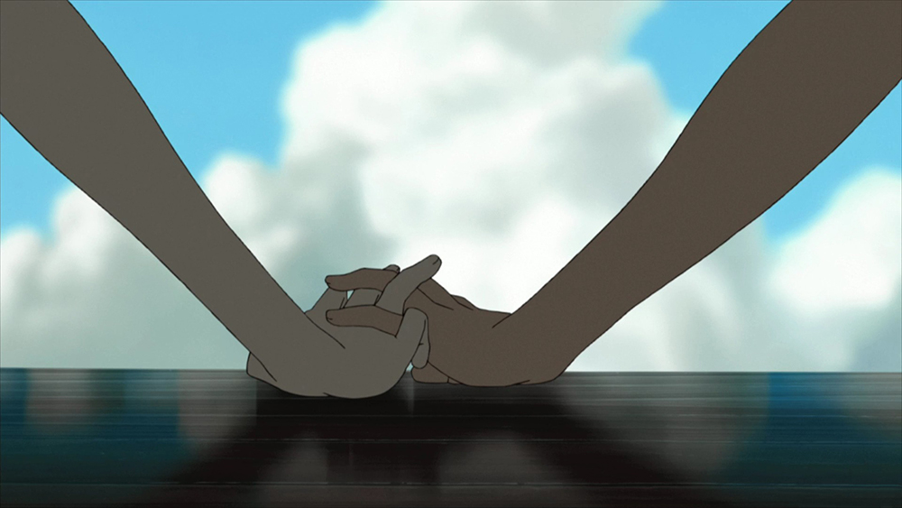

[Summer Wars](https://hummingbird.me/anime/summer-wars)

I'm not sure how this movie came on my radar (probably because of it's ranking in the [Hummingbird's Explore Anime](https://hummingbird.me/anime/filter/all) section). Once I figured out I generally enjoy works by Madhouse, I figured I might enjoy this one and added it to my queue. Since the fall 2015 season is a lot less full, I've had the chance to work my way through other series, and Summer Wars was the first movie (rather than series) that I pulled out of the queue.

Boy, am I glad I did.

## Story & Characters

The initial setup is a little vague but we start out with Kenji, a shy and nerdy high school student who volunteers to help Natsuki, an older student and secret crush with a summer job. Her family is gathering at her grandmother's house to celebrate her 90th birthday and she needs Kenji's help with a small little detail.

The added wrinkle in the story is that it takes place some time in the future where a _Snow Crash_ type virtual reality called Oz has permeated every facet of society. Everyone has avatars and this world seems to have replaced every level of standard communication in everyone's lives in both professional and social capacities.

What follows is fantastic interplay between distressing events taking place in Oz and the craziness of Natsuki's large family led by her grandmother. The dynamics of the large family was brilliantly done (as someone with exposure to a large family can attest to).

I loved that while Kenji's personality is shy by default, he does stand up for himself in ways that were exceptionally likable. I also appreciated the fact that Natsuki herself doesn't occupy a stereotype exclusively -- she gets her moment to shine and equally shares the "saved the day" honor in the end.

For director Mamoru Hosoda, _Summer Wars_ follows his success with [The Girl Who Leapt Through Time](https://hummingbird.me/anime/the-girl-who-leapt-through-time) (another Madhouse classic that I hope to watch soon). He would later go on to direct [Wolf Children](https://hummingbird.me/anime/wolf-children) so we have a pedigree here that will not disappoint most people.

## Animation & Sound

This is prototypical Madhouse animation -- both the Japan setting and the Oz setting stand out in their own ways. The detail in the real world environments is incredibly rich. As someone who doesn't watch as many anime films as TV series, it was refreshing feast for the eyes. My only complaint with Oz was it was too sterile for what I image a VR system like this would be. If they had actually gone in a more _Snow Crash_ direction where the world felt more lived in, it really would have been awesome.

I also think Madhouse has a thing about games, for not long after this movie was done they did _No Game No Life_ and _Death Parade_ which definitely take the game storytelling aspect to 11. Speaking of _NGNL_, I think a lot of the sound design of Oz carried over, because there were definitely times where sounds were causing deja vu.

The voice casting is spot on. There aren't any big names on the bill so there was never a "Oh that's the voice of X" moments. This is a huge plus in a film like this as it feels even more like a big gathering of normal people.

## Final Thoughts

You can't go wrong with _Summer Wars_ -- fantastic story, characters and animation. There is an english dub which seems so-so from the clips I've seen from youtube (though it does include J. Michael Tatum which is one of my all time favorite english voice actors). I will probably try to track down a copy as I think my kids will enjoy this one in a few yers.

This is the first of Hosoda's big films that I've seen and as a result I will definitely make sure to get to _TGWLTT_ and _Wolf Children_ **very** soon.
