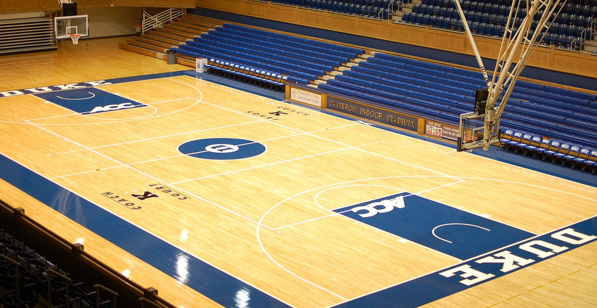

I found an old post from the old [DBR](https://dukebasketballreport.com) forum about the Duke vs UNC game played on February 1, 2001 and I thought I'd share it. I couldn't find the original post (not sure if it made it through the DBR revamp) so credit goes to _WI Dukie_

 <small>Credit: <a href="https://flic.kr/p/7fpAza">Lindsay Hickman</a></small>

I was one of the members of DUMB that stuck around well after the game ended and this is one of my favorite memories of getting to play in the band in Cameron Indoor Stadium.

> I sometimes have trouble finding the bright side of things. I am never that person that is always telling people to cheer up. I don't like losing. I especially don't like losing to the 'Heels. I really, really don't like doing so in Cameron, even less so when its my last UNC game as a student.

> But, February 1, 2001 will go down as one of my most memorable nights as a Cameron Crazie.

> Despite being sick as a dog, I was especially pumped for this game. Mount Olympus (my tent) had been through some interesting times, but it was hopefully about to pay off. We almost all dressed in togas, just to do something stupid, and were ready to go nuts. Last UNC game. Time to rock.

> There was a game played. It was exciting, it was close, it was frustrating as all hell. The result was not what we had all hoped for. I didn't need to see Haywood give the throat-slitting gesture. But, in many ways I think it will be good for the team. They need to feel the sting of losing. They need to realize that, if you play badly, you cannot always save the game at the end.

> After the game, the UNC fans celebrated. I ran from my seat and jumped onto the court. Don't really know why. I guess I wanted to stop the UNC fans from celebrating, but I know I didn't want to perform any Maryland type thuggery. So, I stepped in front of a few cameras taking pictures of UNC fans standing on Cameron's floor. I also shook a few UNC fans hands, told them they played a good game, and that I was looking forward to the re-match in Chapel Hill. Joe Forte walked by, I patted him on the back and said he had a nice game, he seemed to appreciate it, and he did have a really good game.

> So, I wandered around Cameron aimlessly, commiserating with friends and strangers. UNC fans were still dancing and jumping on Center Court, walking around talking about how Cameron was their house now. Cheers of "Let's Go Duke" and "Our House" sprang up. A couple of brave girls ran into the pack of UNC fans at center court and got them to start leaving. A bunch of us followed them and sat down, guarding it from any more torture.

> Everywhere you looked, Crazies had their fist in the air. This is a new thing, but it is a very, very good thing. Coach K told the Crazies that the team was like a fist. The five fingers are the five players on the floor. The five players have to work together to be effective, but they need other members of the team, other parts of the fist, like the Crazies, to succeed. Many painted their fist blue, and we all stood silently during UNC intros with our fists pointed at the Duke bench. After the game, those who stuck around put their fists in the air to show support (although one middle-aged man got rather upset and thought it was a Nazi symbol, he was set straight).

> So, there we sat. Every once in a while, some boisterous, annoying UNC fan would yell something. One tried to hang on the rim. Can't really blame them. If I had lost five straight, I'd be might happy as well.

> People eventually began to leave. A few of the players walked around, greeted with applause. About an hour after the game ended, all that was left were, I guess, about 20 fans (Crazies and DUMB folks), ESPN crews, and family members. Word came through that Coach K was coming out.

> Coach K walks out with a smile on his face and goes directly to the throng of students, and we closed in on him. He told us right off the bat how much the fist at intros meant to him (it's a keeper, folks). He went on to say that the team is taking steps to becoming a greater team, but that there will be bumps in the road. There will also be few nights where the team hits less than half of their free throws. He said this happened because the players wanted it too much, were trying too hard.

> I see this as a very good thing, my friends. Now they just have to harness this extra energy.

> Coach K went on to say that he thought Chris got off a good shot and that he thought it was in. Chris was in on the huddle (so was Mrs. K) and piped up "Me too". But, the important thing is to move on to Florida State and come out ready to go. He put out his fist, we threw ours on top, and broke on 1-2-3 "Win".

> It was rather special that Coach K came out to speak to a couple dozen Crazies who were in Cameron because they didn't really know what else to do. He didn't have to take the time after a tough loss, but he knew that it would help some members of the student body. Although I had always taken K's assertions that we were part of the team with a grain of salt, I saw a legendary coach take the time to console a little more than a handful of fans, and taking pleasure in doing so.

> Thats when I realized that Duke Basketball is much bigger than I had previously thought. It was not just about the game that had taken place, it was bigger than that. It was bigger than any fan, any player, and, yes, bigger than even Coach K. What makes Duke basketball so special is the extent to which it touches people. It's what makes college kids used to all of the comforts of our high-tech age sleep in tents. It's what makes fans and alumni follow the team with such devotion and passion. It's what makes sleep-deprived and sick college seniors hang around an old gym for 1.5 hours after the game just because it comforted him and he couldn't think of being anywhere else.

> It's what made dozens of students stand resolutely with their fists raised for more than an hour after their team had just loss a tough game to their main rival.

> It's what makes a living legend come out and console a few random undergraduates when there are many other things such a powerful and influential man could be doing.

> It's why I will be have to dragged out of Cameron after the Maryland game in a few weeks.

> So, I don't know why I just wasted all of your time (as if you got this far). I just had to share, even if no one wanted to hear it. Maybe its just because my time as a Crazie is almost done. Maybe the last couple nights in the tent were a bit too interesting. Maybe I have been taking way too much cold medicine. But, tonight will be one of my most memorable as an undergrad. The support for the team and the camraderie between the fans, the team, and the Coach was all brought into focus tonight. It is nice to be reminded how special things are. Sometimes it is so easy to forget....

> I will now sleep, hopefully this long, wispy, melodramatic bug will leave me.

> WI Dukie

For the record, that team went on to win the National Championship a few months later.
