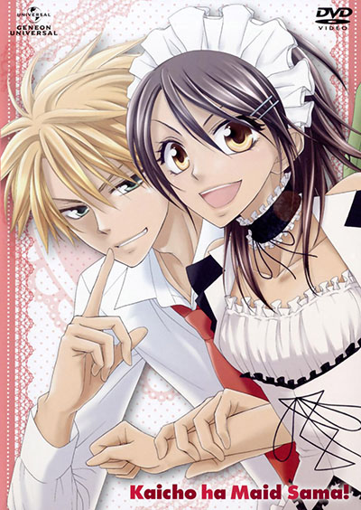
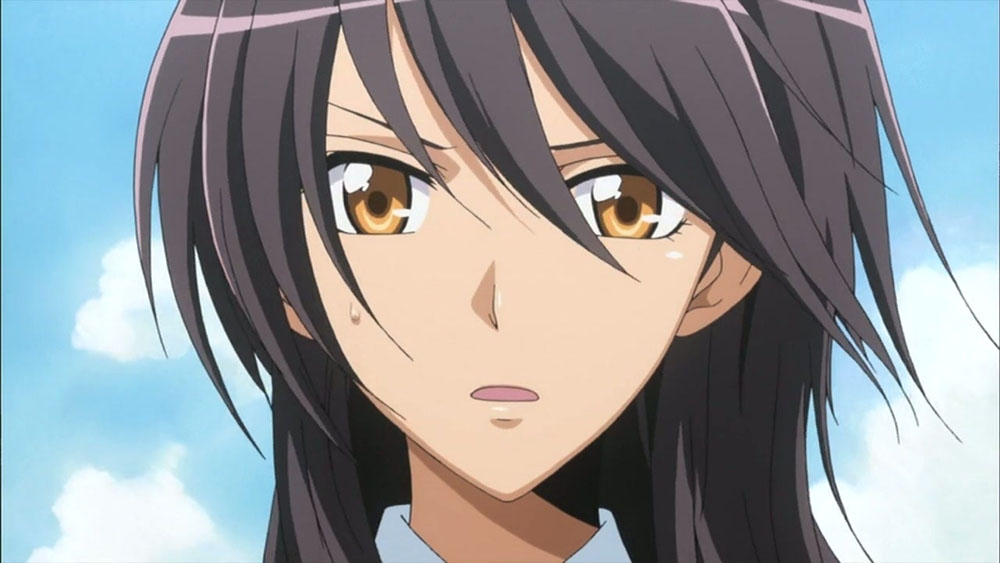
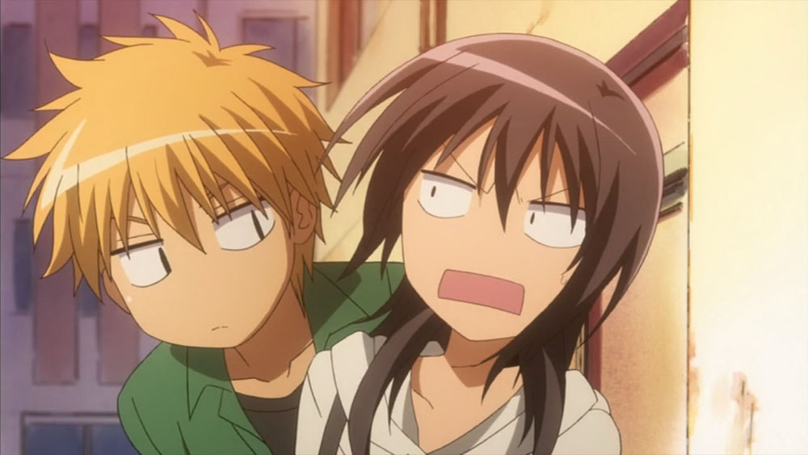
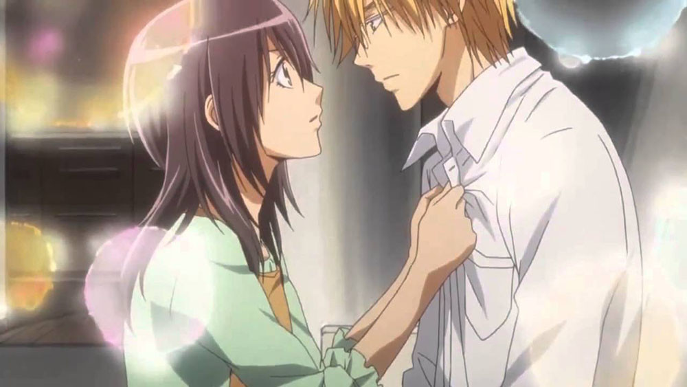

[Kaichou wa Maid-sama!](https://hummingbird.me/anime/kaichou-wa-maid-sama) _Maid-Sama!_

I don't think I've been so conflicted about an anime as I was watching _Maid-Sama!_ On the one hand, I loved the female protagonist -- kicks ass and takes no prisoners. On the other, the male lead is one of the scummiest, aloof jerks I've ever come across in a rom-com. In addition, despite an empowering female lead, there are situations between the two main characters that scream male domination where I actually felt uncomfortable -- it felt like an anime from a previous decade, not 2010.

## Story & Characters

_Maid-Sama!_ is a well regarded rom-com with a fantastically empowered female lead, Misaki Ayuzawa.

Let's unpack this synopsis:

> Seika High School, once an all-boys school notorious for its wild students and for generally being a terrifying place for girls, has recently become a co-ed school. With the female population still a minority and living in fear of the over-the-top antics of the males, Misaki Ayuzawa takes it into her own hands to reform the school and allow the girls to feel safe in the rough environment. Training, studying and even becoming the first female student council president of the school, Misaki has gained a reputation among the male students body as an uptight boy-hating dictator and as a shining hope for the teachers and fellow female students. However, despite her tough-as-nails appearance, she secretly works part-time at a maid cafe in order to support her family. Unfortunately, her hard-earned reputation is threatened when the popular, attractive, and somewhat impassive Usui Takumi takes an interest in her after discovering her in a maid uniform after school. (Source: Wikipedia)

So part of the setup is Misaki putting her stamp on this male-dominated community -- something she does very well. Her strength and ability to lay down her law unapologetically was genuinely fun to watch. She leads by example and I can truly understand why she is so desperate to keep her part-time job a secret.

Where I get tripped up is the "male-power" vibe that graces it's way through the show. Perhaps is just a cultural _lost in translation_ thing -- I usually avoid shows that skew this heavily into male domination. If it weren't for the dominant female lead, I would definitely have kicked this one by the wayside.

Additionally, this show runs 26 episodes (with a handful of quirky filler episodes thrown in). This is definitely a case where a tighter focus (13, or perhaps 18 episodes) would have improved the show dramatically.

## Animation

The animation here won't be winning any awards. While the character designs are high quality (complete with hyper stylized character shots with boarders -- I don't really know how else to describe the style) the overall production is rather minimal (possibly by design). The backgrounds are plain and minimal for the most part. The comedy aspects are accentuated with "cat eyes" and exaggerated movements (I'm at a vocabulary loss to describe this style but is often used in comedy or in comedic situations).

## Music & Sound

_Maid-Sama!_ has no OP or ED songs, which would have been a staple even in 2010. The OST in general never really caught my ear either.

## Final Thoughts

Did I like it? Yeah, for the most part. Would I recommend this? Eh. There are a bunch of other rom-com's out there that I would definitely recommend well ahead of _Maid-Sama!_. If you've already made it through those and are generally a fan of the genre, give this a try. I think Misaki's character is enough to salvage the shows general faults.
