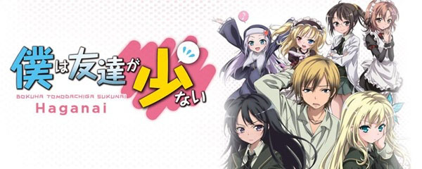
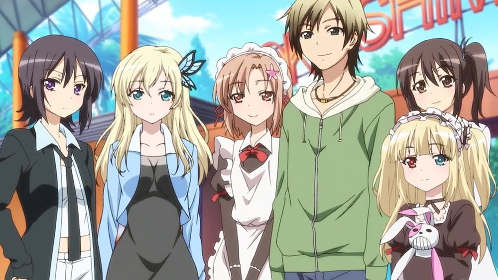
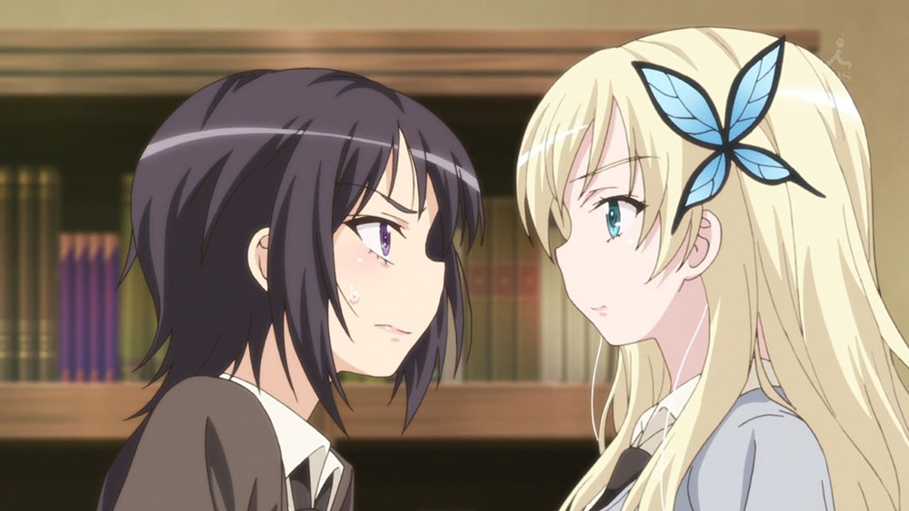

[Boku wa Tomodachi ga Sukunai](https://hummingbird.me/anime/boku-wa-tomodachi-ga-sukunai) _Haganai_

Is this show ecchi? Hell yes. Is a standard harem show? Absolutely.

But there is a nugget -- a kernel -- within the story and characters that lets it almost (but not quite) completely redeem itself.

## Story & Characters

It's your basic ecchi/harem/romcom plot: Our male protagonist, Hasegawa Kodaka, is a recent transfer student and due to unfortunate misunderstandings and is appearance is shunned/avoided by the rest of the students. As a result he has no friends to speak of. He runs into a fellow student, Yozora Mikazuki, who appears to be equally outcast and together they _happen_ to form a new club dedicated to trying to figure out how to get or make friends. They are shortly joined by a girl who they wouldn't think needed friends (Player 2 has joined the game...)

While there are other students who end up joining the club looking for friends, they are mainly there for comedic relief and they aren't nearly as well defined as the first three who form the main relationship triangle. The longing for friendship and their struggles seem completely genuine. These characters are prickly and oblivious in realistic ways. This sincerity won me over very quickly which is the main reason that I probably ended up overlooking what are very obvious flaws.

## Animation

While not breaking any new ground, the animation is quite good for what is essentially a romantic comedy. The character designs are top notch with a word of warning that this definitely is ecchi. There is actually genuine nudity instead of strategically placed hair, steam and clothing which you don't typically see in this genre. This may be just my blinders, but it the ecchi didn't feel gratuitous with this show -- to put it simply, I've seen much worse.

## Music & Sound

<iframe width="100%" height="166" scrolling="no" frameborder="no" src="https://w.soundcloud.com/player/?url=https%3A//api.soundcloud.com/tracks/221550718&amp;color=ff5500&amp;auto_play=false&amp;hide_related=false&amp;show_comments=true&amp;show_user=true&amp;show_reposts=false"></iframe>

The OP & ED are catchy and ended up in my "anime music" playlist. The OST in general was solid but not ear catching.

## Final Thoughts

In many ways, this show reminded me a slightly less sophisticated [My Teen Romantic Comedy SNAFU](https://hummingbird.me/anime/my-teen-romantic-comedy-snafu). There is a second season which I haven't started yet and I genuinely hope they don't end up ruining the show. There are very few anime (hell, TV shows in general) that can pull off resolving a relationship triangle without negatively affecting your opinion of either the characters or the show as a whole. [Toradora](https://hummingbird.me/anime/toradora) might be the sole exception to that rule. In this particular case, I think I'd be OK with the show ending without resolving the triangle.
