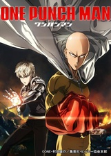
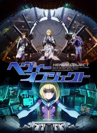
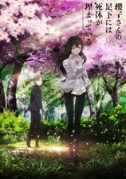
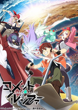
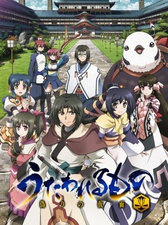
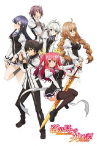
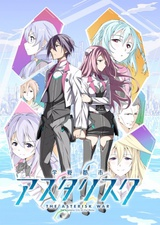
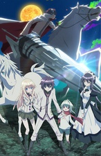
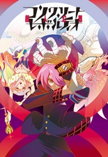

This season had a lot fewer shows that I was interested in when compared to the outstanding Summer season. I ended up dropping more shows then I usually would. I only ended up watching four shows to their conclusion this season (a significant drop from Summer's count of eight). I used the extra time to catch up on some movies and older shows that had been sitting in my queue for a while.

 

### [One Punch Man](https://hummingbird.me/anime/one-punch-man)

_Herooooooo!_

Well, it definitely lived up to the hype -- which really is a massive achievement in and of itself. Sure, there are plenty of flaws, but OPM's essence is just pure, unadulterated fun. I would definitely expect over time this show will overtake [Fullmetal Alchemist : Brotherhood](https://hummingbird.me/anime/fullmetal-alchemist-brotherhood) for top billing on the all time anime charts (which is probably unfair to FMA:B, but does show how much everyone seemed to enjoy it, including me). Pure spectacle -- characters, animation, music. A complete package.

Enjoy it with everyone's blessing.

 

### [Heavy Object](https://hummingbird.me/anime/heavy-object)

_Dropped!_

Wow, talk about disappointment. I couldn't even get past the first episode... it was just _blah_! Random military school-ish situation with random ecchi situations. How perfectly mediocre. It's definitely been a while since JC Staff has made anything that I really enjoyed. I don't think they have anything coming out for Winter either, so unfortunate all around.

 

### [Sakurako-san no Ashimoto ni wa Shitai ga Umatteiru](https://hummingbird.me/anime/sakurako-san-no-ashimoto-ni-wa-shitai-ga-umatteiru)

_Not what I thought_

So it turns out, Sakurako _might_ be engaged, given that we _never are even introduced to her fiancé!_ While I enjoyed this, it's no [Hyouka](https://hummingbird.me/anime/hyouka) and my rating will probably drop further if it never gets a second cour. Being basically a "mystery of the week" type of show, there was almost no character development to speak of. We find out bits of Sakurako's backstory, but never get to the main mystery of her past. We are introduced to what should be a central antagonist essentially in the final episode. Since there is no manga, I'm assuming they are trying to setup a second season that allows Sakurako to match wits with this antagonist. If you haven't started this, I might suggest holding off until the second season is confirmed.

 [8-Bit](https://)

### [Comet Lucifer](https://hummingbird.me/anime/comet-lucifer)

_Dropped!_

My high hopes after episode 1 were completely dashed in episode 2. I'm glad I ended up dropping this one, because based on the episode ratings, it was a fairly clear nose dive.

 

### [Utawarerumono: Itsuwari No Kamen](https://hummingbird.me/anime/utawarerumono-itsuwari-no-kamen)

_Might be Hold territory_

Turns out this is a follow-on series set in the same universe (both based on a game). The pacing feels incredibly slow with a 24 episode run. Through episode 8, there is still no conflict -- no antagonist. Just minimal character and world building. Maybe this is supposed to be more fan service to those who watched the original. I'll probably get to the rest eventually once the run completes.

  [Silver Link](https://)

### [Rakudai Kishi no Cavalry](https://hummingbird.me/anime/rakudai-kishi-no-cavalry)

_Suprising!_

On the whole... Not bad. Not great mind you, but it could have been worse (see below). Characters were good, conflicts were compelling, OP was visually striking. On the whole, if you don't take it too seriously, you'll probably end up enjoying this one.

 

### [Gakusen Toshi Asterisk](https://hummingbird.me/anime/gakusen-toshi-asterisk)

_Completed Dud_

So while I technically completed this one, I definitely wouldn't recommend it. This just bled mediocre. Shallow characters with no compelling conflict. For as much similarity that the first episodes of this and Cavalry showed, they both diverged immediately. Cavalry's characters were compelling, having complex motivations (even taking into account a bit of Deus Ex Machina). Asterisk's fell flat from moment zero and was never able to recover.

 [Studio Gokumi](https://)

### [Lance N’ Masques](https://hummingbird.me/anime/lance-n-masques)

_Dropped!_

Yeah, this one didn't make it past episode 2 for me. Ugh. Just bad.

 

### [Concrete Revolutio: Choujin Gensou](https://hummingbird.me/anime/concrete-revolutio-choujin-gensou)

_Incomplete but Held_

This one I'm putting on hold. Apparently they got Gen Urobuchi to write some episodes for the second season (which is already green-lit), so maybe there is something there underneath the weird that I'll discover down the road.

Hero image created by Zana at <a href="https://neregate.com/blog/">neregate.com</a>  
The following websites were used as sources of information to create the chart : 
<a href="https://www.animenewsnetwork.com/">ANN</a>
<a href="https://m-p.sakura.ne.jp/">Moon Phase</a>
<a href="https://myanimelist.net/">MAL</a>

