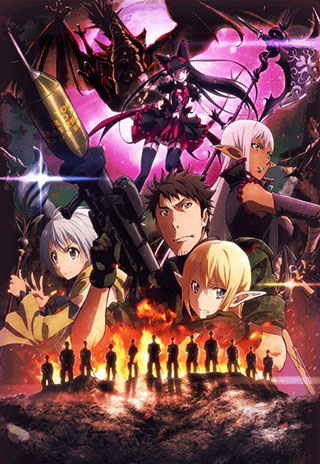

First off... Just how many concurrent projects can A-1 Pictures handle? The sheer volume is staggering.

What is also shocking is that I haven't dropped a single show after it's first episode! This season is going to be crazy if none of the shows below are drop worthy. There is one show that I _really_ hope will be as good as it seems like it could be and the rest coming in solidly average. I'm in for a lot of content this season.

 

### [Gate: Jieitai Kanochi nite, Kaku Tatakaeri - Enryuu-hen](https://hummingbird.me/anime/gate-jieitai-kanochi-nite-kaku-tatakaeri-enryuu-hen)

This means I now get to actually finish the first cour (I usually do that to avoid the season ending cliffhanger). My impression of the first cour was _meh_ but it was interesting enough that I'm curious if we'll get any more depth in the characters.

 2nd Season") 

### [Ansatsu Kyoushitsu (TV) 2nd Season](https://hummingbird.me/anime/ansatsu-kyoushitsu-tv-2)

The first cour was fun and entertaining despite some uneven pacing. The only issue is that this is _another_ 24 episode run. How much original story can they have? I may let this one marinate for 12 episodes or so to make sure it's living up to the promise of the first season -- specifically does it actually go into the backstory of our main antagonist.

 

### [Boku dake ga Inai Machi](https://hummingbird.me/anime/boku-dake-ga-inai-machi)

Wow.

To say that the first episode sucked me in is a significant understatement. By episode 2 I was committed. What a fantastic opening to a show. I really, _really_ hope A-1 doesn't do something to screw this one up, because I think it could hands down be the best show of the season.

 

### [Musaigen no Phantom World](https://hummingbird.me/anime/musaigen-no-phantom-world)

On first glance, this appears to be a more light hearted version of [Beyond the Boundary](). The animation definitely doesn't disappoint -- there are not many studios that can top Kyoto Animation for pure eye candy. That being said, there is a bit too much pandering for my tastes -- too many provocative female poses for no reason other than fan service.

By episode 2, we are still just being introduced to the mechanics of the world. I'm hoping the characters take a front seat soon, or this may end up just being a _meh_ show.

 

### [Hai to Gensou no Grimgar](https://hummingbird.me/anime/hai-to-gensou-no-grimgar)

This is [Sword Art Online]() with amnesia and by the opening of episode 2, they definitely make it clear this is not your parents SAO. The killing of the goblin was honestly difficult to take it. It was clear this was essentially murder and seeing how the characters processed that event was striking. This wasn't like SAO where enemies just went _poof_. I'm really curious to see where this goes. A final note on episode 2 -- taking almost a full 5 minutes of dialog-less animation with a fantastic song after the killing of the goblin was a gutsy call and in my mind paid off in spades.

 

### [Akagami no Shirayuki-hime 2nd Season](https://hummingbird.me/anime/akagami-no-shirayuki-hime-2)

Yay! So happy this got a second cour so soon! My one worry is that the level of tension will make this show unenjoyable for me. I loved the first season _because_ it was so light hearted. My concern with the opening episode is that we have a bunch of _because plot_ happenings to separate our main characters, and they are _hinting_ at a love triangle, which I will not stand for if they go down that route.

 

### [Ao no Kanata no Four Rhythm](https://hummingbird.me/anime/ao-no-kanata-no-four-rhythm)

> In a world where flying is as simple as riding a bicycle, there is a popular sport called "Flying Circus."

Ummmm... Ok.

This show hasn't lost me yet, but I might be quick to pull the dropped trigger on this one.

 

### [Dagashi Kashi](https://hummingbird.me/anime/dagashi-kashi)

_Wierd_ doesn't begin to cover this show. I'm sort of assuming dagashi is a Japanese equivalent of Little Debbie Snacks, just with more flavor variety. I'm not totally sold on this one yet, but the humor seems decent.

 

### [Haruchika: Haruta to Chika wa Seishun Suru](https://hummingbird.me/anime/haruchika-haruta-to-chika-wa-seishun-suru)

On the surface looks like [Hibike! Euphonium](https://hummingbird.me/anime/hibike-euphonium) and [Hyouka](https://hummingbird.me/anime/hyouka) had a baby animated by PA Works. For some reason the level of animation doesn't meet the expectations I usually have for PA Works shows. I wonder if they will stick with a "mystery of the week" style or a longer mystery arc.

 

### [Prince of Stride: Alternative](https://hummingbird.me/anime/prince-of-stride-alternative)

A Madhouse sport's anime? Sign me up!

Ummm... team parkour... _racing?_

I'm not sure about this one. If it wasn't being produced by Madhouse, I don't think I would have even have tried it. I think this will have quite a bit of the hype necessary in a sport anime without going into the shounen super power territory. Let's see how this one plays out.

 

### [Kono Subarashii Sekai ni Shukufuku wo!](https://hummingbird.me/anime/kono-subarashii-sekai-ni-shukufuku-wo)

Ugh. I can't tell if the animation is bad on purpose or there was just no budget for this show. The animation is so borderline I might give it up despite there being some great humor and spit balls thrown at traditional "caught in a virtual RPG." This _almost_ feels like a Mel Brooks type spoof of a bunch of related shows ([SAO](https://hummingbird.me/anime/sword-art-online), [Log Horizon](https://hummingbird.me/anime/log-horizon), [Is it Wrong to Try to Pickup Girls in a Dungeon](https://hummingbird.me/anime/dungeon-ni-deai-wo-motomeru-no-wa-machigatteiru-no-darou-ka)). As long as the show never takes itself too seriously, I'll probably keep it in the loop.

### [Shoujo-tachi wa Kouya wo Mezasu](https://hummingbird.me/anime/shoujo-tachi-wa-kouya-wo-mezasu)

Very meta, but not exactly [Shirobako](https://hummingbird.me/anime/shirobako) here. Animation is OK and the characters while mostly just filling stereotypical roles have enough weight that I think I'll stay tuned for the first few episodes to see what becomes of them.

 

### [Shouwa Genroku Rakugo Shinjuu](https://hummingbird.me/anime/shouwa-genroku-rakugo-shinjuu-tv)

Ok, this show will not be for everyone, but give the first episode a try. The show centers around a style of Japanese storytelling and we actually get to see the full stories. The comedic ones feel like a one-man Abbot & Costello routine and this is definitely a show where I wish I could understand Japanese because I feel it would be even better.

Studio 3Hz, Orange

### [Dimension W](https://hummingbird.me/anime/dimension-w)

I can't believe I almost missed out on this one. Not sure why it initially passed my radar. Probably the combination of production studios I had never heard of and what I took to be a vanilla sounding sci-fi plot. I'm glad I decided to give it a chance though, because the first episodes were definitely fun! I think if I keep expectations low, I'll be pleasantly surprised with this one.

Shorts

Genco, Seven Arcs

### [Ooyasan wa Shishunki!](https://hummingbird.me/anime/ooyasan-wa-shishunki)

Two minute episodes? I end up giving most short series a chance because there is almost no time investment on my part, but two minute episodes are cutting it a little close to the bone. Looks cute and the humor might make it worth while.

Pine Jam, FMF

### [Mahou Shoujo Nante Mou Ii Desukara.](https://hummingbird.me/anime/mahou-shoujo-nante-mou-ii-desukara)

I'm hoping there is enough satire in this to fill 4 minutes. The animation isn't great, but I'm hoping there is enough play on the _Mahou Shoujo_ genre to keep me coming back.

Hero image created by Zana at <a href="https://neregate.com/blog/">neregate.com</a>  
The following websites were used as sources of information to create the chart : 
<a href="https://www.animenewsnetwork.com/">ANN</a>
<a href="https://m-p.sakura.ne.jp/">Moon Phase</a>
<a href="https://myanimelist.net/">MAL</a>

