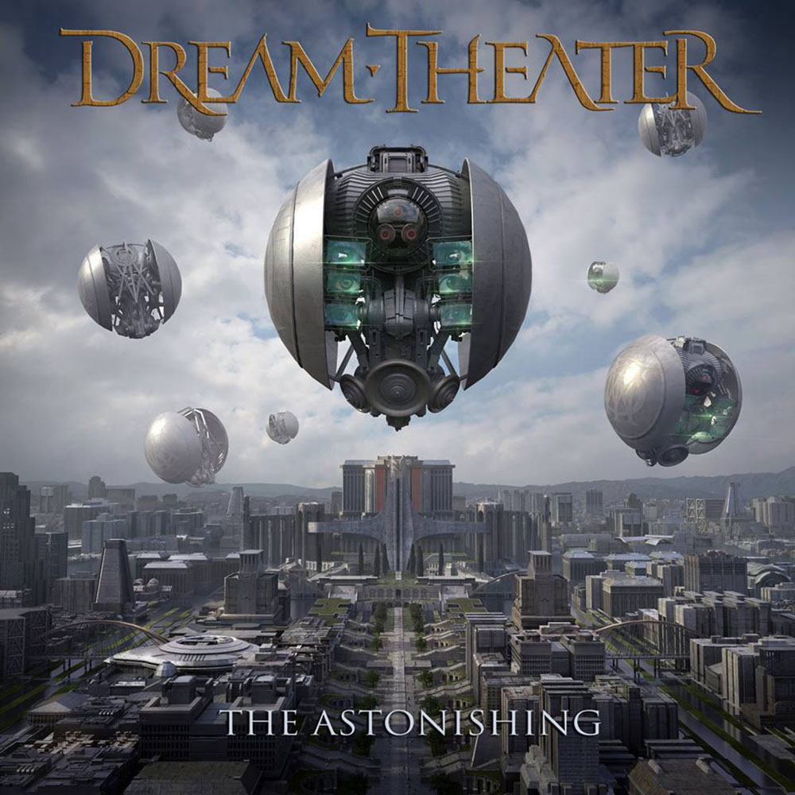

I honestly can't think of a band that is as consistently diverse as Dream Theater has been, going on almost three decades. Some bands pivot their style (Anathema comes to mind), but usually on either side of that pivot the core sound and style is consistent. With Dream Theater, the foundation and overall mix has remained consistent since _Scenes From A Memory_, but the gamut of sound and style is wider than any other band I know of.

_The Astonishing_ is no different. Their previous two attempts at concept albums (_Scenes From A Memory_ and _Six Degrees of Inner Turbulence_ Disc 2) felt more like more epics (a la _Change of Seasons_). This album could legitimately be considered a score to a theatrical production. There are transition tracks between the main songs, and the main songs themselves feel linked together much more so than on _6DoIT_

My first raw impression was "too much cheese" -- the names, the story, the concept all felt **extremely** over the top. To enjoy this album, you will definitely have suspend your "cheese" detector (Lord Nafaryus? Really?!) But when I heard the opening of "A Savior In The Square" I really got hooked and just relaxed and enjoyed the music rather than being too focused on the story. I still haven't broke out the lyric sheet to decipher the story yet and I'm not sure I'll be inclined to do so.

Given the length of the double album, I have given too much listen time to the first disc at the expense of the second. I suggest making a playlist that removes the transition tracks to get a handle on the core songs. Overall, Jordan Rudess and John Petrucci take the center stage with James LaBrie taking a huge vocal burden (though they do use real choirs, rather than Jordan manufacturing it). I do wish John Myung was more prominent in the mix -- I've thought the same thing on the last few albums.

If you're a fan of Dream Theater, you'll enjoy the expansive range of this album -- I'm not sure I'd recommend it as an entry into their catalog. In that way, _SFAM_ was much more approachable for a new fan than this one.
