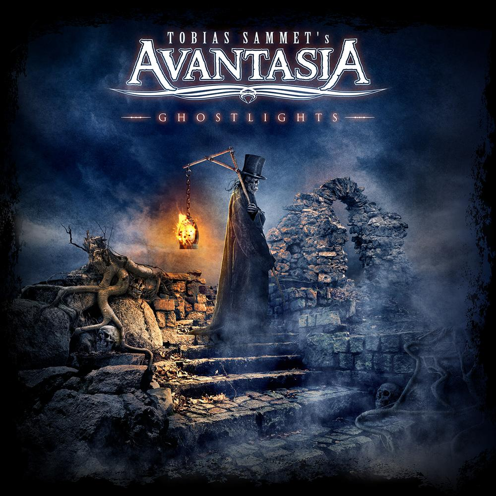

Tobias Sammet's supergroup project has always managed to walk the fine line between bombastically epic and collapsing under it's own weight. Getting top notch vocalists and dialing _rock opera_ to 11 seems to be a formula that works more often than it fails (see [Ayreon](https://www.arjenlucassen.com/content/arjens-projects/ayreon/)).

Avantasia's previous album _The Mystery of Time_ was definitely more on the 'collapsing' side of the equation for me. None of the melodies caught in my brain, and the array of vocalists weren't any that I particularly enjoyed. So when _Ghostlights_ appeared on my radar, I approached with trepidation.

> Dee Snider, Geoff Tate, Jorn Lande, Michael Kiske, Marco Hietala, Ronnie Atkins, Sharon den Adel, Bob Catley, Robert Mason and Herbie Langhans

Damn! Sign me up.

There is a stretch of 5 songs in the middle of this album (_Ghostlights, Draconian Love, Master of the Pendulum, Isle of Evermore,_ and _Babylon Vampyres_) that simply kick all kinds of ass. The vocal performances are fantastic and the song construction screams Sammet's style of rock opera circa _The Wicked Symphony_ and _Angel of Babylon_.

I honestly prefer Sammet's Avantasia writing over his tongue-in-cheek Edguy style, so I'm glad he continues to put together these albums. _Ghostlights_ is definitely an album worth picking up (if you happen to be one of those people, like me, who still buys albums).
