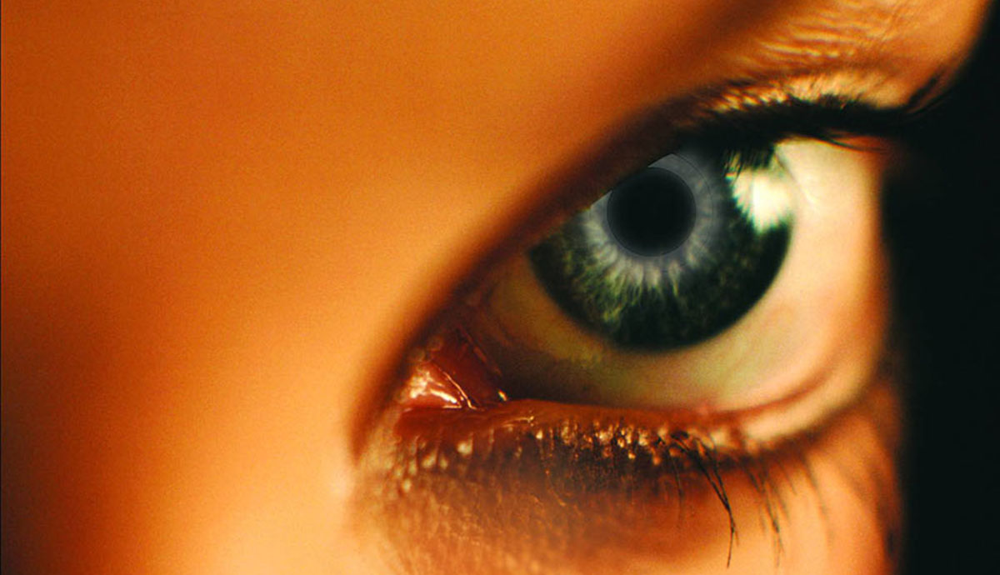

A few disclosures before I start:

I read _The Host_ before I was aware of Meyer's _Twilight_ series (which was well underway by the time this book came out). I think I picked it up after browsing Goodread's Science Fiction section, and the reviews were pretty good. This was all well before the _Twilight_ movies hit. I also have not seen the movie adaption of _The Host_ because it does appear to geared toward that same demographic, rather than a serious take on a very intriguing sci-fi premise. This 'review' is _very_ late, but I happened to grab the audio book (which is narrated by Kate Reading, one of my all time favorite audio book narrators. I also just realized that Kate Reading's husband is Michael Kramer! What a fucking incredible husband-wife duo that is!) and I was reminded how much I find the world utterly fascinating. _The Host_ has real potential if you are willing to turn a blind eye to the over-the-top romantic triangle.

For the sake of this discussion, I'm going to essentially skip over the specific main characters and focus on the world and it's general populations. Also instead of typical review, let me give you a tl;dr:

If you are the type of reader that can forgive bad parts of books when there is something else to balance it, then I might suggest you try it. _The Host_ is not _nearly_ as bad as Twilight -- orders of magnitude better -- but it still suffers from many of the same pit falls that plagued _Twilight_. Mel is not nearly as insipid as Bella, but she is still brought down by Meyer's demeaning portrayal of leading female characters. If you can look past that (which I admit is hard since it's the main thread of the novel), I think you'll find a nugget worth the effort.

I would truly love a prequel that details the start of the Soul invasion and humanity driven into hiding. That story would be bloody awesome if done well if only for the simple fact that humanity wouldn't win. How does a species who abhors violence like the Souls win? I understand the initial infiltration. I could imagine that that initial invasion goes so high, so fast, and so secretly, that humanity essentially has lost before any battle has had chance to start.

What we see in the novel is a microcosm of what is left of humanity. It's a different portrayal than say the _Terminator_ mythos which shows an armed and militarized resistance. I'm not saying that wouldn't exist in this world, but I find it interesting that perhaps if humanity is whittled down to say 1000 or 10000 across the planet, they might go into preservation mode rather than outright open hostilities. What would the mentality be of the people left?

A look forward at the next generation is touched on briefly in the book: a pair of Souls raising their child Soul-less. What happens when you have a new generation or two that has a minority of humans brought up in a society of Souls? They wouldn't be able to hide, given the distinguishing physical characteristics. Would there be discrimination? Does the Soul society evolve differently? Do human kids growing up with Soul parents seek out what is left of humanity? How do the humans in hiding react to human kids brought up with Soul parents? So many fascinating questions...

Unfortunately, I highly doubt we'll get any exploration into those more interesting avenues. I see no indication that Meyer is interested in telling us an expanded tale of this universe. It's one of the stupidest aspects of our current copyright laws -- that you have to wait the creator's lifetime plus 70 years before anyone else could remix this universe and tell their own stories beyond that which the original author intended (or licenses).
