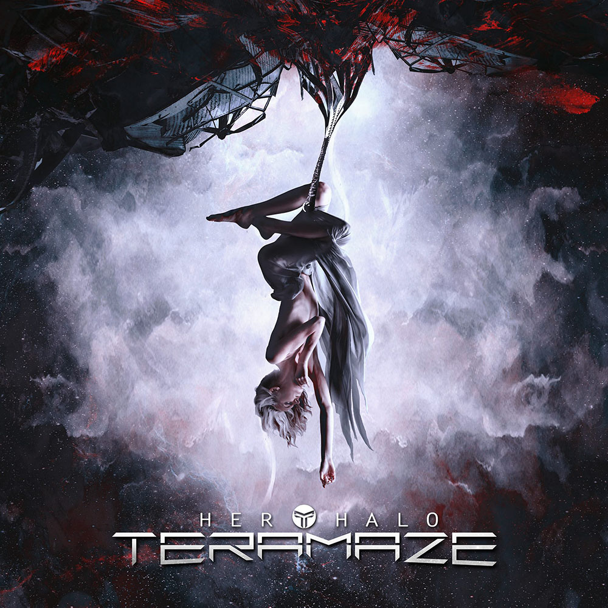

I've never thought much of Amazon's Recommendations. I never thought they were very accurate, even though the amount of information they must have about my musical tastes should be staggering. However, I happen to check out what they had for recommended new releases and a few rows down the cover caught my eye. I had never heard of Teramaze and knew nothing about them. After listening to the sample (in all its bad audio quality) I pulled up youtube and checked out their video single

<iframe width="560" height="315" src="https://www.youtube.com/embed/nlV0nNcazl4" frameborder="0" allowfullscreen></iframe>

I was hooked and immediately grabbed the album. God damn! This might be my favorite album of 2016. I have been listening to the entire album on repeat all week.

tl;dr this checks all my musical boxes: great melodies from an expressive singer (complete with exquisitely layered vocals), tight guitar work, rock solid song structure and a band that won't shy away from opening their album with a 12 minute epic. The range of the band is fantastic as well: guitars with massive riffs, soft piano with spoken audio clips (very reminiscent of Dream Theater's _Awake_), and a lead guitar sound to die for.

I have to say what impressed me most was the quality of the sound and the overall mix. I haven't heard an album sound _this_ good in quite a long time. The mix is incredibly tight and every instrument blends perfectly. The only other band I know of that mixes albums quite like this is [Threshold](https://thresh.net/) (a band which I _highly_ recommend). I have to give kudos to the guitarist and producer Dean Wells for his work on this album.

I also picked up their two previous albums - while good, neither can touch _Her Halo_. They both were sung by the band's previous vocalist who isn't quite up to the chops of their new frontman, Nathan Peachey.

There is not a bad song on this album (which is saying something in this day and age). Broadband, don't dialup and grab this album **now**!
