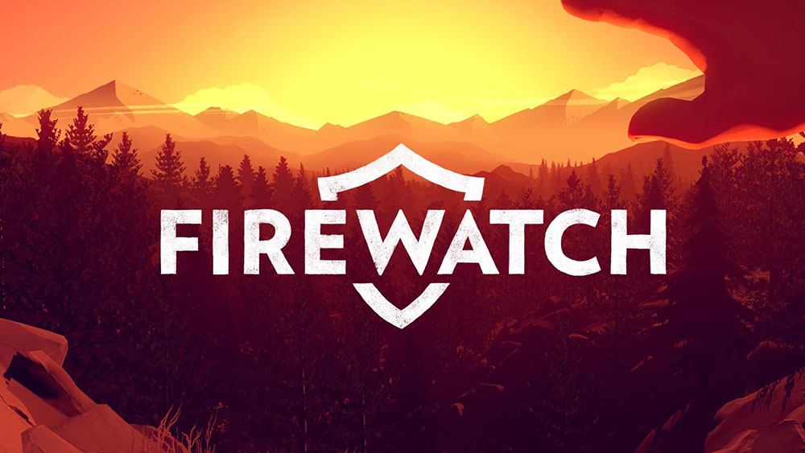

If [Panic Inc.](https://panic.com/) doesn't strike you as a game company, you would be right. Panic is a Mac and iOS application developer (Coda, Transmit, Prompt). [Campo Santo](https://www.camposanto.com/) is a new indie game studio without a game under their belt. Despite the unlikely partnership, _Firewatch_ is obviously a game from a crew who really wanted to deliver an immersive story based game -- and they definitely succeed in spades.

This game does 'interactive movie' better than any other game I can think of. This is not a role playing game in the traditional sense -- your actions don't influence the plot of the story but rather the relationship between the two main characters. That wasn't what I thought it was going into the game, so when the opening sequence began and I was presented with picking between only bad choices I was caught off guard.

That quickly faded as I feasted upon both the spectacle of the forest and the incredible voice acting.

The art style and visual rendering of the forest really makes it s character in its own right. It's not a true open world and the day-night cycle is tied to story cues but that didn't detract from the experience for me. Instead of striving for realism, they went for stylized beauty (very reminiscent of _Journey_ in its execution).

I loved the voice actors for both Henry and Delilah. The choices in the dialog tree allow you to push and pull various aspects of the relationship -- almost like tuning. I came to appreciate the limited choices in the dialog choices because they all remained true to the character even if it wasn't something I would say. By comparison the dialog choices in _Mass Effect_ both affect the plot and have a wider gamut in representing the character's personality (Paragon vs. Renegade).

_Firewatch_ is another gem in a string of recent story driven games (_Gone Home_, _Life is Strange_, _Dreamfall: Chapters_). At about 4 hours of play time, it fits right at home for a casual game (think a long movie). I definitely recommend picking this up. Set aside the time to play it start to finish if you can as I feel that's how it was intended to be enjoyed.

I feel like in the past few years we've received more story based games than in the past decade. I really hope this trend continues if these title can prove to be successes in the market. There definitely is an audience for these, it's just not as large as the ones for FPS and MMORPGs.
