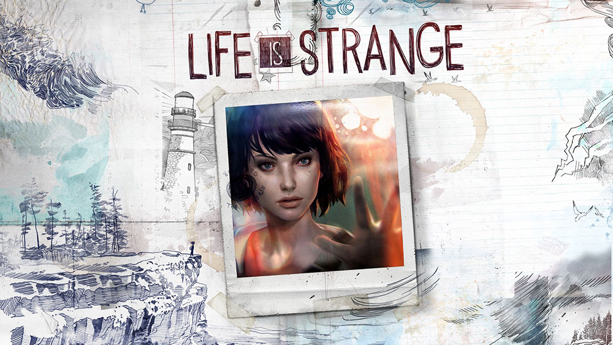

Narrative-focused games are few and far between. There are seemingly hundreds of _Battlefront_ or _Destiny_ style games for every story-based game. Given the absolute shit show that is the gaming community right now, this game embodies everything "the GG side" seem to despise: character driven story based game led by a duo of female protagonists.

All the more reason why we need more games like this. _I_ want more games like this. More games like _Gone Home_, _Dreamfall Chapters_, and _Firewatch_.

_Life is Strange_ has its flaws to be sure, but I refuse to let that detract from what is otherwise an absolute gem of a game.

_Life is Strange_ takes place in a small town called Arcadia Bay, following Max, a shy and reserved high school girl at a school for artistic students. After stumbling into an 'incident' in a bathroom, she discovers she has the ability to rewind time. And... scene.

I want to start by saying I can't think of any other game that was obviously made to look and feel like a movie and manages to pull it off to the degree _LiS_ does. The camera placement and tracking, the visual filters, the color pallet -- all are heavily leveraging their feature film counterparts. For most of the game, the over-the-shoulder camera transitioned smoothly with the tracking camera and back again to the point where it didn't feel like separate "Game Play" - "Cut Scene" - "Game Play" phases.

The "rewind time" mechanic is actually brilliant in my opinion. It allows you to go back and forth on an individual decision (which people would do manually with saved checkpoints) but still forces you to ultimately commit to a decision before moving on. I think in retrospect, the decisions felt bigger than they might ultimately have been with respect to the plot tree, with the exception of a series a choices leading up to big event in the middle of the story. I much prefer how the story continued after that as a result of my decisions, but I could see how if that event goes differently, the entire second half of the game would feel _very_ different.

The character designs and voice acting are extremely impressive with the only thing detracting being some of the actual dialog (very cringe-worthy). More important is how great the OST is. The songs are perfect for the setting (high-school-hipster-indie) and the score does a great job at creating the right mood and emotional beats.

One slight spoiler (so stop reading if you want to go play the game) is that I felt the final choice shouldn't have been a choice at all -- it should have been made for you based on your actions during the game. For me there was a clear and obvious choice (albeit an emotional one to make), but it was obvious to me because of how I had played the game and the choices I had made.

Given how much Dontnod struggled to get this game published (especially in today's climate), my hat is off to them -- they really made a great game with an even better story.
