So I was unable to get to the "sequels" for this season (_Gate_, _Ansatsu Kyoushitsu_, and _Akagami no Shirayuki-hime_). All three I will hopefully complete at some point (especially _Shirayuki_) but this was a crazy quarter personally and I ended up really only having time for a few shows.

I've also started reading manga on a regular basis. I have a bunch of series I'm enjoying (some from shows I've watched and some new ones) and as a result my evening time is spread even more thinly.

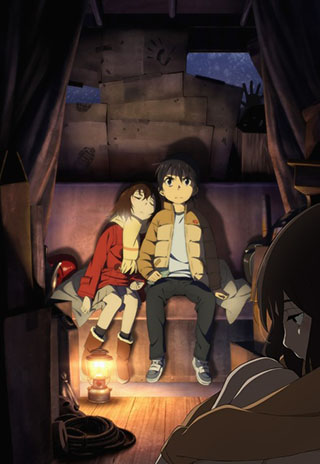 

### [Boku dake ga Inai Machi](https://hummingbird.me/anime/boku-dake-ga-inai-machi)

Holy... Mother...

The opening two episodes hooked me so badly I ended up watching each episode as soon as it came out (until episode 10 where I had to pause and wait for it to finish so I could binge the rest). While this show might not appeal to everyone (specifically if you are disinclined to like anything from A-1 or don't like mysteries) I think it's easily the best show to air in the last few years.

From what I've heard, the manga might be even better since there was quite a few threads dropped in order to fit into a single cour. I'm a few chapters in at the moment and definitely think that consensus might be right.

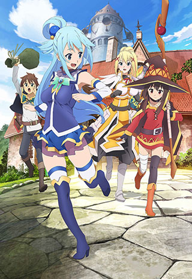 

### [Kono Subarashii Sekai ni Shukufuku wo!](https://hummingbird.me/anime/kono-subarashii-sekai-ni-shukufuku-wo)

For me this was the surprise of the season. The humor was consistently good throughout and even the art style while jarring at first meshed well with the humor. The entire production was just _fun_!

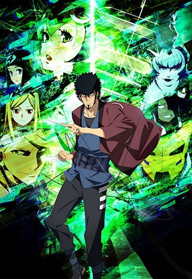

Studio 3Hz, Orange

### [Dimension W](https://hummingbird.me/anime/dimension-w)

My initial assessment was spot on -- I kept my expectations low and was pleasantly surprised. The characters aren't deep and they have minimal arcs, the character design is OK, and the plot is mildly interesting. That might come across as damming, but the sum of the pieces resulted in something fairly entertaining. If you just want a decent sci-fi show to pass the time, this one isn't too bad.

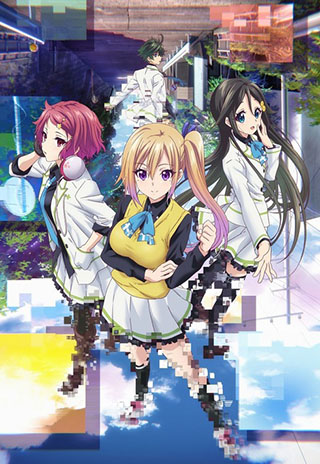 

### [Musaigen no Phantom World](https://hummingbird.me/anime/musaigen-no-phantom-world)

Oh the disappointment. The world had so much potential, but the writers seemed content with standalone surface level character pieces. I mean, it's KyotoAni so it's gorgeous to look at, but there was no depth aside from the art. _sigh_ Chalk this one up to missed opportunity.

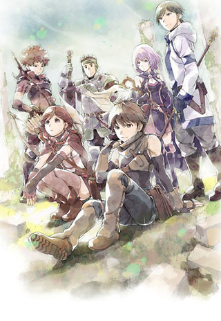 

### [Hai to Gensou no Grimgar](https://hummingbird.me/anime/hai-to-gensou-no-grimgar)

I'm half way through this and while I really want to give it a chance it feels like a bit of a slog. They have me feeling sympathy for the characters in general, but there isn't any character that I'm really rooting for (and there is one in particular I don't like). I think the art style, atmosphere and music are great, but even 5 episodes in, they haven't cracked open any of the characters.

I'm hoping they do soon...

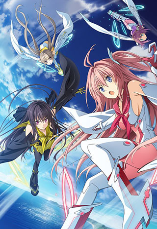 

### [Ao no Kanata no Four Rhythm](https://hummingbird.me/anime/ao-no-kanata-no-four-rhythm)

I got a few episodes in before putting it on hold. I think I would have been more interested if it had more "sports anime" influences. I don't think it's a bad show, just meh.

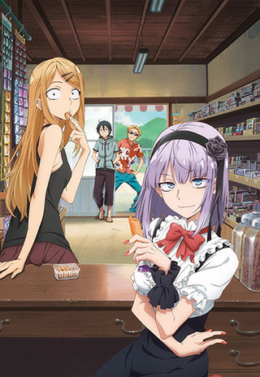 

### [Dagashi Kashi](https://hummingbird.me/anime/dagashi-kashi)

Couldn't do it -- mostly because I can't relate to the food he show revolves around. Ultimately there might be a story hidden underneath but I didn't have the patience to find out.

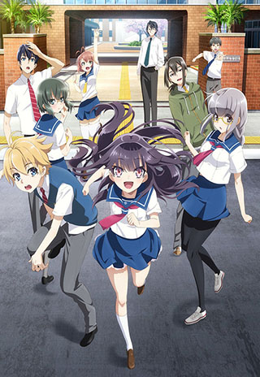 

### [Haruchika: Haruta to Chika wa Seishun Suru](https://hummingbird.me/anime/haruchika-haruta-to-chika-wa-seishun-suru)

This one got moved to the held column pretty quickly because other shows were more interesting.

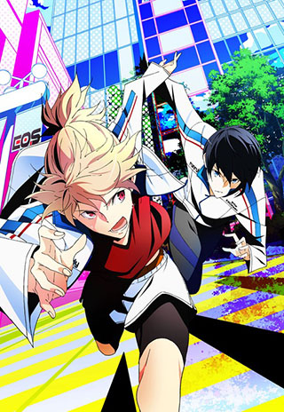 

### [Prince of Stride: Alternative](https://hummingbird.me/anime/prince-of-stride-alternative)

I'm fairly sure I'm going to end up dropping this one. Just not enough there to keep my interest.

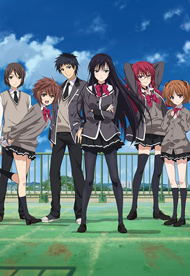

### [Shoujo-tachi wa Kouya wo Mezasu](https://hummingbird.me/anime/shoujo-tachi-wa-kouya-wo-mezasu)

I'm half way through this one and will probably end up just an average show. A lot will depend on how much they the characters versus just the process of making this game, which I only find mildly interesting.

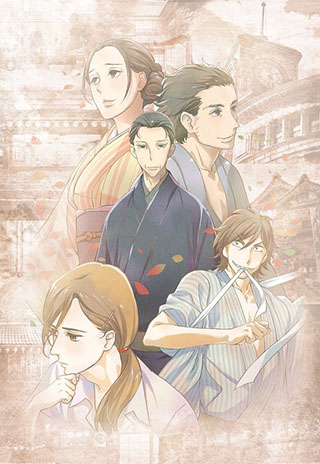 

### [Shouwa Genroku Rakugo Shinjuu](https://hummingbird.me/anime/shouwa-genroku-rakugo-shinjuu-tv)

This show went in a much different direction that I thought from the opening episode. I'm not all the way done yet, but most of the time has been spent telling an origin story. I'm hoping the origin story wraps up soon so we can spend some time with the two younger characters.

Despite this, the way Deen has animated the Rakugo stories is fantastic, often times letting the entire story be told. There is probably a lot lost in translation (and perhaps culturally), but this show has been a fantastic change of pace from the rest of the season.

Shorts

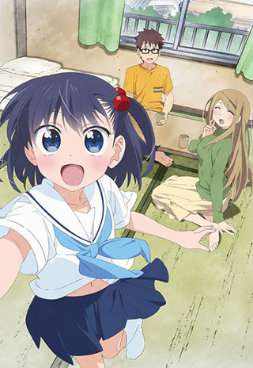

Genco, Seven Arcs

### [Ooyasan wa Shishunki!](https://hummingbird.me/anime/ooyasan-wa-shishunki)

Quirky and fun, but nothing to write home about. The humor is actually decent and the 2 minute run time means you can binge the season in less time than a single normal show.

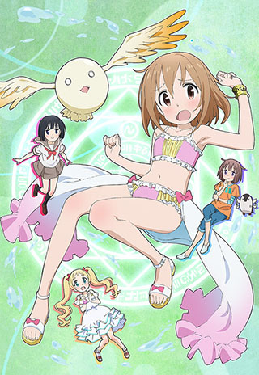

Pine Jam, FMF

### [Mahou Shoujo Nante Mou Ii Desukara.](https://hummingbird.me/anime/mahou-shoujo-nante-mou-ii-desukara)

While there was some nice pokes at the typical magical girl tropes, I feel they should have hit a lot harder. Ultimately pass on this one.

Hero image created by Zana at <a href="https://neregate.com/blog/">neregate.com</a>  
The following websites were used as sources of information to create the chart : 
<a href="https://www.animenewsnetwork.com/">ANN</a>
<a href="https://m-p.sakura.ne.jp/">Moon Phase</a>
<a href="https://myanimelist.net/">MAL</a>

