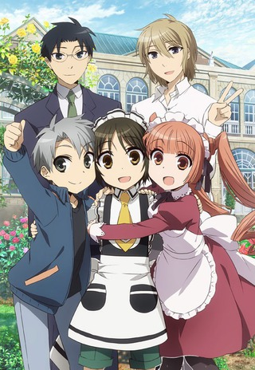

You'll notice [Boku no Hero Academia](https://hummingbird.me/anime/boku-no-hero-academia) is not listed below. I guess I'm just not as much a fan of the _shoenen_ category as everyone else as _Academia_ has no draw on me. I might try it at some point, but I think I'd rather give _Hunter x Hunter_ a try instead.

 

### [Re:Zero kara Hajimeru Isekai Seikatsu](https://hummingbird.me/anime/re-zero-kara-hajimeru-isekai-seikatsu)

Umm... This is not at all what I was expecting, but I'd be lying if I said I wasn't already hooked. The show opens with a double length first episode (40 minutes). At the half way point I was about to shrug it off as yet another "Boy trapped in another world" show -- and then the first loot house scene happened. Yeah. Wasn't expecting that.

This is a two cour show (24 episodes) and I have absolutely _no_ idea where this plot will go. There is quite a lot left unexplained about the world and characters that it really could go anywhere. Keeping my fingers crossed for this one.

 

### [Koutetsujou no Kabaneri](https://hummingbird.me/anime/koutetsujou-no-kabaneri)

Two for two in the unexpectedly surprised category.

Essentially this is [Attack on Titan](https://hummingbird.me/anime/attack-on-titan) with zombies but even out of the gate I think I'll like this show a lot more than AoT. For one, it looks like they will avoid the whole "go to school" angle and for two the protagonist is already _much_ more likable than Eren ever was. The animation looks very similar to AoT as well, so they are obviously channeling that vibe. I really liked the steampunk atmosphere and train motif. I just hope the character development delivers (I'm already concerned that the main character Ikoma could be very one dimensional).

Side note here -- I found it _very_ interesting that Amazon picked this one up as an exclusive. I do love the fact that the Amazon Video iOS app lets you download the videos for offline viewing (_cough_ Netflix _cough_).

Project No.9

### [Netoge no Yome wa Onnanoko ja Nai to Omotta?](https://hummingbird.me/anime/netoge-no-yome-wa-onnanoko-ja-nai-to-omotta)

At the half way point of the first episode, I was _this_ close to dropping it. I'm not exactly saying the end redeemed itself, but it at least made me give it a chance. It reminded me a little of [Boku wa Tomodachi ga Sukunai](https://hummingbird.me/anime/boku-wa-tomodachi-ga-sukunai). Whether or not I watch to the end will completely depend on how much humanity these characters have (and how much they are just harem tropes) -- really could go either way.

 

### [Bungou Stray Dogs](https://hummingbird.me/anime/bungou-stray-dogs)

Bones, Bones, Bones. Need I say more?

A super hero detective agency channeling [Kekkai Sensen](https://hummingbird.me/anime/kekkai-sensen) -- the first episode was definitely entertaining with the humor flowing and some nice stylized action sequences. I wonder if this one will have a story arc to it or focus more on individual standalone stories.

 

### [Gakusen Toshi Asterisk 2nd Season](https://hummingbird.me/anime/gakusen-toshi-asterisk-2nd-season)

Why? _Why?_ **Why??**

I finished the first season which really wasn't any good. A coin flip if I get around to this one.

 

### [Flying Witch](https://hummingbird.me/anime/flying-witch)

This one is a fantastic counter balance to _Re:Zero_ and _Kabaneri_ -- you need something to offset the intensity, and I think _Flying Witch_ will suit me nicely. I'm hoping this fills the role that [Non Non Biyori](https://hummingbird.me/anime/non-non-biyori) did. I have high hopes for this one.

 

### [Kiznaiver](https://hummingbird.me/anime/kiznaiver)

I can't believe this is Trigger's first serious outing since [Kill la Kill](https://hummingbird.me/anime/kill-la-kill) -- _SHOCKED_

I'm only an episode in, so I don't know whether or not there will be _any_ character development, or only situational lip service to the plot device -- essentially an ensemble cast whose pain (and possibly other emotions?) are linked together. Could be interesting, but I have a sneaking suspicion that I'm ultimately not going to like any of the characters.

 

### [Joker Game](https://hummingbird.me/anime/joker-game)

I have no idea if I'll ultimately have the patience for this one. The pacing, the premise, the characters (and good god the "identical" character designs) left me a little bored. Will the entire story take place in 1937 or will they skip ahead to after WWII and follow these characters? My guess is the former, but the latter would be more interesting for me.

Kinema Citrus, EMT²

### [Kuma Miko](https://hummingbird.me/anime/kuma-miko)

So, this will sound crazy... but couldn't finish the opening episode because of the Bear's voice actor (I guess not that unusual a statement given The Jungle Book remake, but still). It just prevented me from suspending disbelief. I'll check back later to see what everyone thinks of the show to see if it's worth it.

 

### [Kuromukuro](https://hummingbird.me/anime/kuromukuro)

Netflix picked this one up, but it looks like it will be released much later in the year (no idea why). A bit in the dark on the plot for this one, but I'm usually willing to give shows by PA Works a chance.

8bit

### [Shounen Maid](https://hummingbird.me/anime/shounen-maid)

A late addition for me -- I was going to pass this up as the premise seemed ridiculous, but I ended up catching a review of the first episode and decided to give it a try. I ended up enjoying it despite the over the top setup. It reminded me a little of what I think a modern take on [Kaichou wa Maid-sama!](https://hummingbird.me/anime/kaichou-wa-maid-sama) might look like. The interaction between the two main characters had charm and without one side having power over the other.

Hero image created by Zana at <a href="https://neregate.com/blog/">neregate.com</a>  
The following websites were used as sources of information to create the chart : 
<a href="https://www.animenewsnetwork.com/">ANN</a>
<a href="https://m-p.sakura.ne.jp/">Moon Phase</a>
<a href="https://myanimelist.net/">MAL</a>

