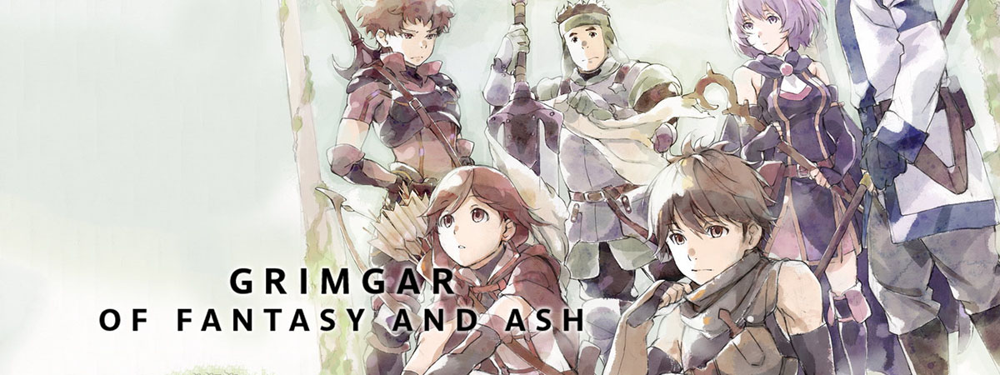
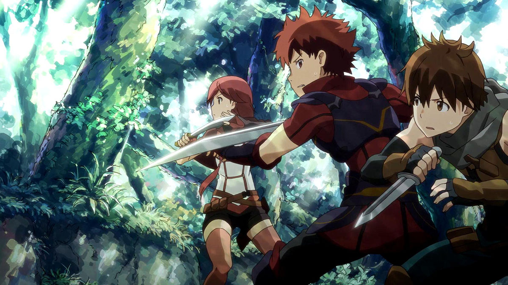

[Hai to Gensou no Grimgar](https://hummingbird.me/anime/hai-to-gensou-no-grimgar) _Grimgar of Fantasy and Ash_

How far are you willing to go to ignore debilitating tropes if the core of the story is good? If the art and animation are spectacular will you give the unnecessary and excessive ecchi a pass?

I completely understand why many people never gave it a chance:

You have A-1 Pictures rolling out yet another "trapped in a alternate/virtual world"; Female characters given skimpy outfits for no reason other than fan service. Every indication that this would just be an attempt at riding the coat tails of [Sword Art Online](https://hummingbird.me/anime/sword-art-online).

_However..._

Looking beyond the surface, there is something here that is more than the sum of it's tropes. The "trapped in world" is insinuated, but it's mostly used as a plot device to drop a group of people together without having to lay out a backstory as to how they got there. This setup is given passing mention, but this is as far from _SAO_, _Log Horizon_, _Overlord_ as you can get while still technically being in the same ballpark. As the show progresses they learn "skills" very reminiscent of game mechanics, but there is never a HUD or any other artifact of a game overlay. This could have just been an adventure/fantasy setup, but you would miss out on the "group of misfit characters" growing as a party and friends.

The fan service is less excusable, but it at least goes both ways and there are some empowered female characters -- it definitely isn't a harem at least (_cough_ SAO _cough_).

From the opening two episodes, it quickly set itself apart from _SAO_ (being probably its main source of similarity). When the party takes out a lone goblin, it doesn't just vanish -- sword cuts don't just pass through in a flash representing damage. The goblin is obviously (and viciously) fighting for its life and its death is actually rather shocking -- to the point where I definitely felt empathy toward the foe (which never happened in _SAO_).

In the second episode, there is a 4 minute montage showing the day-to-day life of these characters, and I was surprised how powerful it was. It's something you would never see in any of its peers. This show is obviously about the characters and them getting to know each other and figuring out how to work together as a party.

The thematic elements were a little overwrought, but I definitely forgave the writers quickly as they were at least attempting it, rather than avoiding it entirely. Too often this genre seems to only appeal to story telling's lowest common denominator, so it was nice to have a genuine _Hero's Journey_.

The art and animation was spectacular. The backgrounds were soft, almost watercolor like. The character designs were solid and the fights while simplistic were well done.

The music was dominated by songs from _(K)NoW_NAME_ with an overall OST that was extremely pleasing and well suited for the world. The voice casting was even and solid throughout.

Unfortunately, the final disappointment was the ending felt like a total _deus ex machina_ even if the writers had attempted to seed the power beforehand. I'm not sure how else I would have ended the show, but I have to imagine there might have been a solution that was little more satisfying.

Despite the criticisms above, I actually really enjoyed watching _Grimgar_. The art alone is worth the price of admission, in my opinion. This show is far from perfect, but I would recommend giving it a shot, even if you might be a little jaded by A-1's recent track record (_Erased_ not withstanding).
