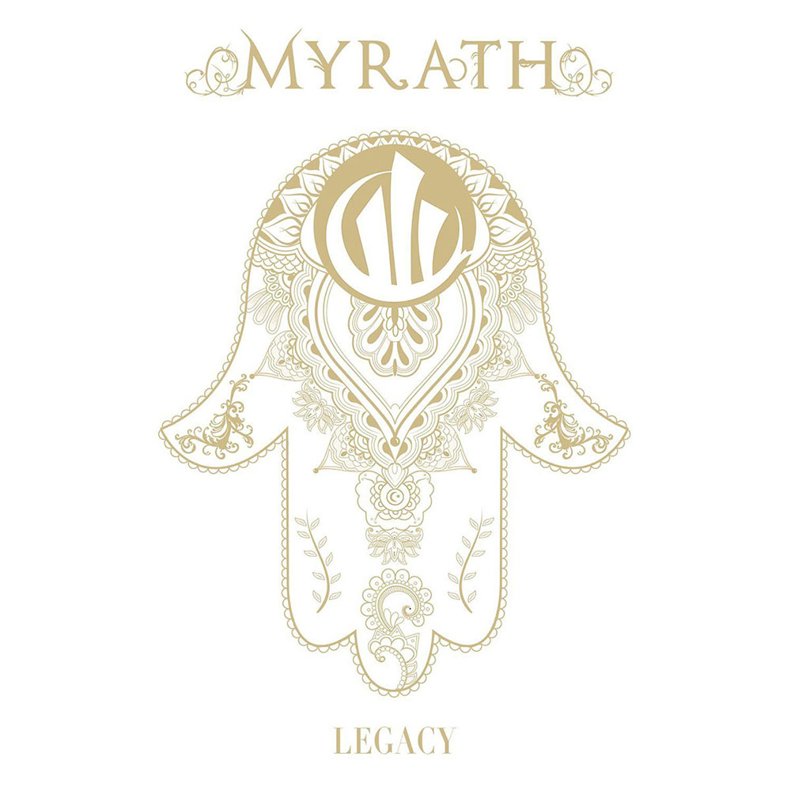
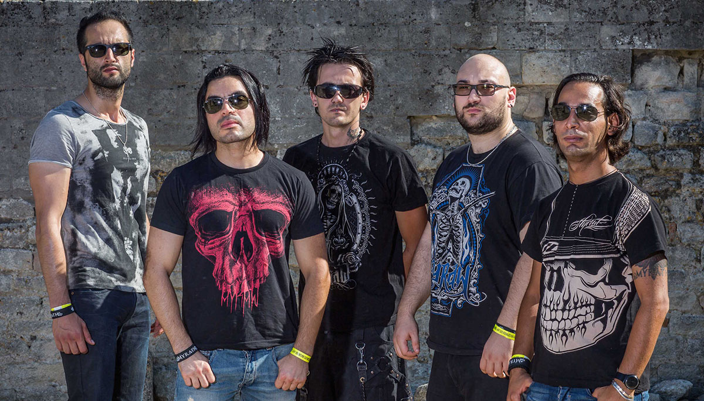

I really can't believe it. Amazon's recommendations are two for two in successive months. This time based on my purchase of _Her Halo_ by Teramaze, the number one recommendation was this album. Damn I feel lucky.

_Legacy_ is the fourth studio album from Myrath a metal band from Tunisia with excellent arabic influences (using double harmonic scales as Google has informed me). I can't emphasize how refreshing this sound is. There is definitely an element of "sameness" from the current block of metal bands from northern Europe. The excellent layered vocals combined with a great mix of traditional metal riffs with middle eastern influences turns out to be a fantastic combination.

This album reminds me of how I viewed Angra's _Holy Land_ album back in the day. The influence of traditional Brazilian sounds with heavy power metal riffs really set it apart from everything else I was listening to at the time. After numerous listens I don't feel the use of the double harmonic scales and associated modes are over used. All the songs utilize them but not to the point you would hear from say a typical medieval folk metal, which I usually tend to avoid because all the songs sound too much the same.

I will definitely go and pick up their other studio albums and I hope they can come close to the quality of sound that _Legacy_ delivers. I'm definitely hooked.
