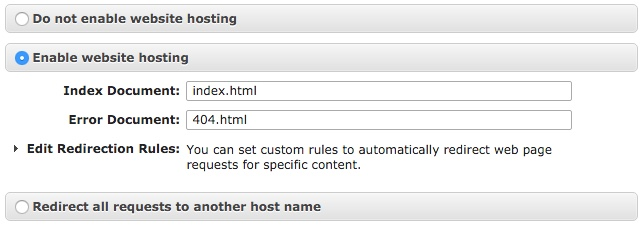

This quick tutorial will take a static blogging engine ([jekyll](https://jekyllrb.com/), [pelican](https://blog.getpelican.com/), [hugo](https://www.gohugo.io/)) and publish it to S3 automatically. I'm making the following assumptions:

* Your static blog is under some sort of source control
* A designated branch in your source control should be published (e.g. master)
* You have a domain and pointed its DNS name servers to Amazon AWS

In the end you will get a publishing workflow that give you:

* Automatic publishing to S3 when changes are pushed to your master branch
* Optionally SSL for your domain (via AWS Cloudfront)

In this example, I'm using [pelican](https://blog.getpelican.com/) for my blog and [travis](https://travis-ci.org/) for my CI. The workflow can definitely be adapted for use with other blogs and other CI services. Travis is free if your blog repository is public in either [Github](https://github.com) or [Bitbucket](https://bitbucket.com).

## Rationale

The main reason _I_ wanted to move to this system was really twofold: I wanted a system where I could write and post from anywhere and I wanted to get away from my old rsync as a deployment strategy.

There were a few posts that detailed bits and pieces of this workflow, but nothing that seemed to capture the process from beginning to end.

## Setup AWS

I'm assuming you already have an AWS account. If you don't, there are plenty of tutorials to get you started. Once you've signed up, head over to the AWS console.

### Create IAM User

For security reasons, we want to create a dedicated user whose sole responsibility is to deploy your blog to an S3 bucket.

Go to the IAM screen and create a new user. You will want to record your `AWS_ACCESS_KEY_ID` and `AWS_SECRET_KEY` values for this user as we will need them later.


In the process of creating the role, edit the permissions for the role and give it full access to S3 (`AmazonS3FullAccess`). This will allow this role to write your blog to S3.

### Create &amp; Configure S3 Bucket

Go to the S3 screen in the console and create a bucket for your domain. Note that the S3 key space is global. Normally if your domain was `foobar.com` then you should be able to create a bucket `foobar.com` -- On the off chance this key is taken, just pick another unique value.



In the `Static Website Hosting` section, select `Enable website hosting` (you may want to set the `Index Document` field to index.html but that depends on your blogging engine).


In the `Permissions` section, click `Edit bucket policy` button and paste in the following policy (modify `$DOMAIN` to your domain)

```json
{
  "Version": "2012-10-17",
  "Statement": [
    {
      "Sid": "AddPerm",
      "Effect": "Allow",
      "Principal": "*",
      "Action": "s3:GetObject",
      "Resource": "arn:aws:s3:::$DOMAIN/*"
    }
  ]
}
```

## Setup Travis

Sign up for an account and add your blog repository to the list of repositories. In the settings screen, you will want to add environment variables for your AWS key and secret.

In your blog's repository, create a `.travis.yml` file. The following is an example of what it might look like.

```
#!yml hl_lines="14 15 16"
language: python
python:
  - "2.7"
cache:
  - apt
  - pip
install:
  - "pip install -r requirements.txt"
script: "pelican -s publishconf.py content/"
deploy:
  provider: s3
  access_key_id: $AWS_ACCESS_KEY # Env
  secret_access_key: $AWS_SECRET_KEY # Env
  bucket: mydomain.com
  endpoint: mydomain.com.s3-website-us-west-2.amazonaws.com
  region: us-west-2
  skip_cleanup: true
  local-dir: output
  acl: public_read
  detect_encoding: true
  cache_control: "max-age=600"
notifications:
  email:
    on_failure: always
branches:
  only:
    - master
```

You will want to modify the `install` and `script` steps to your static blog's 'generate' step. Also, change the highlighted lines to match your domain and the parameters from your S3 bucket.

At this point, you should be able to run a travis build (after a commit) and have travis automatically generate your blog and transfer it to S3. You can verify this by going to the S3 URL. In the next section, we will link your domain to this S3 bucket and add a bit of security sugar for good measure.

## SSL &amp; Cloudfront

If you are OK with an `http` URL, then go ahead and skip this section. However, it's not too much more work (and not too much more in cost) to have your blog hosted under `https` (for good measure).

Head over to the Certificate Manager and create an SSL key for your domain. You should be able to accept all the defaults.

Next head over to Cloudfront and create a `Cloudfront Distribution` for your site.

For the most part you should be able to accept most of the defaults. For `Origin Domain Name` you want to select your S3 bucket. Put your domain in for the `Alternate Domain Names` field.


Make sure the `Origin Protocol Policy` is set to `HTTP Only` (S3's website hosting mode only serves the files with http.

In the `SSL Certificate` section, select `Custom SSL Certificate` and then pick the certificate for your domain we just created.

Finally set your `Default Root Object` to index.html (or some other value depending on your blog engine).

After clicking save, you will have to wait 15-20 minutes for the distribution to propagate. Once it's done, you should be able to hit the `xxxxxxx.cloudfront.net` url and see your blog.

## Route53 to the finish

The final step is to point your domain to either the Cloudfront distribution url or your S3 url (depending on which path you took above).

Create a `Hosted Zone` for your domain and then create an A record that points to the correct resource. AWS should pre-populate values from your account (either your Cloudfront distribution or your S3 bucket)
