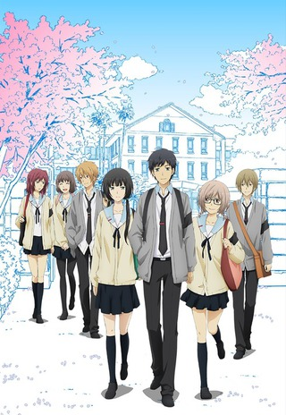
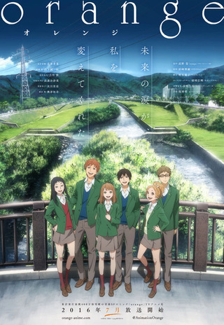
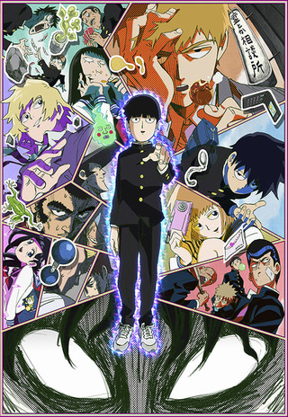
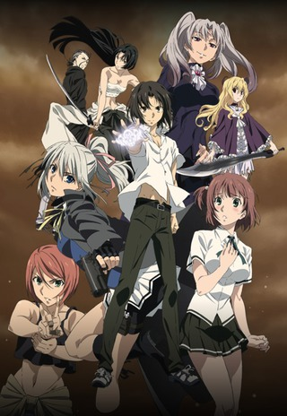
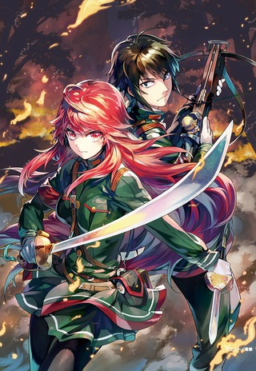
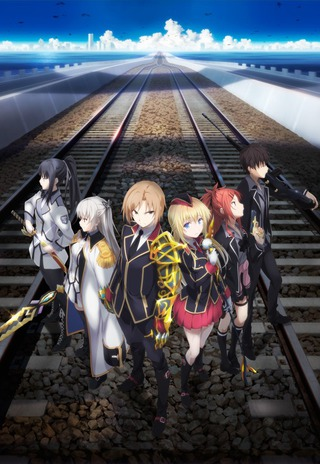
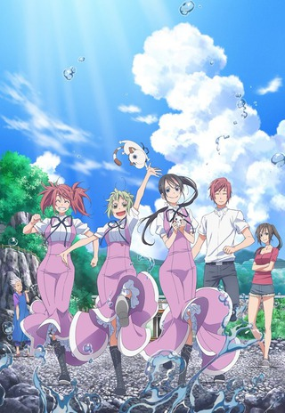

A theme you will see begin to develop is I'm now reading manga where there isn't yet an anime adaptation. Early on, I would pick up manga where I had already seen the anime. I wonder how knowing the source material will color my experience of its anime...

Side Note: Damn! Did Crunchyroll buy out the entire season?!

 

### [ReLIFE](https://hummingbird.me/anime/relife)

Holy crap they dropped all 13 episodes at once!

I'm a huge fan of the manga (which is still going) and it looks like the single cour doesn't come close to the manga's current position (I think I have a good guess where they'll end the season). The first episode was just awesome. Humor was spot on and the OST fit the mood perfectly.

I really hope this gets picked up for a second season. Fingers crossed. (The real question though is do I have enough discipline not to binge it in a weekend)

 

### [orange](https://hummingbird.me/anime/orange)

This is another one where I've read a bit of the manga before. I'm not very far into the story, so the anime should quickly pass by my current place in the manga. This will probably be a test run to see if I'm already familiar with the source material, should I read beyond the anime adaption.

The opening episode was quite good and a faithful adaptation of the manga in my opinion. What is left unknown is if this show is an upper or downer...

 

### [Mob Psycho 100](https://hummingbird.me/anime/mob-psycho-100)

Hmmm. While I throughly enjoyed _One Punch Man_, I'm not sure how I will fair with this one. I'm not going to lie, the humor is going to have to be _really_ good to counterbalance the art style. At least _OPM_ moved well between both styles (rough and hyper stylized). I guess I'll take a wait and see attitude.

8bit

### [Rewrite](https://hummingbird.me/anime/rewrite)

Like _Re:Zero_ last season, _Rewrite_ started with a double length opening episode which felt awkward because the first 80% was essentially filler with not-so-subtle hints of "other things" going on. This show is a VN adaptation and I've only seen rave reviews of the VN. I think I'm on the fence for this one. Even with a 2x opening episode I have no sense of the characters, plot or world (though part of that might be on purpose, I can't tell yet). Contrast this with _Re:Zero_'s which quickly established the characters, even if the world and plot was a complete mystery.

I'll give it a few more episodes to see if it can work itself out.

Shuka

### [91 Days](https://hummingbird.me/anime/ninety-one-days)

Damn! Awesome setting (Prohibition Era), great music and a really cool opening setup. As long as there are no one-note-characters (or the number kept to a minimum), I think I will throughly enjoy this one.

 

### [Tales of Zestiria the X](https://hummingbird.me/anime/tales-of-zestiria-the-x)

Damn what a hot mess that only ufotable could produce. The first episode is a prologue and really an epic cluster-f\*ck of stage setting with little to no context -- all done with ufotable's unique blend of CGI and hand drawn craft.

I can't judge this until we see what follows this prologue. Intriguing setting, but no idea if we'll get characters to match.

Side Note: My favorite [OP](https://my.mixtape.moe/ingrnl.webm) of the season on this one.

 

### [Taboo Tattoo](https://hummingbird.me/anime/taboo-tattoo)

_Sigh_

JC Staff, it's like you're not even trying. We have a weird combination of absurd fan service, lazy animation and flat dialog with really well animated fight choreography (with a real sense of weight and realism). If I had to predict, this will be the first one in the drop category this season, but I'm willing to stick it out an episode or two more to see if there are any other redeeming qualities.

 

### [Nejimaki Seirei Senki: Tenkyou no Alderamin](https://hummingbird.me/anime/nejimaki-seirei-senki-tenkyou-no-alderamin)

While not a perfect comparison, this one felt a little like [_Rokka no Yuusha_](https://hummingbird.me/anime/rokka-no-yuusha) but I don't think a season long mystery is in store for us this time. I like the fact there are strong female characters and as long as they do a bit of world building, this might be an interesting series.

 

### [Qualidea Code](https://hummingbird.me/anime/qualidea-code)

And... nope! Pretty sure there isn't going to be anything redeeming here.

Doga Kobo

### [New Game!](https://hummingbird.me/anime/new-game)

_Shirobako_ this definitely isn't, but just the kind of cute fluff one needs to offset some of the more serious shows. Let's see if "working on a game" is more than just pretense. I have a feeling however that it will basically revolve around shoujo hijinks -- not that there is anything wrong with that (in moderation at least).

 

### [Amaama to Inazuma](https://hummingbird.me/anime/amaama-to-inazuma)

Oh God! This level of cute! It will _destroy_ you.

This feels like [_Usagi Drop_](https://hummingbird.me/anime/bunny-drop) with a bit less of the "weird". The kid is _super_ cute (no seriously!) and there appears to be enough feels to go around to make it a compelling story.

 

### [Amanchu!](https://hummingbird.me/anime/amanchu)

Seriously! JC Staff what the hell were you thinking?! Both main characters spent more than half of the first episode with hyper cartoonish facial expressions. You should use that effect sparingly, otherwise just do your entire character design that way!

I'll give this one a few more episodes to see if there is any depth to these characters, through frankly I'm not holding my breath...

You see what I did there? "holding my breath..." It's a pun. Get it?

_Sigh_

Hero image created by Zana at <a href="https://neregate.com/blog/">neregate.com</a>  
The following websites were used as sources of information to create the chart : 
<a href="https://www.animenewsnetwork.com/">ANN</a>
<a href="https://m-p.sakura.ne.jp/">Moon Phase</a>
<a href="https://myanimelist.net/">MAL</a>

