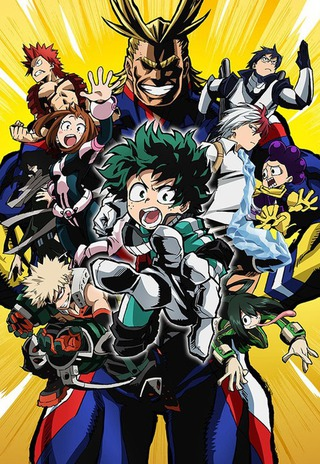
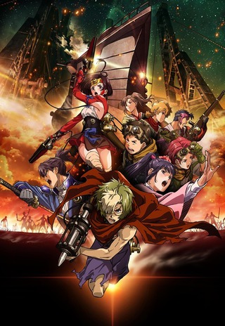
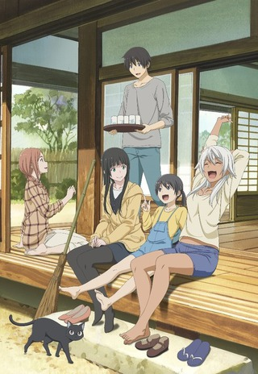
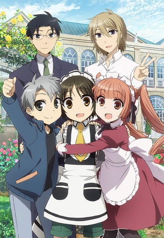

Going into this season I was a little worried there wasn't going to be anything that would really peak my interest. Though I knew of _Academia_ through the manga (I haven't ready any), the rest of the shows on the docket were completely unknowns. All in all it turned out to be a solid season.

There are still a bunch of shows I need to finish (per usual) but I was able to "keep current" with more shows than I usually do. Just a note, _Re:Zero_ was a two cour show, so I'll be reviewing that in my Summer retro (tl;dr -- It's awesome!)

**Update** :: The _Re:Zero_ retro is included in the [Summer Retro](https://markphilpot.com/posts/2016/XX/XX/anime_2016_summer_retro/)

_Kiznaiver_, _Netoge no Yome wa Onnanoko ja Nai to Omotta?_ and _Bungou Stray Dogs_ were placed on hold. I will hopefully make my way through these at some point (especially _Kiznaiver_ and _Bungou_).

 

### [Boku no Hero Academia](https://hummingbird.me/anime/boku-no-hero-academia)

Welp, my thinking that I wouldn't pick this up was definitely off. While I enjoyed it, it didn't sweep me away like it seems to have done for the rest of the community. I don't think that's the fault of Bones, I think I'm just not as into the "superhero" genre as most seem to be.

As far as origin stories go, this was a great attempt. I believe a second season has already been confirmed, so we'll wait and see where they take the story.

 

### [Koutetsujou no Kabaneri](https://hummingbird.me/anime/koutetsujou-no-kabaneri)

Solid.

Flawed? To be sure, but I was definitely entertained. The characters are one notes, the plot fairly predictable and an ending that felt both rushed and contrived. Though let me just say, the OST was spectacular! The OP wasn't as strong as say _Attack on Titan_, but there were multiple times durning the show where I went back to watch an action sequence because it had a kick ass soundtrack.

 

### [Flying Witch](https://hummingbird.me/anime/flying-witch)

Exactly as advertised and exactly what I needed to offset _Re:Zero_ and _Kabaneri_. This gave me hope that not all is lost with JC Staff (who has been delivering a bunch of duds lately in my opinion).

8bit

### [Shounen Maid](https://hummingbird.me/anime/shounen-maid)

Much better than I thought it was going to be with enough pulling at emotional heartstrings to keep me coming back for the next episode. Each episode was fairly standalone with a light character arc over top. I wish there was more time spent in the backstories to the characters. Madoka's relationship with is Mom is only ever implied and it would have been fun to see that relationship explained and evolve with Chihiro finding out. It seems this is based on a manga series. I might dip in there to see if there is a bit more character development.

Hero image created by Zana at <a href="https://neregate.com/blog/">neregate.com</a>  
The following websites were used as sources of information to create the chart : 
<a href="https://www.animenewsnetwork.com/">ANN</a>
<a href="https://m-p.sakura.ne.jp/">Moon Phase</a>
<a href="https://myanimelist.net/">MAL</a>

