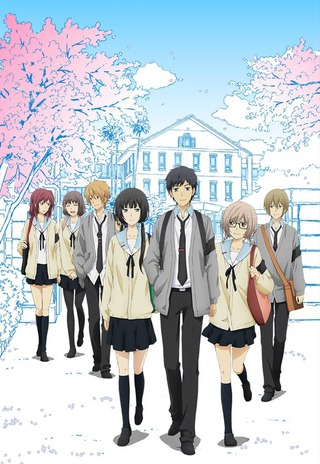
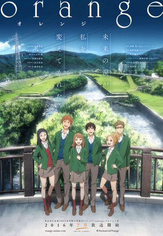
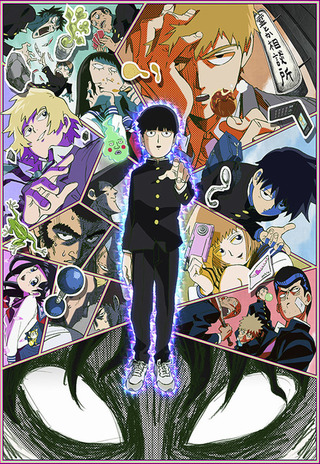
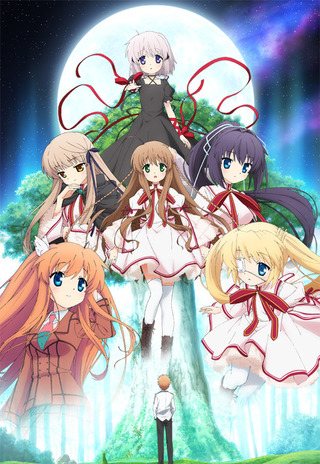
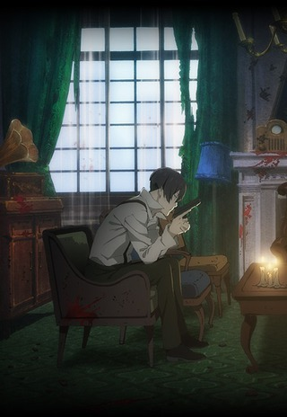
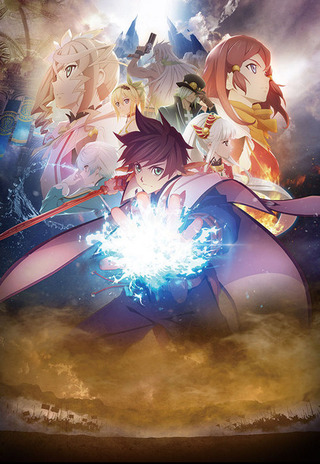
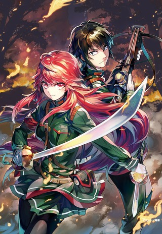
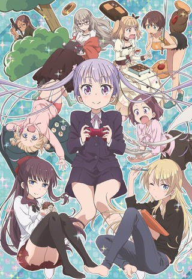
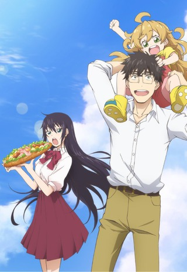

 

### [Re:Zero kara Hajimeru Isekai Seikatsu](https://hummingbird.me/anime/re-zero-kara-hajimeru-isekai-seikatsu)

(cribbed from [Spring Retro](https://markphilpot.com/posts/2016/07/31/anime_2016_spring_retro/))

_Holy Shit_

OK, so this show has it's flaws to be sure, but damn was this a fun ride. White Fox managed to explore some dark aspects of the main protagonist and really drags the audience around through the muck of despair. I had hope during each episode that things would come back up -- that we were taking this downward trajectory with the expectation that we would come back up after hitting rock bottom (and oh did we hit bottom all right). Thankfully, the payoff is really good and rewards your investment in the show.

Let me take a moment to talk about Episode 18.

Actually, no. Words would not do this episode justice. If I just described it to you (two characters talking to each other in the same spot for 24 minutes) you would say it must be a boring episode. Trust me when I say that Episode 18 might just be my all time favorite episode of anime ever.

 

### [ReLIFE](https://hummingbird.me/anime/relife)

Binged? ✅   Enjoyed? ✅   Want Second Season? ✅

What a truly fantastic adaption! They were very faithful to the source material while still making it their own. The characters were fantastic and the humor actually translated very well to the screen. They also managed to end the season with both a resolution and a tease for more that was actually satisfying (though to be fair that might be because I've been reading the manga). I really, **really** hope there is a second season in store for us down the road.

 

### [orange](https://hummingbird.me/anime/orange)

I couldn't even start this because I feared how much of a downer it would be. I probably wasn't wrong given the bits of reactions I managed to hear. I _will_ watch this at some point. It just might not be anytime soon.

And no, I haven't made any progress through the manga for the same reason. I think I might be scarred by [Shigatsu wa Kimi no Uso](https://hummingbird.me/anime/shigatsu-wa-kimi-no-uso).

 

### [Mob Psycho 100](https://hummingbird.me/anime/mob-psycho-100)

Most people seemed to have loved this show (maybe not quite as much as One Punch Man). It just wasn't my cup of tea. It's on hold rather than dropped as maybe someone will review it and really make me feel that I missed out by not watching it.

8bit

### [Rewrite](https://hummingbird.me/anime/rewrite)

Such. A. Slow. Start.

The problem through really is that once it gets going no one really bothers to tell you where. The characters are no more than cardboard cutouts of anime stereotypes and I really don't see that developing or evolving. I think I heard something that there might be a second season? _Shrug_

Shuka

### [91 Days](https://hummingbird.me/anime/ninety-one-days)

Unfortunately on hold for the time being and through no real fault of the show itself -- I just preferred watching other series. One day!

 

### [Tales of Zestiria the X](https://hummingbird.me/anime/tales-of-zestiria-the-x)

This was not a great anime by any stretch of the imagination. It's more or less a straight adaption of the game. It inexplicably has a 2 episode tangent to promote the prequel game set in the same universe. The main character is essentially _deus ex-machina_ personified.

Now, all that being said, I did rather enjoy it. The music is fantastic and the animation is flat out gorgeous (if you happen to like the ufotable digital style). To top it all of, it got me to buy the game (on sale on Steam) and introduced me to the entire _Tales of_ series of games that hadn't crossed my radar prior.

So... Mission Accomplished?

 

### [Nejimaki Seirei Senki: Tenkyou no Alderamin](https://hummingbird.me/anime/nejimaki-seirei-senki-tenkyou-no-alderamin)

_Alderamin_ employed a brand of story telling I enjoy immensely. They told their story without needlessly explaining every detail. They let events unfold naturally without forcing some idiotic exposition to explain to the audience what all the characters would already know. I sincerely appreciated that in this show and I think it's all the better for it.

Characters were quite good with a story that was fairly straight forward -- the opening episode informs you exactly what ultimately happens. It's of course the journey and how they get you there that is worth the price of admission.

Now of course since this is a Madhouse production, we will never get a sequel, so while the ending is somewhat satisfactory, I went ahead and pulled down the manga where hopefully the rest of the story will be told. It's such a striking contrast in tone, at least in the opening few volumes of the manga. The tone of the manga is much more lighthearted than the anime adaptation -- I'm curious when they get to the battles and war will it continue or shift dramatically.

Doga Kobo

### [New Game!](https://hummingbird.me/anime/new-game)

The epitome of _Slice of Life_ anime with a little extra character depth sprinkled in. I ended up saving this until the season had ended so I could binge it in a few days. If you liked [K-On!](https://hummingbird.me/anime/k-on) chances are you will enjoy this one. This isn't [Shirobako](https://hummingbird.me/anime/shirobako) -- you won't be getting an intimate look into the game production process (any studio willing to take that one on? Seems like a slam dunk). Since I wasn't expecting that going in, I wasn't disappointed with the episodic hijinks.

 

### [Amaama to Inazuma](https://hummingbird.me/anime/amaama-to-inazuma)

Enough cute to make you melt and enough food to make your mouth water. It is definitely the same formula repeated twelve times but in the end I didn't mind it at all. All the characters were fantastic and shout out to the child voice actor that plays the little girl. She **nailed** each and every performance and was really the linchpin of the series.

Hero image created by Zana at <a href="https://neregate.com/blog/">neregate.com</a>  
The following websites were used as sources of information to create the chart : 
<a href="https://www.animenewsnetwork.com/">ANN</a>
<a href="https://m-p.sakura.ne.jp/">Moon Phase</a>
<a href="https://myanimelist.net/">MAL</a>

