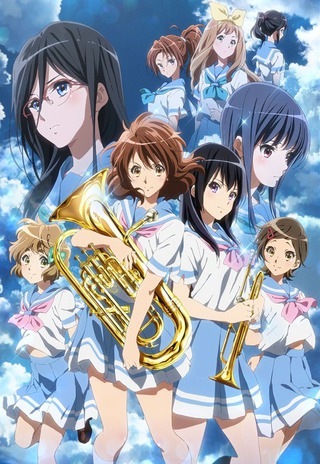
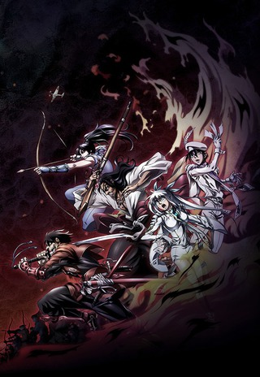
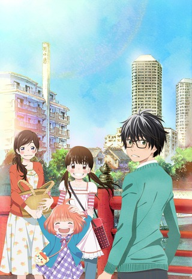
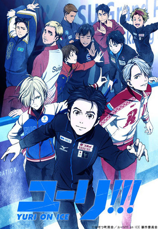
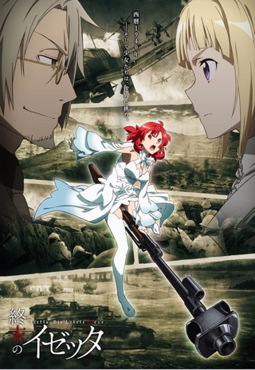
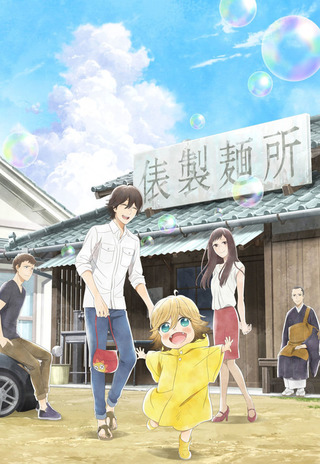
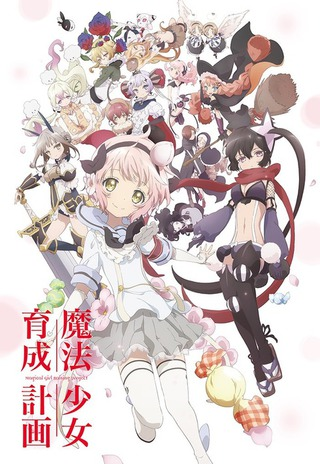
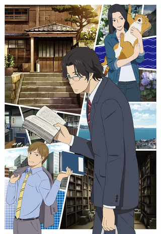
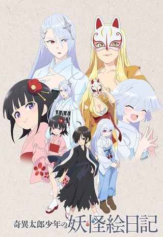
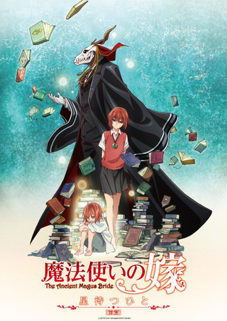

Every time a new season rolls around I think it's going to be a light one because most of it is completely unknown to me before watching the first episodes. I definitely don't try absolutely everything, just ones that catch my eye. You'll notice this first impressions post is a bit later than usual -- I thought I wouldn't have that many shows to watch this fall, so I took the time to finish up a few remaining summer shows. It really wasn't until I created the skeleton for this post that I realized how many had caught my eye enough to give it a try.

Also, I guess the Crunchyroll/Funimation links for each show are kind of useless -- with the "partnership" announcement all the subtitled works will end up on CR anyway. There are a few from last season that Funimation announced they would be doing a dub for that I'm curious for (Re:LIFE), but it looks like going forward most things will be on CR.

 

### [Hibike! Euphonium 2](https://hummingbird.me/anime/hibike-euphonium-2)

Anime Gods be praised! KyoAni has blessed us with a second season! **So** excited for this! The first season was up there on my all time favorite anime. The only question I have is if they will take the story all the way to nationals or dangle that for a third season.

For some unknown masochistic reason, I've decided not to follow the show each week and instead binge them all at the end. No idea if this is smart or not and also no idea if I'll have the will power to follow through.

While you (and I) wait, please enjoy the following selection:

<iframe width="560" height="315" src="https://www.youtube.com/embed/z2pRHJYU9QQ" frameborder="0" allowfullscreen></iframe>

Hoods Drifters Studio

### [Drifters](https://hummingbird.me/anime/drifters-tv)

Not sure this is the show for me. I'm not a fan of [JoJo's Bizare Adventure](https://hummingbird.me/anime/jojo-s-bizarre-adventure-2012) so I think some of the humor and art style is lost on me. I also thought the pacing and timing of the jokes was really off for the opening episode. I think I'll give it one more shot to hook me but if I was a betting man I would pre-slot this over to _Dropped_.

 

### [3-gatsu no Lion](https://hummingbird.me/anime/three-gatsu-no-lion)

Wow! It's Shaft not doing a [\*monogatri](https://hummingbird.me/anime/bakemonogatari) series. I love the art style, the restrained use of dialog and the OST is fantastic too. I'm firmly sold on this one (and it's a two cour show to boot).

Avex Pictures

### [Yuri!!! on Ice](https://hummingbird.me/anime/yuri-on-ice)

The strong opening episode really caught me off guard. The comedic timing was superb and there was a level of confidence and sincerity exuding from the show that really hooks you in while the comedy acknowledges not to take the show too seriously. It was a fantastic combination. Give this show a chance even if you would initial balk at the subject. I don't think you will regret it.

Ajia-Do

### [Shuumatsu no Izetta](https://hummingbird.me/anime/shuumatsu-no-izetta)

_Sigh_

I was actually rather enjoying the opening episode right up until the witch Izetta _mounted_ the rifle as if it was a broom and started flying. That rather unfortunate shot to the system got me to realize all the other flaws and suddenly I wasn't quite as interested. I will still give this one a few more episodes but frankly I don't have high hopes for this.

 

### [Trickster: Edogawa Ranpo "Shounen Tanteidan" yori](https://hummingbird.me/anime/trickster-edogawa-ranpo-shounen-tanteidan-yori)

Another Ranpo adaptation and this one starts off with a kick! Nothing really explained in the first episode but with a two cour show, they can afford to take their time. The animation is top notch and there is every indication the dialog is going to be chock full of some clever banter. Definitely a keeper.

Liden Films

### [Udon no Kuni no Kiniro Kemari](https://hummingbird.me/anime/udon-no-kuni-no-kiniro-kemari)

Literally [Sweetness & Lightning](https://hummingbird.me/anime/amaama-to-inazuma) meets [Usagi Drop](https://hummingbird.me/anime/bunny-drop). I have my doubts that this will be anywhere near as good as S&L. Apparently death, food and a cute kid are a winning combination. I'll stick this one out as long as they keep a good level of character development going.

rlish Number")

Diomedea

### [Gi(a)rlish Number](https://hummingbird.me/anime/girlish-number)

Wow. Not at all what I expected. There is quite a lot of not so subtle ribbing going on here. This one feels like [Shirobako](https://hummingbird.me/anime/shirobako)'s evil twin taking the whole experience down a few notches. Let's see where this one goes.

 

### [Mahou Shoujo Ikusei Keikaku](https://hummingbird.me/anime/mahou-shoujo-ikusei-keikaku)

How much will this just be an inferior clone of [Madoka Magica](https://hummingbird.me/anime/mahou-shoujo-madoka-magica)? I hope it's more than that, but I have my worries. There could be lots of room to play around with this as long as they have the confidence to break out of Madoka's shadow. Not sure if this original or an adaption (not that it really matters, just curious more than anything). Hopefully we get to see a new side of a _Mahou Shoujo_ turned on its head rather than yet another exploitive magical girl torture porn series.

ZEXCS

### [Fune wo Amu](https://hummingbird.me/anime/fune-wo-amu)

A very unusual premise -- creating a new dictionary. The protagonist's voice actor is [Takahiro Sakurai](https://myanimelist.net/people/79/Takahiro_Sakurai) who as literally been in _everything_ (Jesus... what a resume). I have no idea if I'll keep this one up. If the main focus is the _dictionary_ then I'll probably pass. If the dictionary is the device to tell some stories about these characters, then I think I could get on board.

Studio 3Hz, Infinite

### [Flip Flappers](https://hummingbird.me/anime/flip-flappers)

This one has the potential to be the gem of the season. The animation is gorgeous and an absolute trip. No idea where this one's going, but I'm definitely in for the ride.

Shorts

### [Kiitarou Shounen no Youkai Enikki](https://hummingbird.me/anime/kiitarou-shounen-no-youkai-enikki)

Cute and Fun. Definitely give this one a click.

 

### [Mahou Tsukai no Yome: Hoshi Matsu Hito](https://hummingbird.me/anime/mahou-tsukai-no-yome-hoshi-matsu-hito)

This isn't a short, but a three episode OVA prequel in support of manga. It's a shame because I think this could be a really great full length series. It got me to pick up the manga so, again, it accomplished what it set out to do (provided they were actually selling the English translation...)

Hero image created by Zana at <a href="https://neregate.com/blog/">neregate.com</a>  
The following websites were used as sources of information to create the chart : 
<a href="https://www.animenewsnetwork.com/">ANN</a>
<a href="https://m-p.sakura.ne.jp/">Moon Phase</a>
<a href="https://myanimelist.net/">MAL</a>

