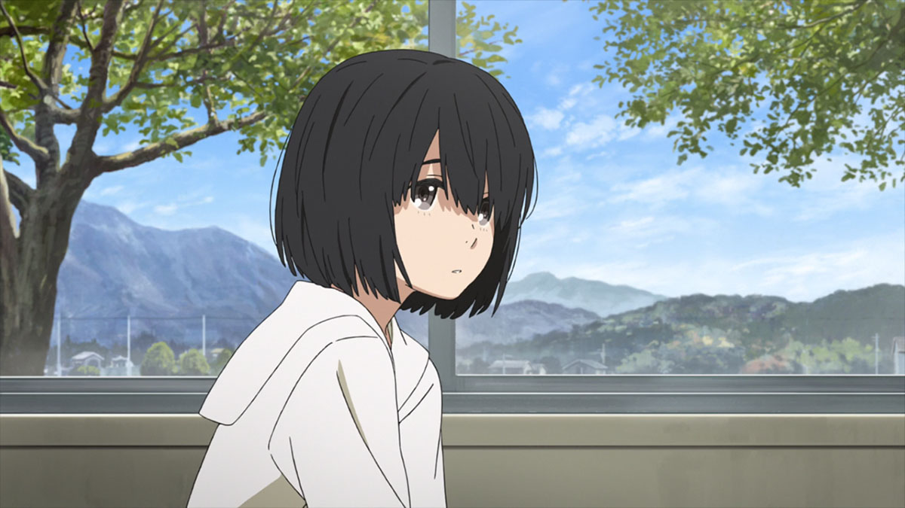

[Kokoro ga Sakebitagatterunda](https://hummingbird.me/anime/kokoro-ga-sakebitagatterunda) _The Anthem of the Heart_

> Don't tell people to disappear like it's nothing! Words can hurt people! You can't ever take them back

The mind is a powerful thing. When my parents became divorced, I distinctly remember going to a therapist that in retrospect was definitely checking to make sure what happened to Naruse was not happening to us -- internalizing the conflict and blaming yourself for the parents conflict. _Anthem_ is a powerful story on how that can really mess up a kid.

Beyond the fantastic story, I want to call out the gorgeous animation by A-1 pictures. I'm not sure which group within it was responsible, but they delivered a fantastic feast for the eyes.

I loved this movie. Director [Nagai Tatsuyuki](https://myanimelist.net/people/8539/Nagai_Tatsuyuki) directed [Toradora!](https://hummingbird.me/anime/toradora) and [A Certain Scientific Railgun](https://hummingbird.me/anime/toaru-kagaku-no-railgun) which are among my favorite anime series but _Anthem_ seems to be his breakout feature film hit. I hope he gets a chance to do more.

I want to take a second to discuss the ending, so if want to remain spoiler free, then stop now and watch _Anthem_ with my full recommendation.

My first take on the relationship resolution took me by surprise. I was expecting a more conventional resolution where Naruse ends up with Sakagami while completely sidelining the supporting friends. But when I began thinking about it the more I came to appreciate it and how it respects all the characters involved. If this show were to be made in the West, I can't imagine what kind of production pressure would be on the writers to resolve it differently. Check my expectations, apparently.

Anime movies are a treat that requires quite a bit of patience. Unlike series that are translated and aired immediately movies require us to wait until the DVD or BluRay release and pray some sort of distribution agreement is made.

Released in September of last year, _Anthem_ had been on my radar for a while, but never got a distribution agreement. It's such a shame that almost everyone outside the anime community won't get a chance to see this film. Stories like this seems to be relegated to Japanese Anime exclusively -- you would never see Disney or Pixar take on a project like this. Projects like _Anthem_ and [Koe no Katachi](https://hummingbird.me/anime/koe-no-katachi) are the reason I love anime.
