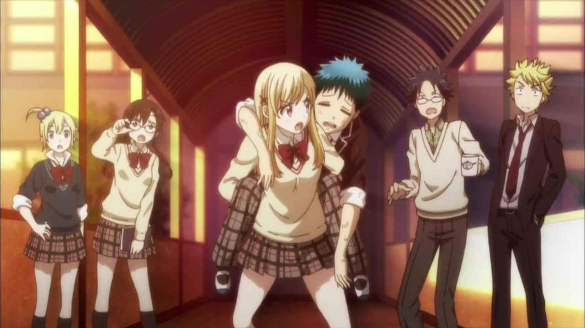
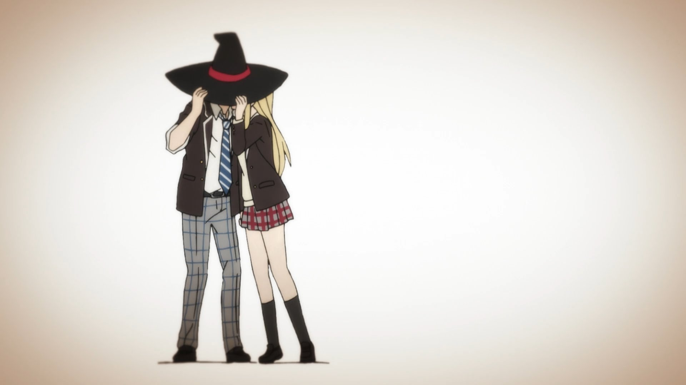

")

Liden Films

[Yamada-kun to 7-nin no Majo](https://hummingbird.me/anime/yamada-kun-to-7-nin-no-majo-tv) _Yamada-kun and the Seven Witches_

_Note:_ I watched this quite a while ago, but this review remained in my drafts folder for a _very_ long time.

Early on in my anime watching life, I didn't really pay attention to the source material of a particular anime series, be it manga, light novel or original. I only very recently starting diving into manga and I know if I had started that before this show began airing, I would have been all over it. Before I get too far, let me just say that the manga is excellent and while I haven't quite caught up, I would say this anime is a very good adaption of the source material.

The story follows Ryu Yamada as a problem student and his frustrations with his school life. On a fateful day, Ryu has a run in (or I guess I should say, "fall in") with Urara Shiraishi and they inexplicably swap bodies. They discover that kissing triggers this transformation and also stumble upon more girls that have special powers. What follows is a rather clever story as they explore the implications of these powers and the girls that control them.

I think I watched the first episode or two while it was airing, but then put it on hold as I thought it was going to descend into stereotypical harem tropes. What I missed the first time was how really good the characters are and that the girls in the story are not hollow shells of harem charactatures.

The animation is enjoyable and brings the manga's style to life complementing some really good voice performances. The story wraps very neatly and actually doesn't ever give you the sense that the manga has more material (still going strong as of this post). They could very easily have dropped a twist at the end but thankfully they refrained and left us with a very touching conclusion that does the series justice.
