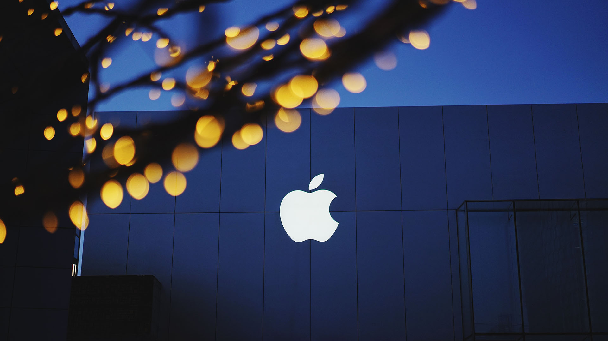

For many years I rocked an old IBM [Thinkpad](https://www.thinkwiki.org/wiki/Category:X61) running Ubuntu and my own blend of [AwesomeWM](https://awesome.naquadah.org/). This laptop was underpowered, but it extremely small and had no trackpad -- instead the famous/infamous red nub in the middle of the keyboard. It was perfect for me and I loved it. At home or work I was using a huge desktop workstation (with as much RAM as I could afford/get work to pay for), so I only needed the laptop for light usage.

On my home desktop I had to bend over backwards fighting linux audio drivers and [jackd](https://www.jackaudio.org/) to try to get any sort of music recording done. At some point, I just decided it wasn't worth the time I spent fighting it -- I barely had enough to musically doodle as it was. So I took the plunge and got a Mac Pro in 2010 (which solved that issue at the time). The Thinkpad kept chugging until a fateful incident with a beer bottle finally did the laptop in. Thankfully, Apple released a revamped MacBook Air (2012) and I fell into a homogenous platform with Apple.

I've since added an iPhone and iPad to the lineup. All in all it's been good. I get the best of both worlds in a command line I can do work on and a GUI that I don't have to worry about or manage. However, years on my trusty Air's battery is failing and my Mac Pro's chipset does not meet the virtualization requirements to run Docker for Mac (though if I had splurged for the 6 or 8 core it would have... fairly bitter about that one).

It's now almost the end of 2016 and Apple still hasn't released a new Mac Pro I could justify spending a huge load of cash on and the recent MacBook Pro announcement left me feeling without any good options (and it [seems](https://mjtsai.com/blog/2016/10/27/new-macbook-pros-and-the-state-of-the-mac/) I'm not the only one). What I really wanted was a retina Air, but sadly that line appears dead. I would have been fine going up to a 13" MBP if I thought I was getting a quality laptop commensurate with the price. If the MPB Esc was $500 cheaper, I don't think I would be having this heartburn about it.

In the past few days I've been contemplating what it would take to switch my laptop back to Linux (possibly running on Razer's new [Blade Stealth](https://www.razerzone.com/gaming-systems/razer-blade-stealth) which is a hell of a lot more laptop for considerably less money). The problem is I've drifted away from cross-platform solutions in a few key areas that will make any heterogenous system _very_ difficult to pull off -- since I'll be sticking with my Mac Pro, iPhone and iPad.

In particular: [OmniFocus](https://www.omnigroup.com/omnifocus) for TODO tracking and [Quiver](https://happenapps.com/) for note taking. Quiver is my Evernote replacement and it has two things Evernote doesn't: code snippet blocks with syntax highlighting and Markdown support. OmniFocus is the productivity core on which I currently get things done.

A replacement for any key piece of software needs to be truly cross-platform (support for both macOS and Linux) since I can't convert all my computing uses to one platform. For quite a number of apps, I can find very good replacements or the apps I'm using are already cross-platform. I'm struggling to find equivalents for OmniFocus and Quiver that will work with macOS, iOS and Linux.

The sad truth may be that I just get a maxed out MBP Esc to tide me over a few releases. Maybe by then Apple will have resolved its current identity crisis or more independent software developers will branch out into cross-platform products.
