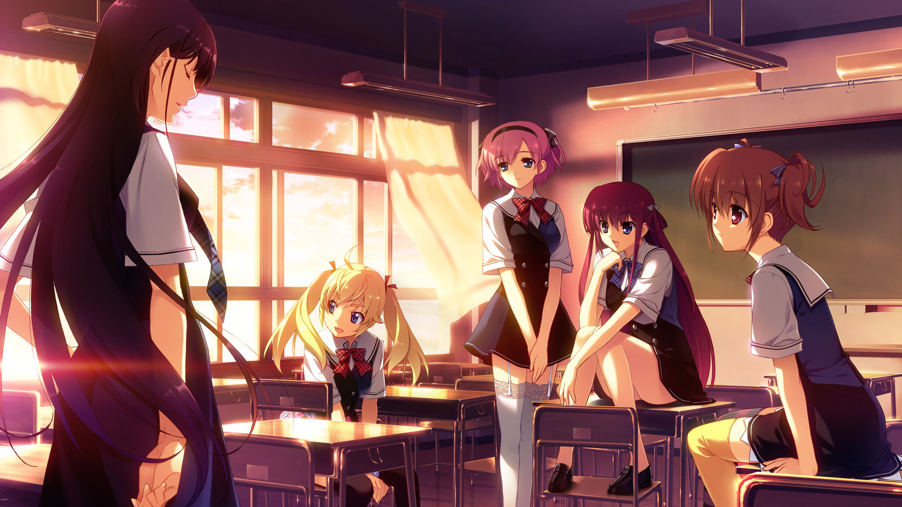
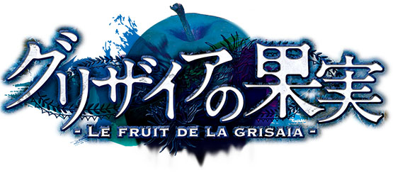
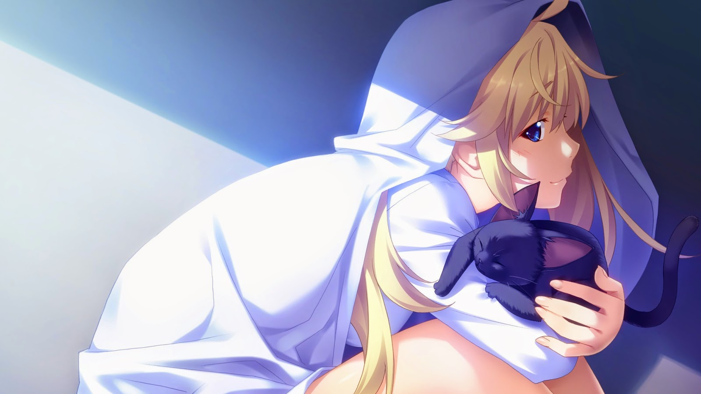
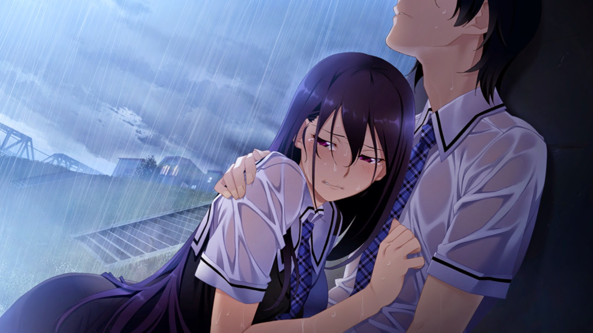

When I watched the anime, I knew _Grisaia_ was one of _those_ visual novels -- big works like _Fate/Stay Night_ -- where the adaptation had to be a sliver of the overall work due to sheer size alone. Where _FSN_ got two cours for _each_ of the first two routes and a _movie_ for the third (not to mention a two cour prequel), _Grisaia_ was limited to telling a summary version of all 5 routes in a single cour. While enjoyed the anime (flawed to be sure, but entertaining), I wanted more of the story. Until Steam started releasing VNs, they were incredibly difficult to obtain and you often had to patch them with fan translations. Hell, _FSN_ is still that way. But slowly Steam has been building up it's catalog of Japanese VN games and _Grisaia_ is definitely only the start.

The tl;dr for _Grisaia_ is essentially a school harem romantic comedy. The common story is a bit slow to get going, but every character is allowed to establish themselves before splitting of in their respective routes. The voice acting is truly great (at least as far as a non-native speaker can discern) and the translation is pitch perfect. While all the routes are good, they are definitely not created equal -- I enjoyed Michiru's and Yumiko's routes especially. They were both well paced and I really like the respective characters. Sachi's route is the tear-jerker of the set and was quite touching. The only slight issue I have with the stories in general is Yuuji's character is essentially a _deus-ex machina_ -- though knowing what I know of the sequel there is some slight role reversal to be had.

Per my nature, I probably won't get around to playing the _Bad Endings_ for any of them -- I'm definitely not that masochistic. Even with that, you are probably looking at about a 60 to 70 hour investment to get through all the routes -- essentially a full JRPG a la Final Fantasy. Well worth it in my opinion if story is really important for your gaming experience.

So I guess anime is the gateway drug. Manga and now Visual Novels. I'm in trouble now.
