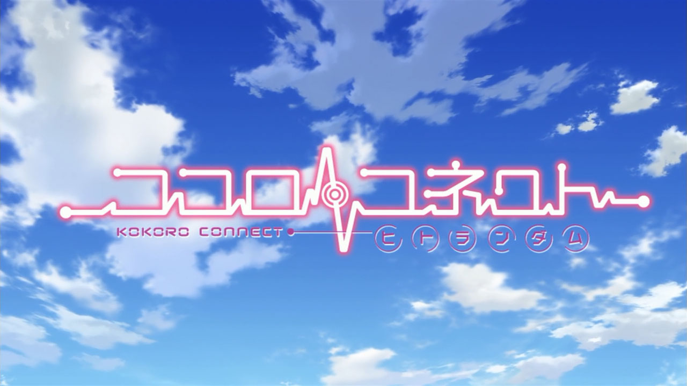
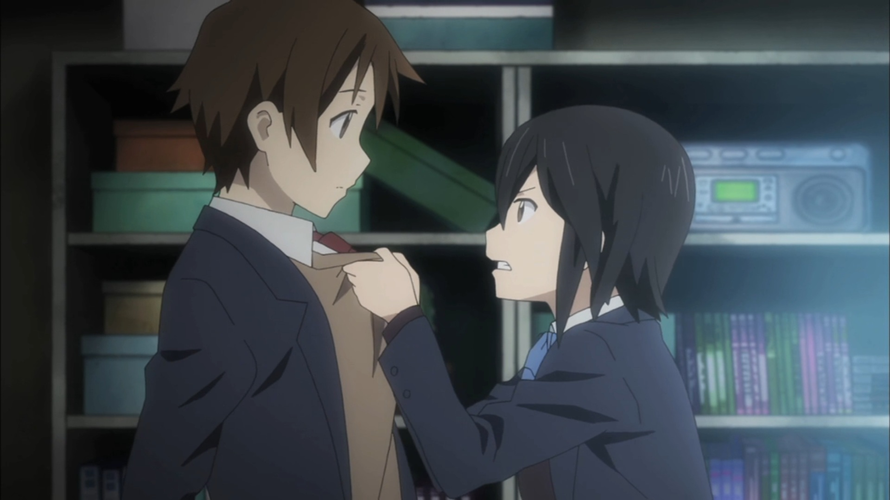

> Don't forget that kindness can hurt people too

[Kokoro Connect](https://hummingbird.me/anime/kokoro-connect) is the adult, serious take on the body/mind swapping trope done in [Yamada-kun](https://hummingbird.me/anime/yamada-kun-to-7-nin-no-majo-tv). Instead of the comedy laden hijinx, Kokoro delivers personal conflict, dealing with past trauma, contemplations of suicide, depression, and friendship. I don't mean to say that it's all downers -- there is enough comedy to offset the mood, including one of my all time favorite lines -- but this definitely is not a light hearted high school romp.

If you treat this series as a character exploration and don't ask too many questions on the _why_, I think you'll find you will maximize your enjoyment in this series. The antagonist as the orchestrator of the conflict in the story is a bit of a _deus ex-machina_ in his own right. There is no satisfying explanation for his actions and purpose other than to drive the story forward by performing ill-opportune swaps -- just to twist the knife a bit more. If you are able to just accept that, I found the ensemble cast of students to be engaging, flawed and interesting.

Just a heads up, there is a [four episode OVA](https://hummingbird.me/anime/kokoro-connect-michi-random) that really is mandatory watching to wrap up the entire story. In my mind they shouldn't be considered separate (though everyone tracks _Michi Random_ as a separate entity). The combined entity wraps up the story with a satisfying conclusion.
