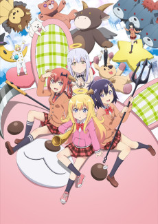

So.

Umm.

    ┻┳|
    ┳┻|
    ┻┳|
    ┳┻|
    ┻┳|
    ┳┻|
    ┻┳|
    ┳┻|
    ┻┳|
    ┳┻|
    ┻┳|
    ┳┻|
    ┻┳|
    ┳┻|
    ┻┳|
    ┳┻|
    ┻┳|
    ┳┻| ___
    ┻┳| •.•)  is 2016 gone?
    ┳┻| ⊂ﾉ
    ┻┳|

Seriously.

Anyway... Welcome to 2017.

You'll probably notice that this first impressions post is coming out a bit later than usual (and probably before the fall retrospective). First, I had a few shows from last season I wanted to finish off before diving into this one. Second, with hummingbird.me transitioning to kitsu.io, my bootstrap script that helps me put this post together became OBE. After a bit of research, I switched over to a very good API provided by [anilist.co](https://anilist.co) -- and to be honest, I'm _this_ close to switching my anime tracking to anilist full time (my profile is [here](https://anilist.co/user/mphilpot/animelist)) (_Update:_ Done and done).

My first impression of this season seems to be _understated_ but _solid_. There is a wide variety with comedies taking the lead. With the holidays I fell behind last season, so I'll be playing catch up and hopefully try to stay more current for this one.

One "shocking" bit of news before we dive in is Amazon's new pay-for anime channel called [Anime Strike](https://www.animenewsnetwork.com/news/2017-01-12/amazon-u.s-launches-anime-strike-paid-streaming-service/.110924) as part of their paid streaming service. I don't know what to think of this -- to say their catalog is bare bones is significantly understating the situation. As a happy paying subscriber of Crunchyroll, Funimation & Netflix, as well as an Amazon Prime member, I'm not sure I will be diving into yet another pay-for stream service one unless they start buying up enough shows to really deprive CR. Will be interesting to see what shows they pick up this coming year. If I had to bet, I'd say they might go aggressively after [Shingeki no Kyojin 2](https://anilist.co/anime/20958/ShingekinoKyojin2) as an exclusive. That would be quite the steal.

Anyway, let's dive in...

 

### [Kono Subarashii Sekai ni Shukufuku wo! 2](https://anilist.co/anime/21699)

Season 1 came out of nowhere and for many was the best show of 2016 (and easily the best comedy). I'm a _little_ concerned about what they have planned this time around. It was clear they didn't know what they had the first time, so I hope they don't end up ruining it because of the unexpected popularity. After seeing the first episode, I have a second concern: the animation budget. The first cour was rough, but it felt on purpose and for the most part was balanced out with decent effort and framerates. This time around, there was so much of the "rough edges" it felt like someone thought that was part of the aesthetic success of the first season (which in my opinion was not a positive factor the first time). The humor seemed to build from where they left off, but overall I'm left with more concerns than before -- usually not a good sign.

 

### [Masamune-kun no Revenge](https://anilist.co/anime/21857)

There are a few ways this one could go. I feel it's a bit like a Monty Hall problem -- we could very easily end up with a goat. The opening wasn't half bad, but we'll have to give it a few more episodes to prove itself. The show seemingly avoided a few pitfalls in it's debut and managed to make the two main characters slightly more than one dimensional. Fingers crossed?

") 

### [Little Witch Academia (TV)](https://anilist.co/anime/21858)

Netflix supposedly has picked this up, but for some inexplicable reason they haven't aired either of the first two episodes. This is a manifestation of a concern I have with Netflix and Amazon trying to wade into the anime space -- I have no confidence about their stewardship or attention to the anime community. I'm not saying Crunchyroll, Funimation and the rest are angels in this regard, but they are definitely more responsive due to the fact that anime is their main business.

 

### [Kuzu no Honkai](https://anilist.co/anime/21701)

Like watching an emotional train wreck in slow motion.

I have reservations with this one. I managed to figure out that "Oni-chan" in this instance is just a family friend rather than her actual brother, but it's hard to dispel the thought given Japan's propensity for that story line. I thought the animation style was nice and different. The use of split screen and overall editing style was actually really refreshing. My worry is that this will have the possibility for an absolute crushing ending. There are very few "happy" resolutions for a plot started this way. Like [orange](https://anilist.co/anime/21647/orange) last year, I may have to stay away until I figure out what kind of ending it has for my own emotional sanity.

NUT

### [Youjo Senki](https://anilist.co/anime/21613)

What. The Hell. Did I Just Watch.

I will give it at least one more episode, but I'm not sure I can get over the rather unfortunate character designs. The overall animation didn't strike me as great either (although I was too distracted by the characters to really take notice). A season after another mediocre war anime in [Izetta](https://anilist.co/anime/21838/ShuumatsunoIzetta) I sincerely doubt I'll be up for this one.

 

### [Fuuka](https://anilist.co/anime/21887)

I almost passed this one by, but Crunchyroll picked it up, so I thought I'd give the first episode a chance. It was ever-so _slightly_ endearing, even if it does roll out a whole slew of tropes and fan service. I'm really hoping there is more to the story and characters that what we see on the surface, but I won't be surprised if we continue a mediocre romcom plot with needless fan service and an abundance of tropes.

 

### [Tales of Zestiria the X 2](https://anilist.co/anime/97645)

Given the source material (JRPG) there was obviously plenty of material for a second cour for _Tales_ but I'm a little suprised it's getting one (which probably means it was planned to be a 2 cour series from the start). The first cour was entertaining, but nothing special (though if you enjoy ufotable's animation, then the story was really a perfect complement). Keep your expectations low and enjoy the animation.

Thanks to the [ReLIFE](https://anilist.co/anime/21049/ReLIFE) dub from Funimation, I discovered the greatness of [Alexis Tipton](https://myanimelist.net/people/9091/Alexis_Tipton). She also does the voice for Alisha in the _Tales_ dub, so I've added that to my queue. Depending on the strength of that dub, I might continue this series on that side of the divide.

 

### [ACCA: 13-ku Kansatsu-ka](https://anilist.co/anime/21823)

_zzzzzzzzzzzzzzzzzzzzzzzzzzzzzzzzzz_

Wow. So Madhouse can release a dud. I'm not sure I understand _who_ would be interested in a tale spun around a bureaucracy, but to combine it with this particular character design seems to me like an absolute recipe for disaster

 

### [Shouwa Genroku Rakugo Shinjuu: Sukeroku Futatabi-hen](https://anilist.co/anime/21733)

Last year's first season was anime of the year in my opinion. Not everyone's cup of tea, but it was just _so good_ at what it set out to do. I'm even more excited for this cour since (hopefully) will be focusing on the new student, _Yotaro_.

Studio Gokumi

### [Seiren](https://anilist.co/anime/97730)

From the staff who brought us [Amagami SS](https://anilist.co/anime/8676/AmagamiSS) (if not the studio). I honestly rather enjoyed Amagami, but I'm going to at least wait so I can binge each heroine's arc rather than waiting week to week.

 

### [Demi-chan wa Kataritai](https://anilist.co/anime/97592)

Ok, this one is going to be my not-so-secret favorite of the season. Heartwarming & cute -- this one fills the feel good role that [Flying Witch](https://anilist.co/anime/21284/flyingwitch) and [Sweetness and Lightning](https://anilist.co/manga/86044/AmaamatoInazuma) filled last year. I couldn't help but smile throughout the entire first episode. Kudos to A1 if they can pull this off.

 

### [Kobayashi-san Chi no Maidragon](https://anilist.co/anime/21776)

This one got quite a few chuckles out of me. It feels like an anime short in the body of a full length series. Episodic hijinks, here we come.

 

### [Gabriel DropOut](https://anilist.co/anime/21878)

There is going to be some comedy gold in this one. I never saw [Himouto! Umaru-Chan](https://anilist.co/anime/20987/HIMOUTOUMARUCHAN) a few seasons ago, but this feels a bit like I imagine that one would be (just in a slightly reverse fashion... almost like [Hataraku Maou-sama!](https://anilist.co/anime/15809/HatarakuMaousama) (_Devil is a Part-Timer_)).

Hero image created by Zana at <a href="https://neregate.com/blog/">neregate.com</a>  
The following websites were used as sources of information to create the chart : 
<a href="https://www.animenewsnetwork.com/">ANN</a>
<a href="https://m-p.sakura.ne.jp/">Moon Phase</a>
<a href="https://myanimelist.net/">MAL</a>

